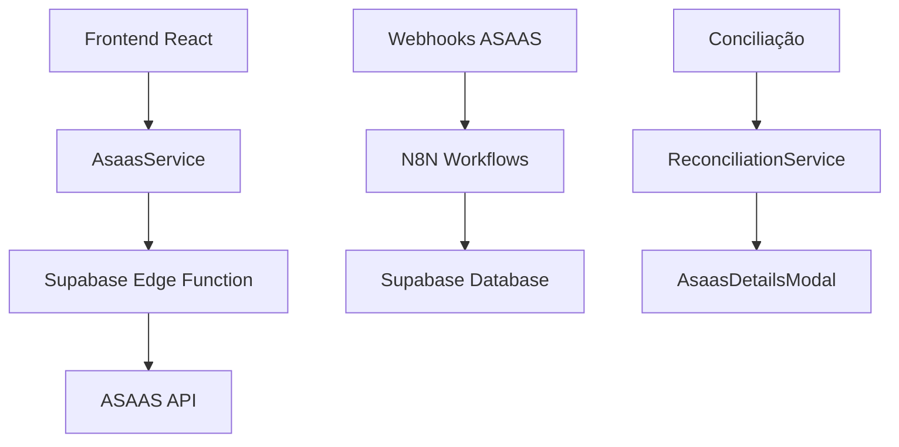
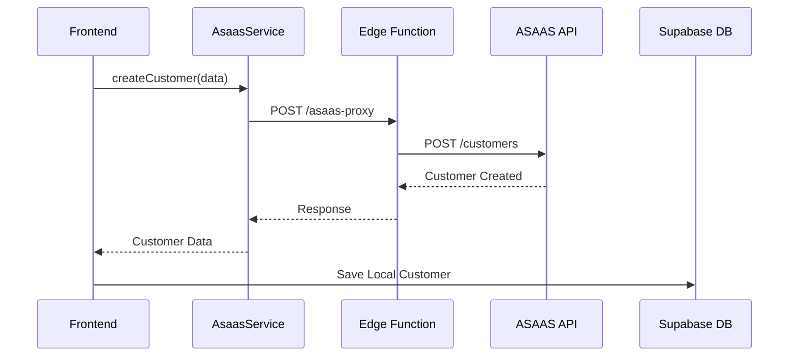
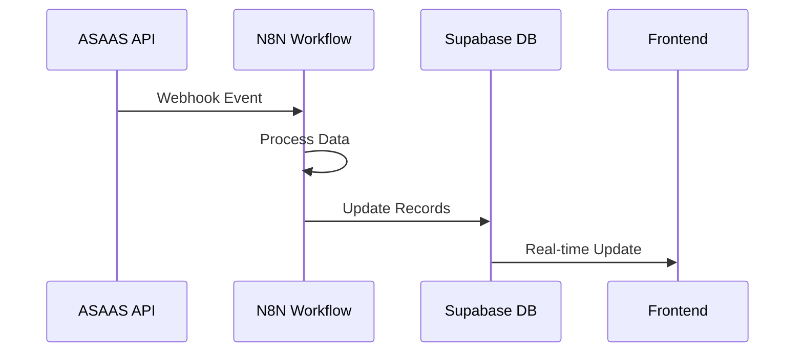
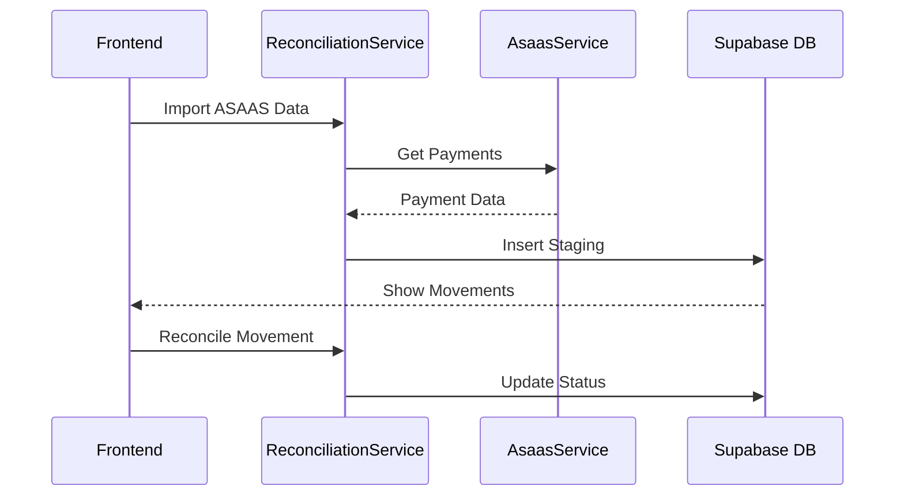

# 📋 DOCUMENTAÇÃO MASTER - INTEGRAÇÃO ASAAS

**Versão:** 1.0  
**Data:** 24/09/2025  
**Autor:** Barcelitos (AI Agent)  
**Projeto:** Revalya Oficial  

---

## 🎯 **VISÃO GERAL DA INTEGRAÇÃO**

A integração com o **ASAAS** (gateway de pagamentos) é uma das principais funcionalidades do sistema Revalya, permitindo:

- ✅ **Gestão de Clientes**: Criação, atualização e sincronização de clientes
- ✅ **Processamento de Pagamentos**: Criação e gestão de cobranças
- ✅ **Conciliação Financeira**: Reconciliação automática de movimentações
- ✅ **Webhooks**: Recebimento de notificações em tempo real
- ✅ **Multi-tenant**: Isolamento por tenant com credenciais específicas

---

## 🏗️ **ARQUITETURA DA INTEGRAÇÃO**

### **1. Componentes Principais**



### **2. Fluxo de Dados**

1. **Frontend** → `AsaasService` → `asaas-proxy` (Edge Function) → **ASAAS API**
2. **ASAAS Webhooks** → **N8N** → **Supabase Database**
3. **Conciliação** → `ReconciliationService` → **Staging Tables**

---

## 📁 **ESTRUTURA DE ARQUIVOS**

### **Serviços Core**
- `src/services/asaas.ts` - Serviço principal de integração
- `src/services/asaasService.ts` - Serviço auxiliar (cancelamentos)
- `supabase/functions/asaas-proxy/index.ts` - Proxy Edge Function

### **Tipos e Interfaces**
- `src/types/asaas.ts` - Definições TypeScript completas
- `src/types/models/customer.ts` - Modelo de cliente com asaas_id
- `src/types/models/cobranca.ts` - Modelo de cobrança com asaas_id

### **Componentes UI**
- `src/components/reconciliation/AsaasDetailsModal.tsx` - Modal de detalhes
- `src/components/integracoes/IntegrationServices.tsx` - Configuração
- `src/components/clients/ImportModal.tsx` - Importação de clientes

### **Hooks e Utilitários**
- `src/hooks/useAsaasData.ts` - Hook para dados do ASAAS
- `src/hooks/useChargeIntegration.ts` - Hook para cobranças
- `src/utils/gatewayValidation.ts` - Validações de gateway

### **N8N Workflows**
- `src/n8n/workflows/webhook.ts` - Webhook de clientes
- `src/n8n/workflows/sync-charges.ts` - Sincronização de cobranças
- `src/n8n/workflows/main.ts` - Workflow principal
- `src/n8n/workflows/bulk-messages.ts` - Mensagens em massa

---

## 🔧 **CONFIGURAÇÃO E CREDENCIAIS**

### **1. Variáveis de Ambiente**

```env
# ASAAS Configuration
VITE_ENABLE_ASAAS=true
VITE_ASAAS_API_KEY=your_api_key_here
VITE_ASAAS_ENVIRONMENT=production|sandbox
VITE_ASAAS_WEBHOOK_TOKEN=your_webhook_token

# Supabase Edge Function
ASAAS_API_KEY=your_api_key_here
```

### **2. Configuração por Tenant**

A integração suporta **multi-tenancy** com credenciais específicas por tenant:

```sql
-- Tabela: tenant_integrations
INSERT INTO tenant_integrations (
  tenant_id,
  integration_type,
  api_key,
  api_url,
  environment,
  is_active,
  credentials
) VALUES (
  'tenant-uuid',
  'asaas',
  'api_key_here',
  'https://api.asaas.com/v3',
  'production',
  true,
  '{"webhook_token": "token_here"}'
);
```

### **3. Ambientes Suportados**

- **Production**: `https://api.asaas.com/v3`
- **Sandbox**: `https://sandbox.asaas.com/v3`

---

## 🔌 **SERVIÇOS E FUNCIONALIDADES**

### **1. AsaasService (Principal)**

**Localização:** `src/services/asaas.ts`

#### **Métodos Disponíveis:**

```typescript
class AsaasService {
  // Clientes
  async getAllCustomers(): Promise<any[]>
  async createCustomer(data: CreateCustomerDTO): Promise<any>
  async updateCustomer(id: string, data: Partial<CreateCustomerDTO>): Promise<any>
  
  // Pagamentos
  async cancelPayment(id: string): Promise<any>
  
  // Cidades
  async findCityId(cityName: string): Promise<string | null>
  async getCityInfo(cityId: string): Promise<CityInfo>
  
  // Cache
  clearCityCache(): void
}
```

#### **Características Técnicas:**

- ✅ **Timeout**: 15 segundos por requisição
- ✅ **Cache de Cidades**: Otimização para consultas repetidas
- ✅ **Tratamento de Erros**: Logs detalhados e mensagens específicas
- ✅ **Proxy via Edge Function**: Segurança e isolamento por tenant

### **2. Edge Function (asaas-proxy)**

**Localização:** `supabase/functions/asaas-proxy/index.ts`

#### **Funcionalidades:**

- 🔐 **Autenticação por Tenant**: Credenciais isoladas
- 🛡️ **Segurança**: Headers CORS e validação
- 📊 **Logging**: Rastreamento completo de requisições
- ⚡ **Performance**: Reutilização de conexões

#### **Uso:**

```typescript
const response = await fetch(`${supabaseUrl}/functions/v1/asaas-proxy`, {
  method: 'POST',
  headers: {
    'Content-Type': 'application/json',
    'x-tenant-id': 'tenant-uuid'
  },
  body: JSON.stringify({
    path: '/customers',
    method: 'GET',
    data: undefined,
    params: { limit: 100 }
  })
});
```

---

## 📊 **TIPOS E INTERFACES**

### **1. Interfaces Principais**

```typescript
// Cliente ASAAS
interface AsaasCustomer {
  id: string;
  name: string;
  email: string | null;
  phone: string | null;
  cpfCnpj: string | null;
  address: string | null;
  city: string | null;
  state: string | null;
  // ... outros campos
}

// Pagamento ASAAS
interface AsaasPayment {
  id: string;
  customer: string;
  value: number;
  netValue: number;
  billingType: string;
  status: string;
  dueDate: string;
  paymentDate?: string;
  // ... campos específicos para conciliação
}

// Dados de Conciliação
interface AsaasReconciliationData {
  paymentId: string;
  identificationField?: string;
  barCode?: string;
  nossoNumero?: string;
  originalValue: number;
  paidValue: number;
  billingType: 'BOLETO' | 'PIX' | 'CREDIT_CARD' | 'DEBIT_CARD' | 'TRANSFER';
  paymentStatus: string;
  // ... outros campos
}
```

### **2. Mapeamentos de Dados**

```typescript
// Cliente ASAAS → Cliente Local
export const mapAsaasCustomerToCustomer = (asaasCustomer: AsaasCustomer) => ({
  asaas_id: asaasCustomer.id,
  name: asaasCustomer.name,
  email: asaasCustomer.email,
  phone: asaasCustomer.phone || asaasCustomer.mobilePhone,
  cpf_cnpj: asaasCustomer.cpfCnpj,
  // ... outros campos
});

// Pagamento ASAAS → Cobrança Local
export const mapAsaasPaymentToCharge = (payment: AsaasPayment) => ({
  asaas_id: payment.id,
  customer_id: payment.customer,
  amount: payment.value,
  due_date: payment.dueDate,
  status: payment.status.toLowerCase(),
  // ... outros campos
});
```

---

## 🔄 **FLUXOS DE INTEGRAÇÃO**

### **1. Criação de Cliente**



### **2. Processamento de Webhook**



### **3. Conciliação Financeira**



---

## 🎨 **COMPONENTES DE INTERFACE**

### **1. AsaasDetailsModal**

**Localização:** `src/components/reconciliation/AsaasDetailsModal.tsx`

#### **Funcionalidades:**
- 📊 Exibição detalhada de movimentações ASAAS
- 📋 Cópia de dados (Nosso Número, Linha Digitável, Código de Barras)
- 🔗 Link direto para o ASAAS
- 💰 Cálculo automático de diferenças de valores

#### **Dados Exibidos:**
- Nosso Número
- Linha Digitável
- Código de Barras
- Valor Original vs Valor Pago
- Tipo de Cobrança
- Status do Pagamento

### **2. IntegrationServices**

**Localização:** `src/components/integracoes/IntegrationServices.tsx`

#### **Funcionalidades:**
- ⚙️ Configuração de credenciais ASAAS
- 🔄 Ativação/Desativação da integração
- 🌍 Seleção de ambiente (Production/Sandbox)
- 💾 Salvamento seguro de configurações

### **3. ImportModal**

**Localização:** `src/components/clients/ImportModal.tsx`

#### **Funcionalidades:**
- 📥 Importação de clientes do ASAAS
- 🔄 Sincronização automática
- 📊 Progresso de importação
- ⚠️ Tratamento de erros

---

## 🔗 **HOOKS E UTILITÁRIOS**

### **1. useAsaasData**

```typescript
// Hook para buscar dados do ASAAS
export function useAsaasCustomers({ limit = 10 } = {}) {
  return useInfiniteQuery({
    queryKey: ['asaas-customers'],
    queryFn: async ({ pageParam = 0 }) => {
      const response = await asaasService.getAllCustomers();
      return response;
    }
  });
}
```

### **2. useChargeIntegration**

```typescript
// Hook para integração de cobranças
export function useChargeIntegration() {
  return useMutation({
    mutationFn: async (data) => {
      return await createExternalCharge(data.billing_id, 'asaas');
    }
  });
}
```

---

## 🔄 **N8N WORKFLOWS**

### **1. Webhook de Clientes**

**Arquivo:** `src/n8n/workflows/webhook.ts`

```typescript
{
  name: 'Asaas - Webhooks',
  nodes: [
    {
      name: 'Webhook',
      type: 'n8n-nodes-base.webhook',
      parameters: {
        path: 'webhook/asaas/customers',
        httpMethod: 'POST'
      }
    }
  ]
}
```

### **2. Sincronização de Cobranças**

**Arquivo:** `src/n8n/workflows/sync-charges.ts`

- 🔄 Busca cobranças do ASAAS
- 💾 Sincroniza com banco local
- 🔍 Evita duplicatas via `asaas_id`

### **3. Mensagens em Massa**

**Arquivo:** `src/n8n/workflows/bulk-messages.ts`

- 📱 Envio de mensagens via WhatsApp
- 🎯 Segmentação por status de pagamento
- 📊 Relatórios de entrega

---

## 🛡️ **SEGURANÇA E VALIDAÇÕES**

### **1. Validação de Gateway**

```typescript
// src/utils/gatewayValidation.ts
const supportedProviders = ['asaas', 'cora', 'itau', 'omie'];

const providerNames = {
  'asaas': 'AsaaS',
  // ... outros
};
```

### **2. Validação de Webhook**

```typescript
// src/services/webhookService.ts
private validateAsaasSignature(payload: any, signature: string, secret: string): boolean {
  // Implementar validação HMAC SHA-256 do ASAAS
  return true; // Placeholder
}
```

### **3. Isolamento por Tenant**

- 🔐 Credenciais específicas por tenant
- 🛡️ Headers de autenticação isolados
- 📊 Logs separados por tenant

---

## 📊 **CONCILIAÇÃO FINANCEIRA**

### **1. Estrutura de Dados**

```sql
-- Tabela de staging para conciliação
CREATE TABLE reconciliation_staging (
  id UUID PRIMARY KEY,
  tenant_id UUID NOT NULL,
  origem TEXT NOT NULL, -- 'ASAAS'
  id_externo TEXT NOT NULL,
  valor DECIMAL(10,2),
  data_movimento DATE,
  status TEXT,
  asaas_data JSONB, -- Dados específicos do ASAAS
  created_at TIMESTAMP DEFAULT NOW()
);
```

### **2. Filtros Específicos ASAAS**

- 🔍 **Nosso Número**: Filtro por identificador único
- 💳 **Tipo de Cobrança**: BOLETO, PIX, CREDIT_CARD, etc.
- ⏰ **Status de Pagamento**: PENDING, RECEIVED, CONFIRMED, etc.

### **3. Processo de Conciliação**

1. **Importação**: Dados do ASAAS → `reconciliation_staging`
2. **Matching**: Algoritmo de correspondência automática
3. **Validação**: Conferência manual quando necessário
4. **Confirmação**: Movimentação → `finance_entries`

---

## 🚀 **PERFORMANCE E OTIMIZAÇÕES**

### **1. Cache de Cidades**

```typescript
class AsaasService {
  private cityCache: Map<string, string> = new Map();
  
  async findCityId(cityName: string): Promise<string | null> {
    // Verifica cache antes de fazer requisição
    if (this.cityCache.has(normalizedCityName)) {
      return this.cityCache.get(normalizedCityName) || null;
    }
    // ... busca na API e armazena no cache
  }
}
```

### **2. Timeout de Requisições**

- ⏱️ **Timeout**: 15 segundos por requisição
- 🔄 **Retry**: Implementação de retry automático
- 📊 **Monitoring**: Logs de performance

### **3. Paginação**

```typescript
// Busca paginada de dados
const response = await asaasService.request('/payments', {
  method: 'GET',
  params: {
    limit: 100,
    offset: pageParam * 100
  }
});
```

---

## 🐛 **TRATAMENTO DE ERROS**

### **1. Tipos de Erro**

```typescript
// Erros específicos do ASAAS
class AsaasError extends Error {
  constructor(
    message: string,
    public status: number,
    public code?: string
  ) {
    super(message);
  }
}
```

### **2. Logs Estruturados**

```typescript
// Logging detalhado
console.error('Erro na requisição ao Asaas:', {
  endpoint: '/customers',
  method: 'POST',
  status: response.status,
  error: errorMessage,
  tenant: tenantId,
  timestamp: new Date().toISOString()
});
```

### **3. Fallbacks**

- 🔄 **Retry Automático**: Para erros temporários
- 💾 **Cache Local**: Para dados críticos
- 📱 **Notificações**: Alertas para administradores

---

## 📈 **MÉTRICAS E MONITORAMENTO**

### **1. KPIs Principais**

- 📊 **Taxa de Sucesso**: % de requisições bem-sucedidas
- ⏱️ **Tempo de Resposta**: Latência média das APIs
- 🔄 **Volume de Transações**: Quantidade de operações/dia
- 💰 **Valor Processado**: Volume financeiro total

### **2. Alertas**

- 🚨 **Falhas de Integração**: > 5% de erro
- ⏰ **Timeout**: Requisições > 15 segundos
- 🔐 **Credenciais Inválidas**: Erro 401/403
- 💾 **Quota Excedida**: Limite de API atingido

### **3. Dashboards**

- 📊 **Operational**: Status em tempo real
- 📈 **Business**: Métricas de negócio
- 🔍 **Technical**: Performance técnica

---

## 🔧 **MANUTENÇÃO E TROUBLESHOOTING**

### **1. Comandos Úteis**

```bash
# Verificar logs da Edge Function
supabase functions logs asaas-proxy

# Testar integração
curl -X POST "https://your-project.supabase.co/functions/v1/asaas-proxy" \
  -H "Content-Type: application/json" \
  -H "x-tenant-id: tenant-uuid" \
  -d '{"path": "/customers", "method": "GET"}'

# Limpar cache de cidades
asaasService.clearCityCache();
```

### **2. Problemas Comuns**

| Problema | Causa | Solução |
|----------|-------|---------|
| 401 Unauthorized | API Key inválida | Verificar credenciais no tenant_integrations |
| 404 Not Found | Endpoint incorreto | Verificar path na requisição |
| Timeout | Latência alta | Verificar conectividade e aumentar timeout |
| Cache desatualizado | Dados antigos | Limpar cache com `clearCityCache()` |

### **3. Checklist de Manutenção**

- [ ] Verificar credenciais por tenant
- [ ] Monitorar logs de erro
- [ ] Validar webhooks N8N
- [ ] Testar conciliação
- [ ] Verificar performance
- [ ] Atualizar documentação

---

## 📚 **REFERÊNCIAS E RECURSOS**

### **1. Documentação Oficial**

- 📖 [ASAAS API Documentation](https://docs.asaas.com/)
- 🔗 [Supabase Edge Functions](https://supabase.com/docs/guides/functions)
- ⚡ [N8N Workflows](https://docs.n8n.io/)

### **2. Arquivos de Configuração**

- `supabase/config.toml` - Configuração da Edge Function
- `package.json` - Dependências do projeto
- `.env.example` - Variáveis de ambiente

### **3. Testes**

```typescript
// Exemplo de teste da integração
describe('AsaasService', () => {
  it('should create customer successfully', async () => {
    const customer = await asaasService.createCustomer({
      name: 'Test Customer',
      email: 'test@example.com'
    });
    expect(customer.id).toBeDefined();
  });
});
```

---

## 🎯 **ROADMAP E MELHORIAS**

### **1. Próximas Funcionalidades**

- 🔄 **Sync Bidirecional**: Sincronização completa ASAAS ↔ Revalya
- 📊 **Analytics Avançado**: Dashboards específicos do ASAAS
- 🤖 **IA para Conciliação**: Machine Learning para matching automático
- 📱 **Mobile App**: Integração nativa mobile

### **2. Otimizações Planejadas**

- ⚡ **GraphQL**: Substituir REST por GraphQL
- 🔄 **Real-time**: WebSockets para atualizações instantâneas
- 💾 **Caching Avançado**: Redis para cache distribuído
- 🛡️ **Security**: Implementar OAuth 2.0

### **3. Integrações Futuras**

- 🏦 **Open Banking**: Integração com APIs bancárias
- 📊 **BI Tools**: Conectores para Power BI/Tableau
- 🔗 **ERP Systems**: Integração com ERPs populares
- 📱 **WhatsApp Business**: API oficial do WhatsApp

---

## ✅ **CONCLUSÃO**

A integração com o **ASAAS** no sistema Revalya é uma solução robusta e escalável que oferece:

- 🏗️ **Arquitetura Sólida**: Multi-tenant, segura e performática
- 🔧 **Funcionalidades Completas**: Clientes, pagamentos, conciliação
- 🛡️ **Segurança**: Isolamento por tenant e validações
- 📊 **Monitoramento**: Logs, métricas e alertas
- 🚀 **Escalabilidade**: Preparada para crescimento

Esta documentação serve como guia completo para desenvolvedores, DevOps e stakeholders do projeto.

---

**📝 Documento gerado automaticamente pelo Barcelitos AI Agent**  
**🔄 Última atualização:** 24/09/2025  
**📧 Suporte:** Equipe de Desenvolvimento Revalya