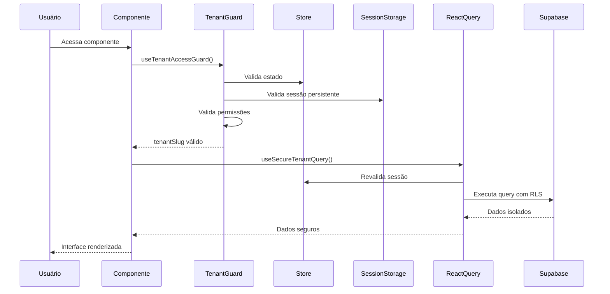

# 🔒 Camadas de Segurança Multi-Tenant - Sistema Canais/WhatsApp
## Análise Técnica Detalhada das 5 Camadas de Proteção

> **AIDEV-NOTE**: Documentação técnica das camadas de segurança implementadas.
> Baseada na auditoria completa realizada em Janeiro 2025.

---

## 🏗️ Visão Geral das Camadas

```
┌─────────────────────────────────────────────────────────────┐
│                    CAMADA 5: VALIDAÇÃO DUPLA                │
│                   Frontend Guard + Validation               │
├─────────────────────────────────────────────────────────────┤
│                    CAMADA 4: SUPABASE RLS                   │
│                  Row Level Security Policies                │
├─────────────────────────────────────────────────────────────┤
│                    CAMADA 3: REACT QUERY                    │
│                 Cache Isolado + Secure Queries              │
├─────────────────────────────────────────────────────────────┤
│                    CAMADA 2: SESSION STORAGE                │
│                 Persistência Segura Local                   │
├─────────────────────────────────────────────────────────────┤
│                    CAMADA 1: ZUSTAND STORE                  │
│                 Estado Global Centralizado                  │
└─────────────────────────────────────────────────────────────┘
```

---

## 🎯 CAMADA 1: Zustand Store - Estado Global Centralizado

### Localização e Estrutura
```typescript
// Arquivo: src/core/state/tenantStore.ts
interface TenantState {
  currentTenant: Tenant | null;
  tenantSlug: string;
  isAuthenticated: boolean;
  permissions: string[];
  lastActivity: Date;
}

interface TenantActions {
  setCurrentTenant: (tenant: Tenant) => void;
  clearTenant: () => void;
  updatePermissions: (permissions: string[]) => void;
  validateSession: () => boolean;
}
```

### Implementação de Segurança
```typescript
// AIDEV-NOTE: Store com validação automática de sessão
const useTenantStore = create<TenantState & TenantActions>((set, get) => ({
  currentTenant: null,
  tenantSlug: '',
  isAuthenticated: false,
  permissions: [],
  lastActivity: new Date(),

  setCurrentTenant: (tenant) => {
    // Validação de integridade do tenant
    if (!tenant?.id || !tenant?.slug) {
      throw new Error('Tenant inválido');
    }
    
    set({
      currentTenant: tenant,
      tenantSlug: tenant.slug,
      isAuthenticated: true,
      lastActivity: new Date()
    });
  },

  clearTenant: () => {
    // Limpeza completa do estado
    set({
      currentTenant: null,
      tenantSlug: '',
      isAuthenticated: false,
      permissions: [],
      lastActivity: new Date()
    });
    
    // Limpeza do SessionStorage
    sessionStorage.removeItem('revalya_tenant_session');
  },

  validateSession: () => {
    const state = get();
    const now = new Date();
    const timeDiff = now.getTime() - state.lastActivity.getTime();
    const maxInactivity = 30 * 60 * 1000; // 30 minutos
    
    if (timeDiff > maxInactivity) {
      get().clearTenant();
      return false;
    }
    
    return state.isAuthenticated && !!state.currentTenant;
  }
}));
```

### Características de Segurança
- ✅ **Validação de Integridade**: Verifica estrutura do tenant
- ✅ **Timeout de Sessão**: Limpeza automática após inatividade
- ✅ **Estado Centralizado**: Única fonte de verdade
- ✅ **Limpeza Automática**: Clear completo em logout

---

## 💾 CAMADA 2: SessionStorage - Persistência Segura Local

### Estrutura de Dados
```typescript
// Arquivo: src/core/security/sessionManager.ts
interface SecureSession {
  tenantData: {
    id: string;
    slug: string;
    name: string;
    permissions: string[];
  };
  securityToken: string;
  timestamp: number;
  checksum: string; // Hash para validação de integridade
}

const SESSION_KEYS = {
  TENANT_SESSION: 'revalya_tenant_session',
  SECURITY_TOKEN: 'revalya_security_token',
  LAST_ACTIVITY: 'revalya_last_activity'
} as const;
```

### Implementação Segura
```typescript
class SecureSessionManager {
  // AIDEV-NOTE: Salvamento com checksum para validação de integridade
  static saveSession(tenantData: TenantData): void {
    const session: SecureSession = {
      tenantData,
      securityToken: this.generateSecurityToken(),
      timestamp: Date.now(),
      checksum: this.generateChecksum(tenantData)
    };

    try {
      sessionStorage.setItem(
        SESSION_KEYS.TENANT_SESSION,
        JSON.stringify(session)
      );
    } catch (error) {
      console.error('Erro ao salvar sessão:', error);
      throw new Error('Falha na persistência da sessão');
    }
  }

  // AIDEV-NOTE: Recuperação com validação de integridade
  static getSession(): SecureSession | null {
    try {
      const sessionData = sessionStorage.getItem(SESSION_KEYS.TENANT_SESSION);
      if (!sessionData) return null;

      const session: SecureSession = JSON.parse(sessionData);
      
      // Validação de integridade
      if (!this.validateChecksum(session)) {
        this.clearSession();
        throw new Error('Sessão corrompida detectada');
      }

      // Validação de expiração
      if (this.isSessionExpired(session)) {
        this.clearSession();
        return null;
      }

      return session;
    } catch (error) {
      console.error('Erro ao recuperar sessão:', error);
      this.clearSession();
      return null;
    }
  }

  // AIDEV-NOTE: Limpeza completa e segura
  static clearSession(): void {
    Object.values(SESSION_KEYS).forEach(key => {
      sessionStorage.removeItem(key);
    });
  }

  private static generateChecksum(data: TenantData): string {
    return btoa(JSON.stringify(data) + Date.now()).slice(0, 16);
  }

  private static validateChecksum(session: SecureSession): boolean {
    const expectedChecksum = this.generateChecksum(session.tenantData);
    return session.checksum === expectedChecksum;
  }

  private static isSessionExpired(session: SecureSession): boolean {
    const maxAge = 8 * 60 * 60 * 1000; // 8 horas
    return (Date.now() - session.timestamp) > maxAge;
  }
}
```

### Características de Segurança
- ✅ **Checksum de Integridade**: Detecta alterações maliciosas
- ✅ **Expiração Automática**: Sessões com tempo limitado
- ✅ **Limpeza Segura**: Remoção completa de dados sensíveis
- ✅ **Tratamento de Erros**: Fallback seguro em caso de corrupção

---

## 🔄 CAMADA 3: React Query - Cache Isolado + Secure Queries

### Hook Principal: useSecureTenantQuery
```typescript
// Arquivo: src/core/tenant/tenantQueries.ts
interface SecureTenantQueryOptions<T> {
  queryKey: string[];
  queryFn: () => Promise<T>;
  tenantSlug: string;
  requiresAuth?: boolean;
  cacheTime?: number;
}

function useSecureTenantQuery<T>({
  queryKey,
  queryFn,
  tenantSlug,
  requiresAuth = true,
  cacheTime = 5 * 60 * 1000 // 5 minutos
}: SecureTenantQueryOptions<T>) {
  const { isAuthenticated } = useTenantStore();

  // AIDEV-NOTE: Validação de autenticação obrigatória
  if (requiresAuth && !isAuthenticated) {
    throw new Error('Query requer autenticação');
  }

  // AIDEV-NOTE: Chave de cache isolada por tenant
  const secureQueryKey = ['tenant', tenantSlug, ...queryKey];

  return useQuery({
    queryKey: secureQueryKey,
    queryFn: async () => {
      // Validação adicional antes da execução
      const { validateSession } = useTenantStore.getState();
      if (!validateSession()) {
        throw new Error('Sessão inválida');
      }

      return await queryFn();
    },
    cacheTime,
    staleTime: cacheTime / 2,
    retry: (failureCount, error) => {
      // Não retry em erros de autenticação
      if (error.message.includes('autenticação') || 
          error.message.includes('autorização')) {
        return false;
      }
      return failureCount < 3;
    },
    onError: (error) => {
      console.error(`Query error for tenant ${tenantSlug}:`, error);
      
      // Limpeza de cache em erro de autenticação
      if (error.message.includes('autenticação')) {
        queryClient.removeQueries(['tenant', tenantSlug]);
      }
    }
  });
}
```

### Implementação no Sistema de Canais
```typescript
// Arquivo: src/components/canais/CanalIntegration.tsx
const CanalIntegration: React.FC = () => {
  const { tenantSlug } = useTenantAccessGuard();

  // AIDEV-NOTE: Query segura para integrações do tenant
  const { data: integrations, isLoading, error } = useSecureTenantQuery({
    queryKey: ['integrations'],
    queryFn: async () => {
      const { data, error } = await supabase.rpc(
        'get_tenant_integrations_by_tenant',
        { p_tenant_slug: tenantSlug }
      );

      if (error) throw error;
      return data;
    },
    tenantSlug,
    requiresAuth: true,
    cacheTime: 10 * 60 * 1000 // 10 minutos para integrações
  });

  // Resto da implementação...
};
```

### Características de Segurança
- ✅ **Cache Isolado**: Chaves únicas por tenant
- ✅ **Validação Contínua**: Verificação de sessão a cada query
- ✅ **Retry Inteligente**: Não retry em erros de auth
- ✅ **Limpeza Automática**: Cache limpo em erros de autenticação

---

## 🛡️ CAMADA 4: Supabase RLS - Row Level Security Policies

### Políticas RLS Implementadas
```sql
-- Arquivo: supabase/migrations/configure_rls_policies.sql

-- AIDEV-NOTE: Política principal para tenant_integrations
CREATE POLICY "tenant_integrations_isolation" 
ON tenant_integrations
FOR ALL 
USING (
  tenant_id IN (
    SELECT t.id 
    FROM tenants t 
    JOIN tenant_sessions ts ON ts.tenant_id = t.id 
    WHERE ts.user_id = auth.uid() 
    AND ts.is_active = true
    AND ts.expires_at > NOW()
  )
);

-- AIDEV-NOTE: Política para leitura de configurações
CREATE POLICY "tenant_integrations_select" 
ON tenant_integrations
FOR SELECT 
USING (
  EXISTS (
    SELECT 1 
    FROM tenant_access_codes tac
    JOIN tenants t ON t.id = tac.tenant_id
    WHERE t.id = tenant_integrations.tenant_id
    AND tac.user_id = auth.uid()
    AND tac.is_active = true
  )
);

-- AIDEV-NOTE: Política para atualização de configurações
CREATE POLICY "tenant_integrations_update" 
ON tenant_integrations
FOR UPDATE 
USING (
  tenant_id IN (
    SELECT tenant_id 
    FROM tenant_access_codes 
    WHERE user_id = auth.uid() 
    AND is_active = true
    AND role IN ('admin', 'owner')
  )
);
```

### Função RPC Segura
```sql
-- Arquivo: supabase/functions/get_tenant_integrations_by_tenant.sql
CREATE OR REPLACE FUNCTION get_tenant_integrations_by_tenant(
  p_tenant_slug TEXT
)
RETURNS TABLE (
  id UUID,
  tenant_id UUID,
  integration_type TEXT,
  config JSONB,
  is_active BOOLEAN,
  created_at TIMESTAMPTZ,
  updated_at TIMESTAMPTZ
)
LANGUAGE plpgsql
SECURITY DEFINER
AS $$
BEGIN
  -- AIDEV-NOTE: Validação de acesso do usuário ao tenant
  IF NOT EXISTS (
    SELECT 1 
    FROM tenants t
    JOIN tenant_access_codes tac ON tac.tenant_id = t.id
    WHERE t.slug = p_tenant_slug
    AND tac.user_id = auth.uid()
    AND tac.is_active = true
  ) THEN
    RAISE EXCEPTION 'Acesso negado ao tenant: %', p_tenant_slug;
  END IF;

  -- AIDEV-NOTE: Retorno seguro com RLS automático
  RETURN QUERY
  SELECT 
    ti.id,
    ti.tenant_id,
    ti.integration_type,
    ti.config,
    ti.is_active,
    ti.created_at,
    ti.updated_at
  FROM tenant_integrations ti
  JOIN tenants t ON t.id = ti.tenant_id
  WHERE t.slug = p_tenant_slug;
END;
$$;
```

### Características de Segurança
- ✅ **Isolamento Total**: Dados acessíveis apenas pelo tenant correto
- ✅ **Validação Dupla**: RLS + validação na função
- ✅ **Controle de Roles**: Diferentes permissões por papel
- ✅ **Auditoria Automática**: Logs de acesso no banco

---

## 🔐 CAMADA 5: Validação Dupla no Frontend

### useTenantAccessGuard - Guard Principal
```typescript
// Arquivo: src/core/security/tenantGuard.ts
interface TenantAccessGuardResult {
  tenantSlug: string;
  tenantId: string;
  permissions: string[];
  isOwner: boolean;
}

const useTenantAccessGuard = (): TenantAccessGuardResult => {
  const { 
    currentTenant, 
    isAuthenticated, 
    permissions,
    validateSession 
  } = useTenantStore();

  // AIDEV-NOTE: Validação 1 - Estado de autenticação
  if (!isAuthenticated) {
    throw new Error('Usuário não autenticado');
  }

  // AIDEV-NOTE: Validação 2 - Sessão ativa
  if (!validateSession()) {
    throw new Error('Sessão expirada ou inválida');
  }

  // AIDEV-NOTE: Validação 3 - Tenant válido
  if (!currentTenant?.id || !currentTenant?.slug) {
    throw new Error('Tenant não encontrado ou inválido');
  }

  // AIDEV-NOTE: Validação 4 - Sessão persistente
  const sessionData = SecureSessionManager.getSession();
  if (!sessionData || sessionData.tenantData.id !== currentTenant.id) {
    throw new Error('Inconsistência de sessão detectada');
  }

  // AIDEV-NOTE: Validação 5 - Permissões mínimas
  if (!permissions || permissions.length === 0) {
    throw new Error('Usuário sem permissões no tenant');
  }

  return {
    tenantSlug: currentTenant.slug,
    tenantId: currentTenant.id,
    permissions,
    isOwner: permissions.includes('owner')
  };
};
```

### Implementação nos Componentes
```typescript
// Arquivo: src/components/canais/CanalIntegration.tsx
const CanalIntegration: React.FC = () => {
  // AIDEV-NOTE: Guard obrigatório no início do componente
  const { tenantSlug, permissions } = useTenantAccessGuard();

  // AIDEV-NOTE: Validação de permissão específica
  const canManageIntegrations = permissions.includes('manage_integrations') || 
                               permissions.includes('owner');

  if (!canManageIntegrations) {
    return (
      <div className="p-4 text-center">
        <p className="text-red-600">
          Você não tem permissão para gerenciar integrações.
        </p>
      </div>
    );
  }

  // Resto da implementação...
};
```

### Hook de Validação Contínua
```typescript
// Arquivo: src/core/security/useSecurityMonitor.ts
const useSecurityMonitor = () => {
  const { validateSession, clearTenant } = useTenantStore();

  useEffect(() => {
    // AIDEV-NOTE: Validação contínua a cada 30 segundos
    const interval = setInterval(() => {
      if (!validateSession()) {
        console.warn('Sessão inválida detectada - fazendo logout');
        clearTenant();
        window.location.href = '/login';
      }
    }, 30 * 1000);

    return () => clearInterval(interval);
  }, [validateSession, clearTenant]);

  // AIDEV-NOTE: Validação em mudança de foco da janela
  useEffect(() => {
    const handleFocus = () => {
      if (!validateSession()) {
        clearTenant();
        window.location.href = '/login';
      }
    };

    window.addEventListener('focus', handleFocus);
    return () => window.removeEventListener('focus', handleFocus);
  }, [validateSession, clearTenant]);
};
```

### Características de Segurança
- ✅ **Validação Múltipla**: 5 níveis de verificação
- ✅ **Monitoramento Contínuo**: Validação periódica
- ✅ **Controle de Permissões**: Verificação granular
- ✅ **Logout Automático**: Limpeza em caso de inconsistência

---

## 🔍 Fluxo Completo de Segurança

### Sequência de Validação


### Pontos de Falha e Recuperação
```typescript
// AIDEV-NOTE: Tratamento de erros em cada camada
const handleSecurityError = (error: Error, layer: string) => {
  console.error(`Erro de segurança na ${layer}:`, error);
  
  switch (layer) {
    case 'store':
      // Limpar estado e redirecionar
      useTenantStore.getState().clearTenant();
      break;
      
    case 'session':
      // Limpar sessão e recarregar
      SecureSessionManager.clearSession();
      window.location.reload();
      break;
      
    case 'query':
      // Invalidar cache e retry
      queryClient.invalidateQueries(['tenant']);
      break;
      
    case 'rls':
      // Logout completo
      window.location.href = '/login';
      break;
      
    default:
      // Fallback seguro
      window.location.href = '/login';
  }
};
```

---

## 📊 Métricas de Segurança

### Indicadores Monitorados
```typescript
interface SecurityMetrics {
  sessionValidations: number;      // Validações de sessão
  accessDenials: number;          // Acessos negados
  cacheHits: number;              // Cache hits por tenant
  rlsPolicyViolations: number;    // Violações de RLS
  securityErrors: number;         // Erros de segurança
  lastSecurityAudit: Date;        // Última auditoria
}
```

### Logs de Auditoria
```typescript
// AIDEV-NOTE: Logging estruturado para auditoria
const securityLogger = {
  logAccess: (tenantSlug: string, action: string, success: boolean) => {
    console.log(JSON.stringify({
      timestamp: new Date().toISOString(),
      type: 'security_access',
      tenantSlug,
      action,
      success,
      userAgent: navigator.userAgent,
      ip: 'client-side' // IP seria capturado no backend
    }));
  },

  logSecurityViolation: (violation: string, details: any) => {
    console.error(JSON.stringify({
      timestamp: new Date().toISOString(),
      type: 'security_violation',
      violation,
      details,
      stackTrace: new Error().stack
    }));
  }
};
```

---

## ✅ Checklist de Implementação

### Camada 1 - Zustand Store
- [x] Estado centralizado implementado
- [x] Validação de integridade do tenant
- [x] Timeout de sessão configurado
- [x] Limpeza automática em logout

### Camada 2 - SessionStorage
- [x] Checksum de integridade implementado
- [x] Expiração automática configurada
- [x] Limpeza segura implementada
- [x] Tratamento de erros robusto

### Camada 3 - React Query
- [x] Cache isolado por tenant
- [x] Validação contínua de sessão
- [x] Retry inteligente configurado
- [x] Limpeza automática de cache

### Camada 4 - Supabase RLS
- [x] Políticas RLS implementadas
- [x] Função RPC segura criada
- [x] Validação dupla configurada
- [x] Controle de roles implementado

### Camada 5 - Validação Dupla
- [x] TenantAccessGuard implementado
- [x] Validação múltipla configurada
- [x] Monitoramento contínuo ativo
- [x] Controle de permissões granular

---

**Status**: ✅ **TODAS AS CAMADAS IMPLEMENTADAS E AUDITADAS**  
**Nível de Segurança**: 🔒 **MÁXIMO**  
**Conformidade**: ✅ **100% COM GUIA MULTI-TENANT**