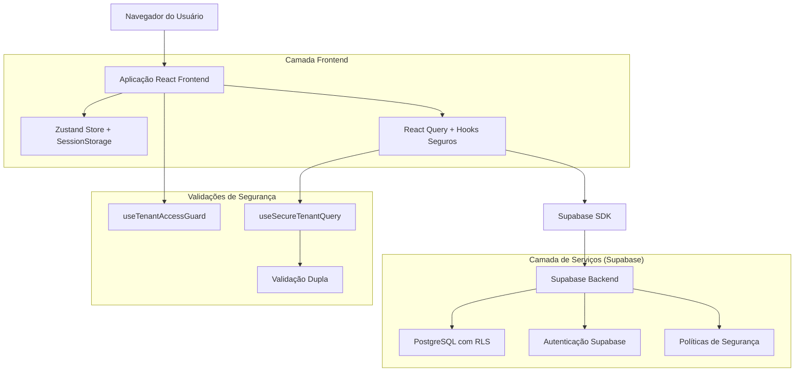
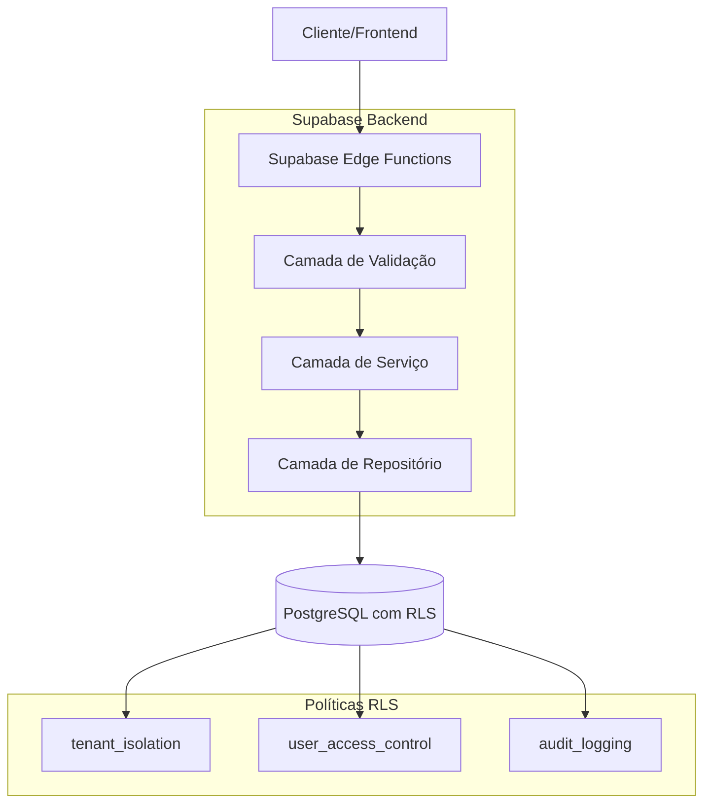
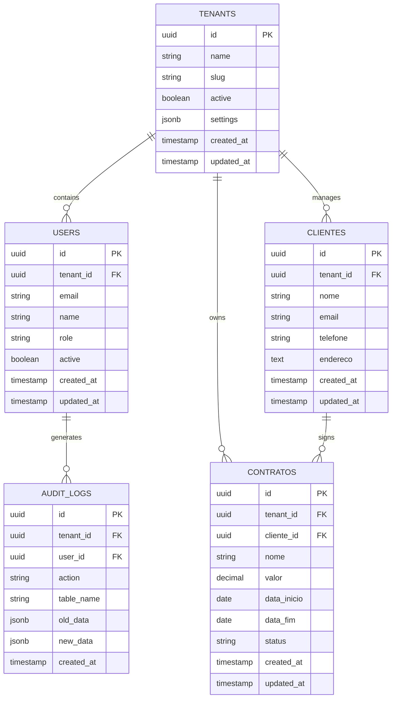

# Arquitetura Técnica - Sistema Multi-Tenant Seguro

## 1. Design da Arquitetura



## 2. Descrição das Tecnologias

- **Frontend**: React@18 + TypeScript + Vite + TailwindCSS@3
- **Estado Global**: Zustand + SessionStorage
- **Cache e Queries**: React Query (TanStack Query)
- **Backend**: Supabase (PostgreSQL + Auth + RLS)
- **Validação**: Zod + React Hook Form
- **Roteamento**: React Router v6

## 3. Definições de Rotas

| Rota | Propósito |
|------|----------|
| `/login` | Página de autenticação com seleção de tenant |
| `/dashboard` | Dashboard principal com métricas e seletor de tenant |
| `/contratos` | Gestão de contratos isolados por tenant |
| `/contratos/:id` | Detalhes e edição de contrato específico |
| `/clientes` | Gestão de clientes com isolamento completo |
| `/clientes/:id` | Perfil e edição de cliente específico |
| `/relatorios` | Geração de relatórios filtrados por tenant |
| `/configuracoes` | Configurações de segurança e logs de auditoria |
| `/configuracoes/usuarios` | Gerenciamento de usuários do tenant |
| `/configuracoes/logs` | Visualização de logs de auditoria |

## 4. Definições de API

### 4.1 APIs Principais

**Autenticação e Tenant**
```typescript
// Supabase Auth + Custom Functions
POST /auth/v1/token
GET /rest/v1/user_tenants
POST /rest/v1/rpc/switch_tenant
```

**Contratos**
```typescript
GET /rest/v1/contratos
```

Request Headers:
| Nome | Tipo | Obrigatório | Descrição |
|------|------|-------------|----------|
| Authorization | string | true | Bearer token do Supabase |
| apikey | string | true | Chave pública do Supabase |
| tenant-context | string | true | ID do tenant atual |

Response:
| Nome | Tipo | Descrição |
|------|------|----------|
| data | array | Lista de contratos do tenant |
| count | number | Total de registros |

Exemplo:
```json
{
  "data": [
    {
      "id": "uuid-contrato",
      "tenant_id": "uuid-tenant",
      "nome": "Contrato ABC",
      "valor": 10000,
      "created_at": "2024-01-01T00:00:00Z"
    }
  ],
  "count": 1
}
```

**Clientes**
```typescript
GET /rest/v1/clientes
POST /rest/v1/clientes
PATCH /rest/v1/clientes
DELETE /rest/v1/clientes
```

Request (POST/PATCH):
| Nome | Tipo | Obrigatório | Descrição |
|------|------|-------------|----------|
| nome | string | true | Nome do cliente |
| email | string | true | Email do cliente |
| telefone | string | false | Telefone de contato |
| tenant_id | string | true | ID do tenant (automático) |

**Relatórios**
```typescript
POST /rest/v1/rpc/generate_report
```

Request:
| Nome | Tipo | Obrigatório | Descrição |
|------|------|-------------|----------|
| report_type | string | true | Tipo do relatório |
| date_from | string | true | Data inicial (ISO) |
| date_to | string | true | Data final (ISO) |
| tenant_id | string | true | ID do tenant |

### 4.2 Hooks Seguros Customizados

**useSecureTenantQuery**
```typescript
interface SecureTenantQueryOptions<T> {
  queryKey: (string | number)[];
  queryFn: (supabase: SupabaseClient, tenantId: string) => Promise<T>;
  enabled?: boolean;
}

function useSecureTenantQuery<T>(
  options: SecureTenantQueryOptions<T>
): UseQueryResult<T>
```

**useTenantAccessGuard**
```typescript
interface TenantAccessGuardResult {
  hasAccess: boolean;
  accessError: string | null;
  currentTenant: Tenant | null;
  isLoading: boolean;
}

function useTenantAccessGuard(): TenantAccessGuardResult
```

## 5. Arquitetura do Servidor



## 6. Modelo de Dados

### 6.1 Definição do Modelo de Dados



### 6.2 Linguagem de Definição de Dados (DDL)

**Tabela de Tenants**
```sql
-- Criar tabela de tenants
CREATE TABLE tenants (
    id UUID PRIMARY KEY DEFAULT gen_random_uuid(),
    name VARCHAR(255) NOT NULL,
    slug VARCHAR(100) UNIQUE NOT NULL,
    active BOOLEAN DEFAULT true,
    settings JSONB DEFAULT '{}',
    created_at TIMESTAMP WITH TIME ZONE DEFAULT NOW(),
    updated_at TIMESTAMP WITH TIME ZONE DEFAULT NOW()
);

-- Índices
CREATE INDEX idx_tenants_slug ON tenants(slug);
CREATE INDEX idx_tenants_active ON tenants(active);
```

**Tabela de Usuários**
```sql
-- Criar tabela de usuários
CREATE TABLE users (
    id UUID PRIMARY KEY DEFAULT gen_random_uuid(),
    tenant_id UUID NOT NULL REFERENCES tenants(id) ON DELETE CASCADE,
    email VARCHAR(255) UNIQUE NOT NULL,
    name VARCHAR(255) NOT NULL,
    role VARCHAR(50) DEFAULT 'USER' CHECK (role IN ('ADMIN', 'USER', 'VIEWER')),
    active BOOLEAN DEFAULT true,
    created_at TIMESTAMP WITH TIME ZONE DEFAULT NOW(),
    updated_at TIMESTAMP WITH TIME ZONE DEFAULT NOW()
);

-- Índices
CREATE INDEX idx_users_tenant_id ON users(tenant_id);
CREATE INDEX idx_users_email ON users(email);
CREATE INDEX idx_users_role ON users(role);
```

**Tabela de Contratos**
```sql
-- Criar tabela de contratos
CREATE TABLE contratos (
    id UUID PRIMARY KEY DEFAULT gen_random_uuid(),
    tenant_id UUID NOT NULL REFERENCES tenants(id) ON DELETE CASCADE,
    cliente_id UUID REFERENCES clientes(id) ON DELETE SET NULL,
    nome VARCHAR(255) NOT NULL,
    valor DECIMAL(15,2) NOT NULL,
    data_inicio DATE NOT NULL,
    data_fim DATE,
    status VARCHAR(50) DEFAULT 'ATIVO' CHECK (status IN ('ATIVO', 'INATIVO', 'CANCELADO')),
    created_at TIMESTAMP WITH TIME ZONE DEFAULT NOW(),
    updated_at TIMESTAMP WITH TIME ZONE DEFAULT NOW()
);

-- Índices
CREATE INDEX idx_contratos_tenant_id ON contratos(tenant_id);
CREATE INDEX idx_contratos_cliente_id ON contratos(cliente_id);
CREATE INDEX idx_contratos_status ON contratos(status);
CREATE INDEX idx_contratos_data_inicio ON contratos(data_inicio);
```

**Tabela de Clientes**
```sql
-- Criar tabela de clientes
CREATE TABLE clientes (
    id UUID PRIMARY KEY DEFAULT gen_random_uuid(),
    tenant_id UUID NOT NULL REFERENCES tenants(id) ON DELETE CASCADE,
    nome VARCHAR(255) NOT NULL,
    email VARCHAR(255),
    telefone VARCHAR(20),
    endereco TEXT,
    created_at TIMESTAMP WITH TIME ZONE DEFAULT NOW(),
    updated_at TIMESTAMP WITH TIME ZONE DEFAULT NOW()
);

-- Índices
CREATE INDEX idx_clientes_tenant_id ON clientes(tenant_id);
CREATE INDEX idx_clientes_email ON clientes(email);
CREATE INDEX idx_clientes_nome ON clientes(nome);
```

**Tabela de Logs de Auditoria**
```sql
-- Criar tabela de logs de auditoria
CREATE TABLE audit_logs (
    id UUID PRIMARY KEY DEFAULT gen_random_uuid(),
    tenant_id UUID NOT NULL REFERENCES tenants(id) ON DELETE CASCADE,
    user_id UUID REFERENCES users(id) ON DELETE SET NULL,
    action VARCHAR(50) NOT NULL,
    table_name VARCHAR(100) NOT NULL,
    record_id UUID,
    old_data JSONB,
    new_data JSONB,
    ip_address INET,
    user_agent TEXT,
    created_at TIMESTAMP WITH TIME ZONE DEFAULT NOW()
);

-- Índices
CREATE INDEX idx_audit_logs_tenant_id ON audit_logs(tenant_id);
CREATE INDEX idx_audit_logs_user_id ON audit_logs(user_id);
CREATE INDEX idx_audit_logs_action ON audit_logs(action);
CREATE INDEX idx_audit_logs_created_at ON audit_logs(created_at DESC);
```

**Políticas RLS (Row Level Security)**
```sql
-- Habilitar RLS em todas as tabelas
ALTER TABLE tenants ENABLE ROW LEVEL SECURITY;
ALTER TABLE users ENABLE ROW LEVEL SECURITY;
ALTER TABLE contratos ENABLE ROW LEVEL SECURITY;
ALTER TABLE clientes ENABLE ROW LEVEL SECURITY;
ALTER TABLE audit_logs ENABLE ROW LEVEL SECURITY;

-- Função para obter tenant_id do usuário atual
CREATE OR REPLACE FUNCTION get_current_tenant_id()
RETURNS UUID AS $$
BEGIN
    RETURN (auth.jwt() ->> 'tenant_id')::UUID;
EXCEPTION
    WHEN OTHERS THEN
        RETURN NULL;
END;
$$ LANGUAGE plpgsql SECURITY DEFINER;

-- Políticas de isolamento por tenant
CREATE POLICY "tenant_isolation_users" ON users
    FOR ALL USING (tenant_id = get_current_tenant_id());

CREATE POLICY "tenant_isolation_contratos" ON contratos
    FOR ALL USING (tenant_id = get_current_tenant_id());

CREATE POLICY "tenant_isolation_clientes" ON clientes
    FOR ALL USING (tenant_id = get_current_tenant_id());

CREATE POLICY "tenant_isolation_audit_logs" ON audit_logs
    FOR ALL USING (tenant_id = get_current_tenant_id());

-- Política para tenants (apenas leitura do próprio tenant)
CREATE POLICY "tenant_self_access" ON tenants
    FOR SELECT USING (id = get_current_tenant_id());

-- Permissões básicas
GRANT SELECT ON tenants TO anon, authenticated;
GRANT ALL PRIVILEGES ON users TO authenticated;
GRANT ALL PRIVILEGES ON contratos TO authenticated;
GRANT ALL PRIVILEGES ON clientes TO authenticated;
GRANT ALL PRIVILEGES ON audit_logs TO authenticated;
```

**Dados Iniciais**
```sql
-- Inserir tenant de exemplo
INSERT INTO tenants (name, slug, active) VALUES
('Empresa Exemplo', 'empresa-exemplo', true),
('Acme Corporation', 'acme-corp', true);

-- Inserir usuários de exemplo
INSERT INTO users (tenant_id, email, name, role) VALUES
((SELECT id FROM tenants WHERE slug = 'empresa-exemplo'), 'admin@exemplo.com', 'Admin Exemplo', 'ADMIN'),
((SELECT id FROM tenants WHERE slug = 'acme-corp'), 'admin@acme.com', 'Admin Acme', 'ADMIN');
```