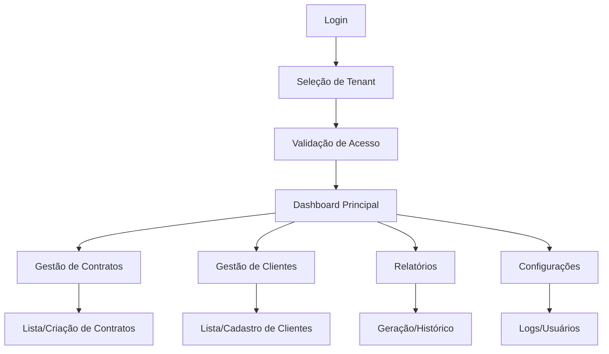

# PRD - Sistema Multi-Tenant Seguro

## 1. Visão Geral do Produto

Sistema de gestão empresarial multi-tenant com arquitetura de segurança em 5 camadas, garantindo isolamento completo de dados entre diferentes empresas/organizações. O produto resolve o problema crítico de vazamento de dados entre tenants através de validações múltiplas e padrões obrigatórios de desenvolvimento.

O sistema atende empresas que precisam de uma solução SaaS segura, onde cada tenant (empresa) tem acesso exclusivo aos seus próprios dados, com zero possibilidade de cross-contamination.

## 2. Funcionalidades Principais

### 2.1 Papéis de Usuário

| Papel | Método de Registro | Permissões Principais |
|-------|-------------------|----------------------|
| Admin do Tenant | Convite por email + validação | Acesso total aos dados do tenant, gerenciamento de usuários |
| Usuário Padrão | Convite do admin + aprovação | Acesso limitado aos módulos autorizados do tenant |
| Super Admin | Acesso direto do sistema | Gerenciamento de tenants e monitoramento de segurança |

### 2.2 Módulos Funcionais

Nosso sistema multi-tenant consiste nas seguintes páginas principais:

1. **Dashboard Principal**: visão geral dos dados do tenant, métricas de segurança, seletor de tenant
2. **Gestão de Contratos**: listagem, criação e edição de contratos isolados por tenant
3. **Gestão de Clientes**: cadastro e gerenciamento de clientes com isolamento completo
4. **Relatórios**: geração de relatórios filtrados automaticamente por tenant
5. **Configurações de Segurança**: logs de auditoria, configurações de acesso, monitoramento
6. **Autenticação**: login/registro com seleção de tenant e validação de acesso

### 2.3 Detalhes das Páginas

| Nome da Página | Nome do Módulo | Descrição da Funcionalidade |
|----------------|----------------|-----------------------------|
| Dashboard Principal | Seletor de Tenant | Permitir troca segura entre tenants disponíveis para o usuário |
| Dashboard Principal | Métricas de Segurança | Exibir logs de auditoria e tentativas de acesso |
| Dashboard Principal | Visão Geral | Mostrar resumo dos dados do tenant atual com validação dupla |
| Gestão de Contratos | Lista de Contratos | Listar contratos filtrados por tenant_id com validação de segurança |
| Gestão de Contratos | Criação/Edição | Criar e editar contratos com tenant_id obrigatório e validação |
| Gestão de Clientes | Lista de Clientes | Exibir clientes do tenant com hooks seguros e cache isolado |
| Gestão de Clientes | Cadastro | Cadastrar novos clientes com tenant_id automático |
| Relatórios | Geração de Relatórios | Gerar relatórios com filtros automáticos por tenant |
| Relatórios | Histórico | Visualizar relatórios anteriores com isolamento por tenant |
| Configurações | Logs de Auditoria | Visualizar logs de acesso e operações por tenant |
| Configurações | Gerenciamento de Usuários | Gerenciar usuários do tenant com validação de permissões |
| Autenticação | Login | Autenticar usuário e carregar tenants disponíveis |
| Autenticação | Seleção de Tenant | Permitir escolha do tenant após login com validação |

## 3. Processo Principal

### Fluxo do Usuário Admin:
1. Login no sistema com credenciais
2. Seleção do tenant (empresa) para trabalhar
3. Validação de acesso e carregamento do contexto seguro
4. Navegação entre módulos com isolamento automático
5. Operações CRUD com validação dupla de tenant_id
6. Logout com limpeza completa do estado

### Fluxo do Usuário Padrão:
1. Login com credenciais limitadas
2. Acesso automático ao tenant designado
3. Navegação restrita aos módulos autorizados
4. Operações limitadas com auditoria completa



## 4. Design da Interface

### 4.1 Estilo de Design

- **Cores Primárias**: #2563eb (azul principal), #dc2626 (vermelho para alertas de segurança)
- **Cores Secundárias**: #64748b (cinza), #10b981 (verde para sucesso)
- **Estilo de Botões**: Arredondados com sombra sutil, estados hover bem definidos
- **Fonte**: Inter, tamanhos 14px (corpo), 16px (títulos), 12px (labels)
- **Layout**: Card-based com navegação superior, sidebar para seleção de tenant
- **Ícones**: Lucide React com estilo minimalista, ícones de segurança em destaque

### 4.2 Visão Geral do Design das Páginas

| Nome da Página | Nome do Módulo | Elementos da UI |
|----------------|----------------|----------------|
| Dashboard Principal | Seletor de Tenant | Dropdown com logo da empresa, indicador visual do tenant ativo |
| Dashboard Principal | Métricas | Cards com números grandes, gráficos de linha para tendências |
| Gestão de Contratos | Lista | Tabela responsiva com filtros, botões de ação por linha |
| Gestão de Contratos | Formulário | Layout em duas colunas, validação em tempo real |
| Configurações | Logs | Tabela com timestamps, filtros por tipo de evento |
| Autenticação | Login | Formulário centralizado, logo da empresa, campos com validação |

### 4.3 Responsividade

Desktop-first com adaptação completa para mobile. Otimização para touch em tablets, com navegação por gestos para troca de tenant em dispositivos móveis.

## 5. Arquitetura de Segurança

### 5.1 Camadas de Segurança

**CAMADA 1: Zustand Store (Estado Global)**
```typescript
interface TenantState {
  currentTenant: Tenant | null;
  availableTenants: Tenant[];
  userRole: string | null;
  isLoading: boolean;
}
```

**CAMADA 2: SessionStorage (Isolamento por Aba)**
```typescript
sessionStorage.setItem('tenant_context', JSON.stringify({
  tenantId: 'uuid-tenant',
  tenantSlug: 'empresa-abc',
  userRole: 'ADMIN',
  expiresAt: timestamp
}));
```

**CAMADA 3: React Query (Cache Isolado)**
```typescript
queryKey: ['contratos', currentTenant?.id] // SEMPRE incluir tenant_id
```

**CAMADA 4: Supabase RLS (Row Level Security)**
```sql
CREATE POLICY "tenant_isolation" ON contratos
FOR ALL USING (tenant_id = get_current_tenant_id());
```

**CAMADA 5: Validação Dupla no Frontend**
```typescript
// Validar antes da query E depois do resultado
if (!currentTenant?.id) throw new Error('Tenant não definido');
const invalidData = data?.filter(item => item.tenant_id !== tenantId);
if (invalidData?.length > 0) throw new Error('Violação de segurança');
```

### 5.2 Padrões Obrigatórios

#### Hook Seguro Obrigatório
```typescript
// ✅ CORRETO
const { data } = useSecureTenantQuery(['contratos'],
  async (supabase, tenantId) => {
    return supabase.from('contratos').select('*').eq('tenant_id', tenantId);
  }
);

// ❌ INCORRETO - RISCO DE VAZAMENTO
const { data } = useQuery(['contratos'], () =>
  supabase.from('contratos').select('*') // SEM FILTRO DE TENANT
);
```

#### Validações Obrigatórias
```typescript
export function ContratosPage() {
  const { hasAccess, accessError, currentTenant } = useTenantAccessGuard();
  
  // 🛡 VALIDAÇÃO CRÍTICA ANTES DE RENDERIZAR
  if (!hasAccess) {
    return <div>Erro: {accessError}</div>;
  }
  
  // 🔍 AUDIT LOG OBRIGATÓRIO
  console.log(`[AUDIT] Acessando contratos - Tenant: ${currentTenant.name}`);
  
  // Resto da implementação...
}
```

### 5.3 Template de Implementação

```typescript
export function MinhaPage() {
  // 1. VALIDAÇÃO DE ACESSO (OBRIGATÓRIO)
  const { hasAccess, accessError, currentTenant } = useTenantAccessGuard();
  
  // 2. HOOK SEGURO PARA DADOS (OBRIGATÓRIO)
  const { data, isLoading } = useSecureTenantQuery(['meus-dados'],
    async (supabase, tenantId) => {
      return supabase.from('tabela').select('*').eq('tenant_id', tenantId);
    }
  );
  
  // 3. GUARD CLAUSE (OBRIGATÓRIO)
  if (!hasAccess) return <div>Erro: {accessError}</div>;
  
  // 4. AUDIT LOG (RECOMENDADO)
  useEffect(() => {
    console.log(`[AUDIT] Página acessada - Tenant: ${currentTenant.name}`);
  }, [currentTenant]);
  
  // 5. RENDERIZAÇÃO SEGURA
  return (
    <div>
      <h1>Dados de {currentTenant.name}</h1>
      {/* Implementação da página */}
    </div>
  );
}
```

## 6. Checklist de Segurança

### Antes de Implementar Qualquer Página:

- [ ] Usar `useTenantAccessGuard()` para validação inicial
- [ ] Usar `useSecureTenantQuery()` para todas as consultas
- [ ] Incluir `tenant_id` em todas as query keys
- [ ] Validar dados retornados pertencem ao tenant correto
- [ ] Adicionar logs de auditoria em operações críticas
- [ ] Testar isolamento com múltiplos tenants

### Validações Críticas em Toda Query:

```typescript
// 1. Validação antes da query
if (!currentTenant?.id) throw new Error('Tenant não definido');
if (!currentTenant.active) throw new Error('Tenant inativo');

// 2. Filtro obrigatório na query
.eq('tenant_id', tenantId)

// 3. Validação após receber dados
const invalidData = data?.filter(item => item.tenant_id !== tenantId);
if (invalidData?.length > 0) throw new Error('Violação de segurança');
```

## 7. Monitoramento e Auditoria

### Logs Obrigatórios:
- Acesso a páginas sensíveis
- Consultas de dados por tenant
- Mutações (criar/editar/deletar)
- Tentativas de acesso negado
- Trocas de tenant

### Métricas de Segurança:
- Tentativas de acesso cross-tenant
- Queries sem filtro de tenant_id
- Dados retornados de tenant incorreto
- Falhas de validação

## 8. Erros Críticos a Evitar

1. **Query sem tenant_id**: Risco de vazamento total
2. **Cache compartilhado**: Dados de um tenant aparecem para outro
3. **Validação única**: Sempre validar antes E depois
4. **Mutação sem filtro**: Pode alterar dados de outro tenant
5. **Estado global contaminado**: Limpar ao trocar tenant

## 9. Arquivos Críticos

- `useSecureTenantQuery.ts` - Template obrigatório para consultas
- `useTenantAccessGuard.ts` - Validação de acesso
- `tenantStore.ts` - Estado global do tenant
- Todas as páginas devem seguir o template de segurança

**REGRA DE OURO: Se não tem tenant_id na query, NÃO PODE ser executada!**