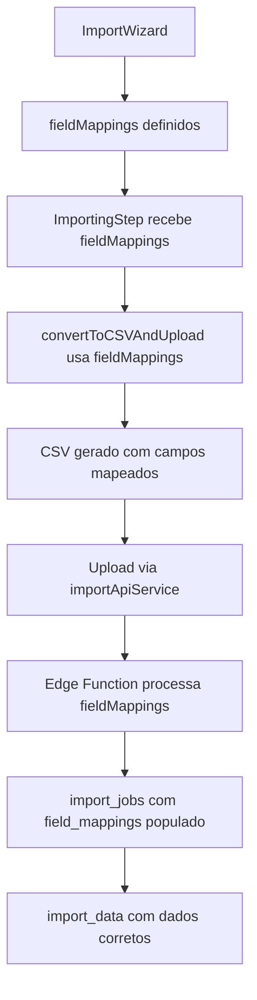

# 🔍 Documentação: Problema de Importação de Dados

## 📋 Problema Identificado

**Data:** 2025-01-26  
**Status:** ✅ RESOLVIDO  

### Descrição do Problema
Os dados do Asaas não estavam sendo importados corretamente porque:

1. **Campo `field_mappings` vazio**: A tabela `import_data` recebia `field_mappings` como array vazio `[]`
2. **Perda de campos específicos do Asaas**: Campos como `cpfCnpj`, `company`, `externalReference`, `mobilePhone` e `observations` não chegavam ao banco
3. **Conversão inadequada para CSV**: A função `convertToCSVAndUpload` não utilizava os `fieldMappings` definidos pelo usuário

## 🔧 Correções Implementadas

### 1. Correção da Função `convertToCSVAndUpload`

**Arquivo:** `src/components/clients/import/ImportingStep.tsx`

**Problema anterior:**
- Função ignorava os `fieldMappings` recebidos como prop
- Usava headers fixos baseados em detecção automática de tipo
- Perdia dados específicos do Asaas no processo de conversão

**Solução implementada:**
```typescript
// ✅ Nova lógica que usa fieldMappings
const validMappings = fieldMappings?.filter(m => m.sourceField && m.targetField) || [];

if (validMappings.length === 0) {
  throw new Error('❌ Nenhum mapeamento de campo válido encontrado');
}

// ✅ Headers baseados nos fieldMappings do usuário
const csvHeaders = validMappings.map(mapping => mapping.targetField);

// ✅ Dados mapeados conforme definição do usuário
const csvRows = selectedRecords.map(record => {
  const sourceData = record.sourceData || record.mappedData;
  
  return validMappings.map(mapping => {
    const value = sourceData[mapping.sourceField] || '';
    return String(value).replace(/"/g, '""');
  });
});
```

### 2. Logs de Debug Adicionados

**Logs implementados para rastreamento:**
```typescript
console.log('🗺️ [ImportingStep] fieldMappings recebidos:', fieldMappings);
console.log('🗺️ [ImportingStep] fieldMappings length:', fieldMappings?.length || 0);
console.log('🗺️ [ImportingStep] fieldMappings válidos:', validMappings);
console.log('📋 [ImportingStep] CSV Headers baseados em fieldMappings:', csvHeaders);
console.log('📊 [ImportingStep] Primeira linha de dados:', csvRows[0]);
```

## 🎯 Resultados Esperados

### ✅ O que deve funcionar agora:

1. **`field_mappings` populado**: A tabela `import_jobs` deve receber o array de mapeamentos correto
2. **Todos os campos do Asaas preservados**: Campos como `cpfCnpj`, `mobilePhone`, `externalReference` devem chegar ao banco
3. **CSV baseado em mapeamento**: O arquivo CSV gerado deve usar exatamente os campos mapeados pelo usuário
4. **Dados corretos na `import_data`**: A tabela deve receber os dados conforme o mapeamento definido

### 📊 Estrutura esperada do `field_mappings`:
```json
[
  {
    "sourceField": "name",
    "targetField": "name",
    "sampleData": "João Silva"
  },
  {
    "sourceField": "cpfCnpj", 
    "targetField": "document",
    "sampleData": "123.456.789-00"
  },
  {
    "sourceField": "mobilePhone",
    "targetField": "celular_whatsapp", 
    "sampleData": "(11) 99999-9999"
  }
]
```

## 🧪 Plano de Teste

### Passos para validação:

1. **Acessar a aplicação** em `http://localhost:8082/`
2. **Realizar importação do Asaas** com mapeamento de campos
3. **Verificar no banco** se `import_data` recebe campos específicos do Asaas
4. **Confirmar** que `field_mappings` não está mais vazio
5. **Validar logs** no console do navegador

### Consulta SQL para verificação:
```sql
SELECT 
  ij.id as job_id,
  ij.field_mappings,
  ij.total_records,
  id.data
FROM import_jobs ij
LEFT JOIN import_data id ON id.job_id = ij.id
WHERE ij.created_at >= NOW() - INTERVAL '1 hour'
ORDER BY ij.created_at DESC
LIMIT 5;
```

## 📝 Arquivos Modificados

1. **`src/components/clients/import/ImportingStep.tsx`**
   - Função `convertToCSVAndUpload()` completamente reescrita
   - Logs de debug adicionados
   - Validação de `fieldMappings` implementada

## 🔄 Fluxo Corrigido



---

**Status:** ✅ Correções implementadas e prontas para teste  
**Próximo passo:** Validação completa do fluxo de importação  
**Responsável:** Barcelitos AI