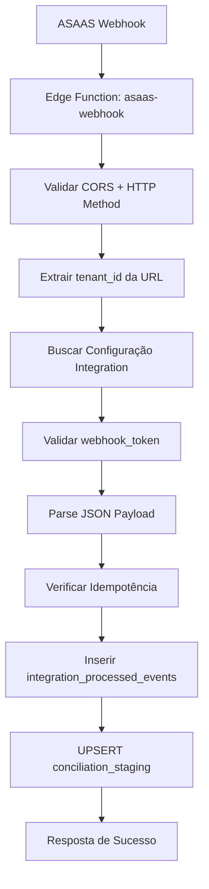
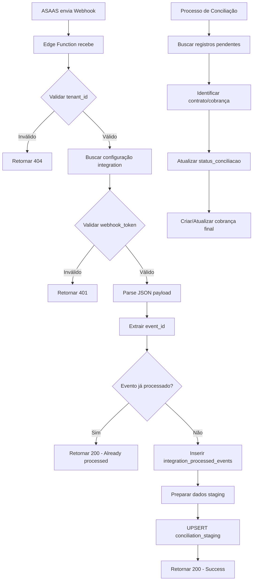
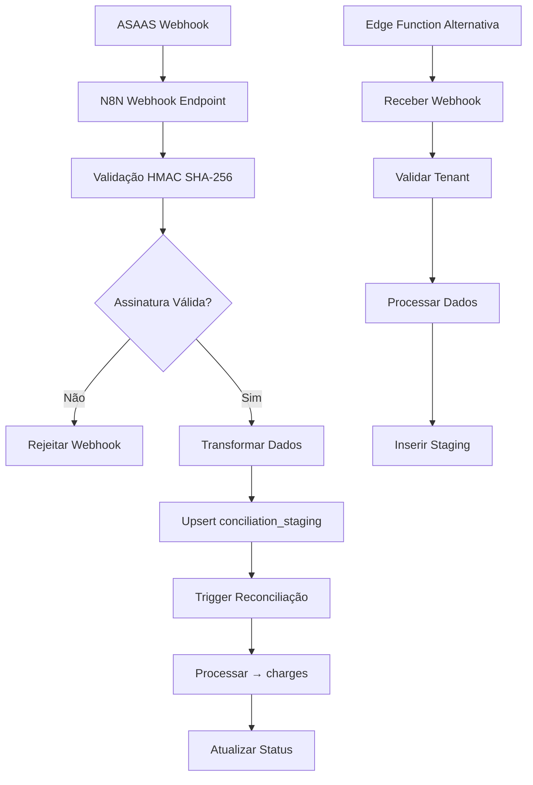
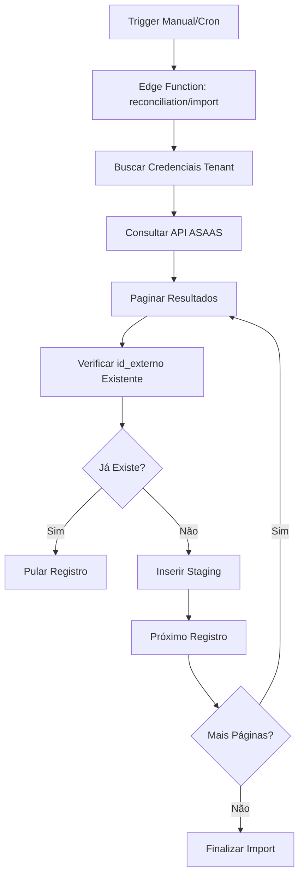
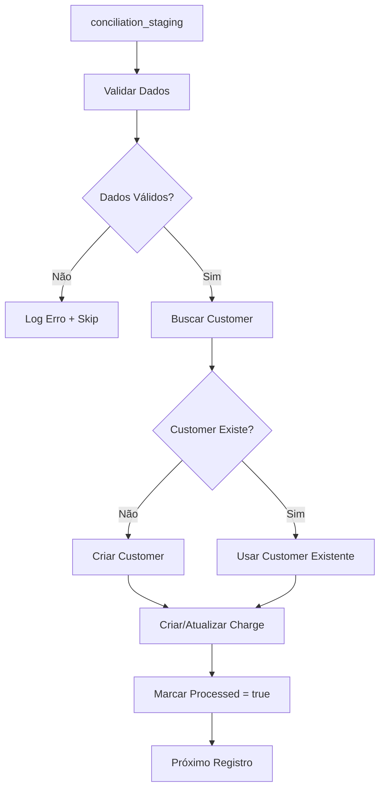

```
# 🏗️ ESTRUTURA DE COBRANÇA ASAAS - DOCUMENTAÇÃO TÉCNICA COMPLETA

**Versão:** 2.0  
**Data:** Janeiro 2025  
**Autor:** Barcelitos (AI Agent)  
**Projeto:** Revalya Oficial  
**Status:** 🔴 ÁREA CRÍTICA - DOCUMENTAÇÃO MASTER

---

## 🎯 **VISÃO GERAL DA ARQUITETURA**

Esta documentação detalha **COMPLETAMENTE** a integração ASAAS no sistema Revalya, incluindo:

- ✅ **Edge Function Atual**: `asaas-webhook` (Supabase Functions)
- ✅ **Fluxo de Dados**: Webhook → Validação → Staging → Conciliação
- ✅ **Segurança Multi-Tenant**: RLS + Validação dupla + Isolamento por `tenant_id`
- ✅ **Anti-Duplicação**: Estratégias de idempotência e UPSERT
- ✅ **Monitoramento**: Logs, métricas e debugging

---

## 🚀 **EDGE FUNCTION ATUAL: `asaas-webhook`**

### **1. Localização e Configuração**
- **Arquivo:** `supabase/functions/asaas-webhook/index.ts`
- **URL:** `https://wyehpiutzvwplllumgdk.supabase.co/functions/v1/asaas-webhook/{tenant_id}`
- **Método:** POST
- **Autenticação:** `SUPABASE_SERVICE_ROLE_KEY` (bypassa RLS)

### **2. Fluxo de Processamento Atual**



### **3. Lógica de Insert/Update Detalhada**

#### **A. Tabela: `integration_processed_events`**
**Operação:** SOMENTE INSERT (sem update)
**Chave Única:** `tenant_id` + `integration_id` + `event_id`

```typescript
// AIDEV-NOTE: Idempotência - verifica se evento já foi processado
const { data: existingEvent } = await supabase
  .from('integration_processed_events')
  .select('id')
  .eq('tenant_id', tenantId)
  .eq('integration_id', integration.id)
  .eq('event_id', eventId)
  .single();

if (existingEvent) {
  return new Response(JSON.stringify({ 
    message: 'Event already processed', 
    event_id: eventId 
  }), { status: 200 });
}

// Inserir novo evento processado
await supabase
  .from('integration_processed_events')
  .insert({
    tenant_id: tenantId,
    integration_id: integration.id,
    event_id: eventId,
    event_type: 'payment_webhook',
    processed_at: new Date().toISOString(),
    payload: webhookData
  });
```

#### **B. Tabela: `conciliation_staging`**
**Operação:** UPSERT (insert ou update)
**Chave de Conflito:** `tenant_id` + `id_externo` + `origem`

```typescript
// AIDEV-NOTE: UPSERT na tabela de staging
const stagingData = {
  tenant_id: tenantId,
  id_externo: payment.id,           // ID do pagamento no ASAAS
  origem: 'ASAAS',                  // Sempre 'ASAAS' para esta integração
  valor_cobranca: payment.value,
  valor_pago: payment.netValue || payment.value,
  status_externo: payment.status,
  status_conciliacao: 'pendente',
  data_vencimento: payment.dueDate,
  data_pagamento: payment.paymentDate,
  observacao: payment.description,
  dados_brutos: payment,            // JSON completo do webhook
  created_at: new Date().toISOString(),
  updated_at: new Date().toISOString()
};

const { error } = await supabase
  .from('conciliation_staging')
  .upsert(stagingData, {
    onConflict: 'tenant_id,id_externo,origem',
    ignoreDuplicates: false         // Permite atualizações
  });
```

### **4. Configuração Manual do Webhook ASAAS**

#### **A. URL do Webhook**
```
https://wyehpiutzvwplllumgdk.supabase.co/functions/v1/asaas-webhook/{tenant_id}
```

#### **B. Configurações no Painel ASAAS**
1. Acessar configurações de webhook no ASAAS
2. Definir URL com o tenant_id específico
3. Selecionar eventos do tipo "PAYMENT"
4. Configurar para API V3
5. Ativar o webhook

#### **C. Token de Autenticação**
- Token gerado via função `generate_secure_token()`
- Exemplo de token: `0275fd8894396c2b3317ea623fc7575a`
- Armazenado de forma segura na tabela `tenant_integrations`

### **2. Funções de Suporte**

#### **A. generate_secure_token**
```sql
CREATE OR REPLACE FUNCTION public.generate_secure_token()
RETURNS text
LANGUAGE plpgsql
AS $$
DECLARE
    v_token text;
BEGIN
    -- Gera token aleatório de 32 caracteres
    v_token := encode(gen_random_bytes(16), 'hex');
    RETURN v_token;
END;
$$;
```

#### **B. save_webhook_info**
```sql
CREATE OR REPLACE FUNCTION public.save_webhook_info(
    p_tenant_id uuid,
    p_webhook_url text,
    p_webhook_token text
)
RETURNS text
LANGUAGE plpgsql
SECURITY DEFINER
AS $$
BEGIN
    -- Verifica acesso do tenant
    PERFORM check_tenant_access(p_tenant_id);
    
    -- Atualiza informações do webhook
    UPDATE public.tenant_integrations
    SET 
        webhook_url = p_webhook_url,
        webhook_token = p_webhook_token,
        updated_at = NOW()
    WHERE 
        tenant_id = p_tenant_id 
        AND integration_type = 'asaas'
        AND is_active = true;
    
    RETURN 'Webhook configurado com sucesso';
END;
$$;
```

### **3. Processo de Configuração Manual**

1. **Gerar Token**
   ```sql
   SELECT generate_secure_token();
   ```

2. **Configurar no ASAAS**
   - URL: `https://wyehpiutzvwplllumgdk.supabase.co/functions/v1/asaas-webhook/{tenant_id}`
   - Token: Usar o token gerado
   - Versão: API V3
   - Eventos: PAYMENT

3. **Salvar Configuração**
   ```sql
   SELECT save_webhook_info(
       '{tenant_id}',
       'https://wyehpiutzvwplllumgdk.supabase.co/functions/v1/asaas-webhook/{tenant_id}',
       '{token_gerado}'
   );
   ```

---

## 🔒 **SEGURANÇA MULTI-TENANT**

### **1. Row Level Security (RLS) - Implementado**

#### **A. Tabela: `tenant_integrations`**
```sql
-- AIDEV-NOTE: RLS policies para tenant_integrations
-- Política SELECT: Usuários do tenant + service_role
CREATE POLICY "tenant_integrations_select_policy" ON tenant_integrations
FOR SELECT USING (
  tenant_id IN (
    SELECT tenant_id FROM tenant_users 
    WHERE user_id = auth.uid() AND active = true
  ) OR auth.jwt() ->> 'role' = 'service_role'
);

-- Política INSERT: Usuários do tenant + service_role
CREATE POLICY "tenant_integrations_insert_policy" ON tenant_integrations
FOR INSERT WITH CHECK (
  tenant_id IN (
    SELECT tenant_id FROM tenant_users 
    WHERE user_id = auth.uid() AND active = true
  ) OR auth.jwt() ->> 'role' = 'service_role'
);

-- Política UPDATE: Usuários do tenant + service_role
CREATE POLICY "tenant_integrations_update_policy" ON tenant_integrations
FOR UPDATE USING (
  tenant_id IN (
    SELECT tenant_id FROM tenant_users 
    WHERE user_id = auth.uid() AND active = true
  ) OR auth.jwt() ->> 'role' = 'service_role'
);

-- Política DELETE: Usuários do tenant + service_role
CREATE POLICY "tenant_integrations_delete_policy" ON tenant_integrations
FOR DELETE USING (
  tenant_id IN (
    SELECT tenant_id FROM tenant_users 
    WHERE user_id = auth.uid() AND active = true
  ) OR auth.jwt() ->> 'role' = 'service_role'
);
```

#### **B. Tabela: `conciliation_staging`**
```sql
-- AIDEV-NOTE: RLS policies para conciliation_staging
-- Política SELECT: Usuários do tenant + service_role
CREATE POLICY "conciliation_staging_select_policy" ON conciliation_staging
FOR SELECT USING (
  tenant_id IN (
    SELECT tenant_id FROM tenant_users 
    WHERE user_id = auth.uid() AND active = true
  ) OR auth.jwt() ->> 'role' = 'service_role'
);

-- Política INSERT: Usuários do tenant + service_role
CREATE POLICY "conciliation_staging_insert_policy" ON conciliation_staging
FOR INSERT WITH CHECK (
  tenant_id IN (
    SELECT tenant_id FROM tenant_users 
    WHERE user_id = auth.uid() AND active = true
  ) OR auth.jwt() ->> 'role' = 'service_role'
);

-- Política UPDATE: Usuários do tenant + service_role
CREATE POLICY "conciliation_staging_update_policy" ON conciliation_staging
FOR UPDATE USING (
  tenant_id IN (
    SELECT tenant_id FROM tenant_users 
    WHERE user_id = auth.uid() AND active = true
  ) OR auth.jwt() ->> 'role' = 'service_role'
);
```

### **2. Validação de Token Webhook**

```typescript
// AIDEV-NOTE: Validação de token no Edge Function
const { data: integration } = await supabase
  .from('tenant_integrations')
  .select('id, webhook_token')
  .eq('tenant_id', tenantId)
  .eq('integration_type', 'asaas')
  .eq('is_active', true)
  .single();

if (!integration) {
  return new Response(JSON.stringify({ 
    error: 'Integration not found or inactive' 
  }), { status: 404 });
}

// Validar token do webhook
const receivedToken = request.headers.get('x-webhook-token');
if (receivedToken !== integration.webhook_token) {
  return new Response(JSON.stringify({ 
    error: 'Invalid webhook token' 
  }), { status: 401 });
}
```

---

## 📊 **ESTRUTURA DE DADOS DETALHADA**

### **1. Tabela: `tenant_integrations`**
**Função:** Configurações de integração por tenant

```sql
-- AIDEV-NOTE: Estrutura atual da tabela tenant_integrations
CREATE TABLE tenant_integrations (
  id UUID PRIMARY KEY DEFAULT gen_random_uuid(),
  tenant_id UUID NOT NULL REFERENCES tenants(id),
  integration_type TEXT NOT NULL,           -- 'asaas', 'pix', etc.
  is_active BOOLEAN DEFAULT true,
  created_at TIMESTAMPTZ DEFAULT NOW(),
  updated_at TIMESTAMPTZ DEFAULT NOW(),
  environment TEXT DEFAULT 'production',    -- 'sandbox' ou 'production'
  webhook_url TEXT,                         -- URL do webhook configurada
  webhook_token TEXT,                       -- Token de validação
  last_sync_at TIMESTAMPTZ,                -- Última sincronização
  sync_status TEXT,                         -- Status da sincronização
  error_message TEXT,                       -- Última mensagem de erro
  created_by UUID,                          -- Usuário que criou
  config JSONB,                            -- Configurações específicas
  
  -- CONSTRAINTS DE SEGURANÇA
  CONSTRAINT unique_integration_per_tenant 
    UNIQUE (tenant_id, integration_type, environment)
);

-- ÍNDICES PARA PERFORMANCE
CREATE INDEX idx_tenant_integrations_tenant_id ON tenant_integrations(tenant_id);
CREATE INDEX idx_tenant_integrations_type ON tenant_integrations(integration_type);
CREATE INDEX idx_tenant_integrations_active ON tenant_integrations(is_active);
```

### **2. Tabela: `conciliation_staging`**
**Função:** Área de staging para dados brutos antes da conciliação

```sql
-- AIDEV-NOTE: Estrutura atual da tabela conciliation_staging
CREATE TABLE conciliation_staging (
  id UUID PRIMARY KEY DEFAULT gen_random_uuid(),
  tenant_id UUID NOT NULL REFERENCES tenants(id),
  origem TEXT NOT NULL,                     -- 'ASAAS', 'PIX', 'MANUAL', 'CORA', 'ITAU', 'BRADESCO', 'SANTANDER'
  id_externo TEXT NOT NULL,                 -- ID único do sistema externo
  valor_cobranca NUMERIC(10,2),            -- Valor original da cobrança
  valor_pago NUMERIC(10,2),                -- Valor efetivamente pago
  status_externo TEXT NOT NULL,            -- Status no sistema externo
  status_conciliacao TEXT DEFAULT 'pendente', -- 'pendente', 'conciliado', 'erro'
  contrato_id UUID,                        -- Referência ao contrato (se identificado)
  cobranca_id UUID,                        -- Referência à cobrança (se conciliado)
  juros_multa_diferenca NUMERIC(10,2),     -- Diferença de juros/multa
  data_vencimento DATE,                    -- Data de vencimento
  data_pagamento TIMESTAMPTZ,              -- Data do pagamento
  observacao TEXT,                         -- Observações gerais
  dados_brutos JSONB,                      -- Dados completos do webhook/API
  created_at TIMESTAMPTZ DEFAULT NOW(),
  updated_at TIMESTAMPTZ DEFAULT NOW(),
  
  -- CONSTRAINTS DE SEGURANÇA MULTI-TENANT
  CONSTRAINT unique_external_id_per_tenant_origin 
    UNIQUE (tenant_id, origem, id_externo)
);

-- ÍNDICES PARA PERFORMANCE
CREATE INDEX idx_conciliation_staging_tenant_id ON conciliation_staging(tenant_id);
CREATE INDEX idx_conciliation_staging_origem ON conciliation_staging(origem);
CREATE INDEX idx_conciliation_staging_status ON conciliation_staging(status_conciliacao);
CREATE INDEX idx_conciliation_staging_created_at ON conciliation_staging(created_at);
CREATE INDEX idx_conciliation_staging_id_externo ON conciliation_staging(id_externo);
```

### **3. Tabela: `integration_processed_events`**
**Função:** Controle de idempotência para webhooks

```sql
-- AIDEV-NOTE: Estrutura da tabela de eventos processados
CREATE TABLE integration_processed_events (
  id UUID PRIMARY KEY DEFAULT gen_random_uuid(),
  tenant_id UUID NOT NULL REFERENCES tenants(id),
  integration_id UUID NOT NULL REFERENCES tenant_integrations(id),
  event_id TEXT NOT NULL,                  -- ID único do evento (do webhook)
  event_type TEXT NOT NULL,               -- Tipo do evento ('payment_webhook', etc.)
  processed_at TIMESTAMPTZ DEFAULT NOW(),
  payload JSONB,                          -- Payload completo do webhook
  
  -- CONSTRAINTS DE IDEMPOTÊNCIA
  CONSTRAINT unique_event_per_integration 
    UNIQUE (tenant_id, integration_id, event_id)
);

-- ÍNDICES PARA PERFORMANCE
CREATE INDEX idx_integration_events_tenant_id ON integration_processed_events(tenant_id);
CREATE INDEX idx_integration_events_integration_id ON integration_processed_events(integration_id);
CREATE INDEX idx_integration_events_event_id ON integration_processed_events(event_id);
CREATE INDEX idx_integration_events_processed_at ON integration_processed_events(processed_at);
```

---

## 🔄 **FLUXO COMPLETO DE PROCESSAMENTO**

### **1. Fluxo Principal: Webhook → Staging → Conciliação**



### **2. Estratégias Anti-Duplicação**

#### **A. Nível 1: Idempotência de Eventos**
```typescript
// AIDEV-NOTE: Verificação de evento já processado
const { data: existingEvent } = await supabase
  .from('integration_processed_events')
  .select('id')
  .eq('tenant_id', tenantId)
  .eq('integration_id', integration.id)
  .eq('event_id', eventId)
  .single();

if (existingEvent) {
  // Evento já foi processado - retornar sucesso sem reprocessar
  return new Response(JSON.stringify({ 
    message: 'Event already processed', 
    event_id: eventId 
  }), { status: 200 });
}
```

#### **B. Nível 2: UPSERT no Staging**
```typescript
// AIDEV-NOTE: UPSERT previne duplicação no staging
const { error } = await supabase
  .from('conciliation_staging')
  .upsert(stagingData, {
    onConflict: 'tenant_id,origem,id_externo',
    ignoreDuplicates: false  // Permite atualizações de dados
  });
```

#### **C. Nível 3: Constraint de Banco**
```sql
-- AIDEV-NOTE: Constraint garante unicidade no banco
CONSTRAINT unique_external_id_per_tenant_origin 
  UNIQUE (tenant_id, origem, id_externo)
```

---

## 🚨 **MONITORAMENTO E DEBUGGING**

### **1. Logs Estruturados**

```typescript
// AIDEV-NOTE: Estrutura padronizada de logs
interface WebhookLogEntry {
  timestamp: string;
  level: 'INFO' | 'WARN' | 'ERROR';
  tenant_id: string;
  event_id: string;
  operation: string;
  duration_ms?: number;
  error?: string;
  details: Record<string, any>;
}

function logWebhookOperation(entry: WebhookLogEntry) {
  console.log(JSON.stringify({
    ...entry,
    timestamp: new Date().toISOString(),
    source: 'asaas-webhook'
  }));
}
```

### **2. Métricas Importantes**

#### **A. Webhooks Recebidos**
- Total de webhooks por tenant/dia
- Taxa de sucesso vs. erro
- Tempo médio de processamento
- Eventos duplicados detectados

#### **B. Staging e Conciliação**
- Registros em staging pendentes
- Taxa de conciliação automática
- Registros com erro de conciliação
- Volume de dados por origem

### **3. Queries de Monitoramento**

```sql
-- AIDEV-NOTE: Queries úteis para monitoramento

-- 1. Webhooks processados nas últimas 24h
SELECT 
  tenant_id,
  COUNT(*) as total_events,
  COUNT(DISTINCT event_id) as unique_events,
  MIN(processed_at) as first_event,
  MAX(processed_at) as last_event
FROM integration_processed_events 
WHERE processed_at >= NOW() - INTERVAL '24 hours'
GROUP BY tenant_id
ORDER BY total_events DESC;

-- 2. Registros em staging pendentes de conciliação
SELECT 
  tenant_id,
  origem,
  status_conciliacao,
  COUNT(*) as total_records,
  MIN(created_at) as oldest_record,
  MAX(created_at) as newest_record
FROM conciliation_staging 
WHERE status_conciliacao = 'pendente'
GROUP BY tenant_id, origem, status_conciliacao
ORDER BY oldest_record ASC;

-- 3. Performance de processamento por tenant
SELECT 
  cs.tenant_id,
  COUNT(*) as total_staging_records,
  COUNT(CASE WHEN cs.status_conciliacao = 'conciliado' THEN 1 END) as conciliated,
  COUNT(CASE WHEN cs.status_conciliacao = 'erro' THEN 1 END) as errors,
  ROUND(
    COUNT(CASE WHEN cs.status_conciliacao = 'conciliado' THEN 1 END) * 100.0 / COUNT(*), 
    2
  ) as success_rate_percent
FROM conciliation_staging cs
WHERE cs.created_at >= NOW() - INTERVAL '7 days'
GROUP BY cs.tenant_id
ORDER BY success_rate_percent DESC;
```

---

## 🛠️ **GUIA PRÁTICO PARA DESENVOLVEDORES**

### **1. Como Configurar um Novo Tenant**

```sql
-- AIDEV-NOTE: Script completo para configurar integração ASAAS

-- 1. Gerar token seguro
SELECT generate_secure_token() as webhook_token;

-- 2. Inserir configuração de integração
INSERT INTO tenant_integrations (
  tenant_id,
  integration_type,
  is_active,
  environment,
  webhook_url,
  webhook_token,
  config
) VALUES (
  '{TENANT_ID}',
  'asaas',
  true,
  'production', -- ou 'sandbox'
  'https://wyehpiutzvwplllumgdk.supabase.co/functions/v1/asaas-webhook/{TENANT_ID}',
  '{TOKEN_GERADO}',
  '{
    "api_version": "v3",
    "events": ["PAYMENT_CREATED", "PAYMENT_UPDATED", "PAYMENT_RECEIVED"],
    "retry_attempts": 3,
    "timeout_seconds": 30
  }'::jsonb
);

-- 3. Verificar configuração
SELECT 
  id,
  tenant_id,
  integration_type,
  is_active,
  webhook_url,
  webhook_token,
  config
FROM tenant_integrations 
WHERE tenant_id = '{TENANT_ID}' AND integration_type = 'asaas';
```

### **2. Como Testar a Integração**

```bash
# AIDEV-NOTE: Script de teste para webhook

# 1. Teste básico de conectividade
curl -X POST \
  "https://wyehpiutzvwplllumgdk.supabase.co/functions/v1/asaas-webhook/{TENANT_ID}" \
  -H "Content-Type: application/json" \
  -H "x-webhook-token: {TOKEN}" \
  -d '{
    "event": "PAYMENT_RECEIVED",
    "payment": {
      "id": "pay_test_123",
      "value": 100.00,
      "status": "RECEIVED",
      "dueDate": "2025-01-15",
      "paymentDate": "2025-01-15T10:30:00Z",
      "customer": "cus_test_456",
      "customerName": "Cliente Teste",
      "description": "Teste de integração",
      "billingType": "PIX"
    }
  }'

# 2. Verificar se foi processado
# Executar no Supabase SQL Editor:
SELECT * FROM integration_processed_events 
WHERE tenant_id = '{TENANT_ID}' 
ORDER BY processed_at DESC 
LIMIT 5;

SELECT * FROM conciliation_staging 
WHERE tenant_id = '{TENANT_ID}' 
ORDER BY created_at DESC 
LIMIT 5;
```

### **3. Como Debuggar Problemas**

#### **A. Webhook não está sendo recebido**
```sql
-- Verificar configuração da integração
SELECT * FROM tenant_integrations 
WHERE tenant_id = '{TENANT_ID}' AND integration_type = 'asaas';

-- Verificar logs da Edge Function (via Supabase Dashboard)
-- Ir para: Functions > asaas-webhook > Logs
```

#### **B. Webhook recebido mas não processado**
```sql
-- Verificar eventos processados
SELECT * FROM integration_processed_events 
WHERE tenant_id = '{TENANT_ID}' 
ORDER BY processed_at DESC 
LIMIT 10;

-- Verificar registros em staging
SELECT * FROM conciliation_staging 
WHERE tenant_id = '{TENANT_ID}' 
AND status_conciliacao = 'pendente'
ORDER BY created_at DESC;
```

#### **C. Dados inconsistentes**
```sql
-- Comparar eventos vs staging
SELECT 
  'events' as source,
  COUNT(*) as total,
  MIN(processed_at) as oldest,
  MAX(processed_at) as newest
FROM integration_processed_events 
WHERE tenant_id = '{TENANT_ID}'

UNION ALL

SELECT 
  'staging' as source,
  COUNT(*) as total,
  MIN(created_at) as oldest,
  MAX(created_at) as newest
FROM conciliation_staging 
WHERE tenant_id = '{TENANT_ID}' AND origem = 'ASAAS';
```

### **4. Como Fazer Manutenção**

#### **A. Limpeza de Dados Antigos**
```sql
-- AIDEV-NOTE: Limpeza de eventos processados (manter últimos 90 dias)
DELETE FROM integration_processed_events 
WHERE processed_at < NOW() - INTERVAL '90 days';

-- Limpeza de staging conciliado (manter últimos 30 dias)
DELETE FROM conciliation_staging 
WHERE status_conciliacao = 'conciliado' 
AND updated_at < NOW() - INTERVAL '30 days';
```

#### **B. Reprocessar Registros com Erro**
```sql
-- Resetar registros com erro para reprocessamento
UPDATE conciliation_staging 
SET 
  status_conciliacao = 'pendente',
  updated_at = NOW()
WHERE status_conciliacao = 'erro' 
AND tenant_id = '{TENANT_ID}';
```

---

## ⚠️ **REGRAS CRÍTICAS DE MANUTENÇÃO**

### **🔴 NUNCA ALTERAR SEM VALIDAÇÃO:**
1. **Constraints de `tenant_id`** - Segurança multi-tenant fundamental
2. **Validação de `webhook_token`** - Segurança de webhooks
3. **Estrutura de `id_externo`** - Prevenção de duplicação
4. **Chaves de UPSERT** - `tenant_id + origem + id_externo`
5. **Políticas RLS** - Isolamento de dados por tenant

### **🟡 ALTERAR COM CUIDADO:**
1. **Estrutura de tabelas** - Requer migração e testes
2. **Formato de `dados_brutos`** - Compatibilidade com versões anteriores
3. **Mapeamento de status** - Pode afetar conciliação existente
4. **Timeouts e retry** - Performance e confiabilidade

### **🟢 SEGURO PARA ALTERAR:**
1. **Logs e monitoramento** - Não afeta funcionalidade
2. **Mensagens de erro** - Melhoria de UX
3. **Queries de relatório** - Análise e debugging
4. **Documentação** - Sempre manter atualizada

---

## 📚 **REFERÊNCIAS E DEPENDÊNCIAS**

### **1. Arquivos Relacionados**
- `supabase/functions/asaas-webhook/index.ts` - Edge Function principal
- `supabase/migrations/` - Migrações de banco de dados
- `src/types/asaas.ts` - Tipos TypeScript (se existir)
- `src/services/conciliation.ts` - Serviços de conciliação (se existir)

### **2. Tabelas do Banco**
- `tenant_integrations` - Configurações de integração
- `conciliation_staging` - Staging de dados brutos
- `integration_processed_events` - Controle de idempotência
- `tenant_users` - Relação usuário-tenant (para RLS)

### **3. APIs Externas**
- **ASAAS API v3** - `https://api.asaas.com/v3`
- **ASAAS Sandbox** - `https://sandbox.asaas.com/v3`
- **Documentação ASAAS** - `https://docs.asaas.com`

### **4. Ferramentas de Monitoramento**
- **Supabase Dashboard** - Logs da Edge Function
- **Supabase SQL Editor** - Queries de debugging
- **ASAAS Dashboard** - Configuração de webhooks

---

**📝 AIDEV-NOTE:** Esta documentação reflete o estado atual da integração ASAAS (Janeiro 2025). Sempre consulte o código fonte para verificar implementações específicas e mantenha esta documentação atualizada com mudanças na arquitetura.

**🔄 Última Atualização:** Janeiro 2025  
**👤 Responsável:** Barcelitos (AI Agent)  
**📋 Status:** 🔴 DOCUMENTAÇÃO CRÍTICA - SEMPRE CONSULTAR ANTES DE ALTERAÇÕES
LANGUAGE plpgsql
SECURITY DEFINER
AS $$
BEGIN
    -- Verifica acesso do tenant
    PERFORM check_tenant_access(p_tenant_id);
    
    -- Atualiza informações do webhook
    UPDATE public.tenant_integrations
    SET 
        config = jsonb_set(
            COALESCE(config, '{}'::jsonb),
            '{webhook}',
            jsonb_build_object(
                'url', p_webhook_url,
                'token', p_webhook_token
            )
        ),
        updated_at = NOW()
    WHERE 
        tenant_id = p_tenant_id 
        AND integration_type = 'asaas'
        AND is_active = true;
    
    RETURN 'Webhook configurado com sucesso';
END;
$$;
```

### **3. Processo de Configuração Manual**

1. **Gerar Token**
   ```sql
   SELECT generate_secure_token();
   ```

2. **Configurar no ASAAS**
   - URL: `https://wyehpiutzvwplllumgdk.supabase.co/functions/v1/asaas-webhook-charges/{tenant_id}`
   - Token: Usar o token gerado
   - Versão: API V3
   - Eventos: PAYMENT

3. **Salvar Configuração**
   ```sql
   SELECT save_webhook_info(
       '{tenant_id}',
       'https://wyehpiutzvwplllumgdk.supabase.co/functions/v1/asaas-webhook-charges/{tenant_id}',
       '{token_gerado}'
   );
   ```

### **4. Vantagens da Configuração Manual**

1. **Controle**
   - Processo transparente e auditável
   - Sem ambiguidade de tenant_id
   - Configuração explícita

2. **Segurança**
   - Token gerado de forma segura
   - Armazenamento protegido
   - Validação de tenant

3. **Manutenção**
   - Fácil diagnóstico
   - Processo documentado
   - Auditoria clara

## Estrutura de Dados

### Tabelas do Sistema

1. **charges**
   - Tabela principal de cobranças
   - Campos específicos ASAAS:
     ```sql
     asaas_id TEXT
     asaas_external_reference TEXT
     asaas_payment_date TIMESTAMPTZ
     asaas_confirmed_date TIMESTAMPTZ
     asaas_credit_date TIMESTAMPTZ
     asaas_original_value NUMERIC
     asaas_net_value NUMERIC
     asaas_interest_value NUMERIC
     asaas_fine_value NUMERIC
     asaas_discount_value NUMERIC
     asaas_payment_method TEXT
     asaas_bank_slip_url TEXT
     asaas_invoice_url TEXT
     asaas_pix_qr_code TEXT
     asaas_pix_copy_paste TEXT
     reconciliation_status TEXT
     reconciliation_date TIMESTAMPTZ
     reconciliation_notes TEXT
     ```

2. **conciliation_staging**
   - Tabela intermediária para reconciliação
   - Campos principais:
     ```sql
     id UUID
     tenant_id UUID
     origem TEXT
     id_externo TEXT
     valor_cobranca NUMERIC
     valor_pago NUMERIC
     status_externo TEXT
     status_conciliacao TEXT
     contrato_id UUID
     cobranca_id UUID
     juros_multa_diferenca NUMERIC
     data_vencimento TIMESTAMPTZ
     data_pagamento TIMESTAMPTZ
     observacao TEXT
     ```
   - Constraint único: (tenant_id, origem, id_externo)
   - RLS: Isolamento por tenant_id
```

**Versão:** 1.0  
**Data:** Janeiro 2025  
**Autor:** Barcelitos (AI Agent)  
**Projeto:** Revalya Oficial  
**Status:** 🔴 ÁREA CRÍTICA - DOCUMENTAÇÃO MASTER

---

## 🎯 **VISÃO GERAL DA ARQUITETURA DE COBRANÇA**

Esta documentação detalha **COMPLETAMENTE** a estrutura de cobrança ASAAS no sistema Revalya, incluindo:

- ✅ **Fluxo Push**: Webhooks ASAAS → Sistema Revalya
- ✅ **Fluxo Pull**: Sistema Revalya → API ASAAS  
- ✅ **Conciliação**: Staging → Reconciliação → Charges
- ✅ **Anti-Duplicação**: Estratégias e mecanismos
- ✅ **Edge Functions**: Supabase Functions para processamento
- ✅ **N8N Workflows**: Automação e transformação de dados

---

## 📊 **MAPEAMENTO COMPLETO DE TABELAS**

### **1. Tabela: `conciliation_staging`**
**Função:** Área de staging para dados brutos do ASAAS antes da reconciliação

```sql
-- AIDEV-NOTE: Estrutura atual da tabela de staging
CREATE TABLE conciliation_staging (
  id UUID PRIMARY KEY DEFAULT gen_random_uuid(),
  tenant_id UUID NOT NULL REFERENCES tenants(id),
  id_externo TEXT NOT NULL,           -- ID único do ASAAS
  valor DECIMAL(10,2) NOT NULL,       -- Valor da cobrança
  status TEXT NOT NULL,               -- Status ASAAS (PENDING, RECEIVED, etc.)
  data_vencimento DATE,               -- Data de vencimento
  data_pagamento TIMESTAMP,           -- Data do pagamento (se pago)
  customer_id TEXT,                   -- ID do cliente no ASAAS
  customer_name TEXT,                 -- Nome do cliente
  description TEXT,                   -- Descrição da cobrança
  payment_method TEXT,                -- Método de pagamento
  raw_data JSONB,                     -- Dados brutos completos do webhook
  processed BOOLEAN DEFAULT FALSE,    -- Flag de processamento
  created_at TIMESTAMP DEFAULT NOW(),
  updated_at TIMESTAMP DEFAULT NOW(),
  
  -- CONSTRAINTS DE SEGURANÇA MULTI-TENANT
  CONSTRAINT unique_external_id_per_tenant 
    UNIQUE (tenant_id, id_externo)
);

-- ÍNDICES PARA PERFORMANCE
CREATE INDEX idx_conciliation_staging_tenant_id ON conciliation_staging(tenant_id);
CREATE INDEX idx_conciliation_staging_id_externo ON conciliation_staging(id_externo);
CREATE INDEX idx_conciliation_staging_processed ON conciliation_staging(processed);
CREATE INDEX idx_conciliation_staging_created_at ON conciliation_staging(created_at);
```

### **2. Tabela: `charges`**
**Função:** Tabela principal de cobranças processadas e reconciliadas

```sql
-- AIDEV-NOTE: Estrutura da tabela principal de cobranças
CREATE TABLE charges (
  id UUID PRIMARY KEY DEFAULT gen_random_uuid(),
  tenant_id UUID NOT NULL REFERENCES tenants(id),
  asaas_id TEXT,                      -- ID no ASAAS (pode ser NULL para cobranças internas)
  customer_id UUID REFERENCES customers(id),
  amount DECIMAL(10,2) NOT NULL,
  status TEXT NOT NULL,               -- Status interno (pending, paid, overdue, cancelled)
  due_date DATE NOT NULL,
  paid_date TIMESTAMP,
  description TEXT,
  payment_method TEXT,
  gateway_data JSONB,                 -- Dados do gateway (ASAAS, etc.)
  created_at TIMESTAMP DEFAULT NOW(),
  updated_at TIMESTAMP DEFAULT NOW(),
  
  -- CONSTRAINTS DE SEGURANÇA
  CONSTRAINT unique_asaas_id_per_tenant 
    UNIQUE (tenant_id, asaas_id) WHERE asaas_id IS NOT NULL
);
```

### **3. Tabela: `customers`**
**Função:** Clientes sincronizados com ASAAS

```sql
-- AIDEV-NOTE: Estrutura de clientes com integração ASAAS
CREATE TABLE customers (
  id UUID PRIMARY KEY DEFAULT gen_random_uuid(),
  tenant_id UUID NOT NULL REFERENCES tenants(id),
  asaas_id TEXT,                      -- ID no ASAAS
  name TEXT NOT NULL,
  email TEXT,
  phone TEXT,
  document TEXT,                      -- CPF/CNPJ
  address JSONB,                      -- Endereço completo
  created_at TIMESTAMP DEFAULT NOW(),
  updated_at TIMESTAMP DEFAULT NOW(),
  
  -- CONSTRAINTS DE SEGURANÇA
  CONSTRAINT unique_asaas_id_per_tenant 
    UNIQUE (tenant_id, asaas_id) WHERE asaas_id IS NOT NULL
);
```

---

## 🔄 **FLUXO COMPLETO DE COBRANÇA - PUSH (WEBHOOKS)**

### **1. Arquitetura do Fluxo Push**



### **2. Implementação Atual - N8N Workflows**

#### **A. Workflow: `webhook/asaas/charges`**
**Localização:** `src/n8n/workflows/workflow-definitions.ts`

```typescript
// AIDEV-NOTE: Configuração do workflow de charges ASAAS
export const chargesWorkflow = {
  name: 'ASAAS Charges Webhook',
  nodes: [
    {
      name: 'Webhook Trigger',
      type: 'webhook',
      parameters: {
        path: 'webhook/asaas/charges',
        httpMethod: 'POST',
        responseMode: 'responseNode'
      }
    },
    {
      name: 'Transform Payment Data',
      type: 'function',
      parameters: {
        functionCode: `
          // Mapear status ASAAS para status interno
          const statusMapping = {
            'PENDING': 'pending',
            'RECEIVED': 'paid', 
            'OVERDUE': 'overdue',
            'CANCELLED': 'cancelled'
          };
          
          const payment = items[0].json;
          
          return [{
            json: {
              tenant_id: payment.tenant_id,
              id_externo: payment.id,
              valor: payment.value,
              status: statusMapping[payment.status] || 'pending',
              data_vencimento: payment.dueDate,
              data_pagamento: payment.paymentDate,
              customer_id: payment.customer,
              customer_name: payment.customerName,
              description: payment.description,
              payment_method: payment.billingType,
              raw_data: payment
            }
          }];
        `
      }
    },
    {
      name: 'Upsert Staging',
      type: 'supabase',
      parameters: {
        operation: 'upsert',
        table: 'conciliation_staging',
        conflictColumns: ['tenant_id', 'id_externo']
      }
    }
  ]
};
```

#### **B. Workflow: `webhook/asaas/customers`**
**Localização:** `src/n8n/workflows/webhook.ts`

```typescript
// AIDEV-NOTE: Workflow para sincronização de clientes
export const customerWebhookWorkflow = {
  name: 'ASAAS Customer Webhook',
  trigger: {
    type: 'webhook',
    path: 'webhook/asaas/customers'
  },
  transform: {
    // Transformar dados do cliente ASAAS
    customerData: {
      tenant_id: '{{ $json.tenant_id }}',
      asaas_id: '{{ $json.id }}',
      name: '{{ $json.name }}',
      email: '{{ $json.email }}',
      phone: '{{ $json.phone }}',
      document: '{{ $json.cpfCnpj }}'
    }
  },
  action: {
    type: 'supabase_upsert',
    table: 'customers',
    conflict: ['tenant_id', 'asaas_id']
  }
};
```

### **3. Implementação Proposta - Edge Function**

#### **A. Edge Function: `asaas-webhook-charges`**
**Localização Proposta:** `supabase/functions/asaas-webhook-charges/index.ts`

```typescript
// AIDEV-NOTE: Edge Function proposta para webhooks de cobrança
import { serve } from 'https://deno.land/std@0.168.0/http/server.ts';
import { createClient } from 'https://esm.sh/@supabase/supabase-js@2';
import { crypto } from 'https://deno.land/std@0.168.0/crypto/mod.ts';

interface AsaasWebhookPayload {
  event: string;
  payment: {
    id: string;
    value: number;
    status: string;
    dueDate: string;
    paymentDate?: string;
    customer: string;
    customerName: string;
    description: string;
    billingType: string;
  };
}

serve(async (req: Request) => {
  try {
    // 1. Validar método HTTP
    if (req.method !== 'POST') {
      return new Response('Method not allowed', { status: 405 });
    }

    // 2. Extrair headers e payload
    const signature = req.headers.get('asaas-signature');
    const tenantId = req.headers.get('x-tenant-id');
    const payload = await req.text();
    
    if (!signature || !tenantId) {
      return new Response('Missing required headers', { status: 400 });
    }

    // 3. Validar assinatura HMAC
    const webhookToken = Deno.env.get('ASAAS_WEBHOOK_TOKEN');
    const expectedSignature = await crypto.subtle.digest(
      'SHA-256',
      new TextEncoder().encode(webhookToken + payload)
    );
    
    if (signature !== Array.from(new Uint8Array(expectedSignature))
        .map(b => b.toString(16).padStart(2, '0')).join('')) {
      return new Response('Invalid signature', { status: 401 });
    }

    // 4. Processar dados
    const data: AsaasWebhookPayload = JSON.parse(payload);
    
    // 5. Mapear status
    const statusMapping: Record<string, string> = {
      'PENDING': 'pending',
      'RECEIVED': 'paid',
      'OVERDUE': 'overdue', 
      'CANCELLED': 'cancelled'
    };

    // 6. Preparar dados para staging
    const stagingData = {
      tenant_id: tenantId,
      id_externo: data.payment.id,
      valor: data.payment.value,
      status: statusMapping[data.payment.status] || 'pending',
      data_vencimento: data.payment.dueDate,
      data_pagamento: data.payment.paymentDate || null,
      customer_id: data.payment.customer,
      customer_name: data.payment.customerName,
      description: data.payment.description,
      payment_method: data.payment.billingType,
      raw_data: data.payment,
      processed: false
    };

    // 7. Inserir/Atualizar staging (UPSERT)
    const supabase = createClient(
      Deno.env.get('SUPABASE_URL')!,
      Deno.env.get('SUPABASE_SERVICE_ROLE_KEY')!
    );

    const { error } = await supabase
      .from('conciliation_staging')
      .upsert(stagingData, {
        onConflict: 'tenant_id,id_externo',
        ignoreDuplicates: false
      });

    if (error) {
      console.error('Erro ao inserir staging:', error);
      return new Response('Database error', { status: 500 });
    }

    // 8. Resposta de sucesso
    return new Response(JSON.stringify({ 
      success: true, 
      message: 'Webhook processado com sucesso',
      id_externo: data.payment.id
    }), {
      headers: { 'Content-Type': 'application/json' },
      status: 200
    });

  } catch (error) {
    console.error('Erro no webhook:', error);
    return new Response('Internal server error', { status: 500 });
  }
});
```

---

## 🔄 **FLUXO COMPLETO DE COBRANÇA - PULL (IMPORTAÇÃO)**

### **1. Arquitetura do Fluxo Pull**



### **2. Implementação Atual - Edge Function**

#### **A. Edge Function: `reconciliation/import`**
**Localização:** `supabase/functions/reconciliation/import.ts`

```typescript
// AIDEV-NOTE: Função de importação ASAAS existente
import { serve } from 'https://deno.land/std@0.168.0/http/server.ts';

serve(async (req: Request) => {
  try {
    const { tenant_id, start_date, end_date } = await req.json();
    
    // 1. Buscar credenciais do tenant
    const { data: integration } = await supabase
      .from('tenant_integrations')
      .select('api_key, api_url')
      .eq('tenant_id', tenant_id)
      .eq('integration_type', 'asaas')
      .eq('is_active', true)
      .single();

    if (!integration) {
      throw new Error('Integração ASAAS não configurada');
    }

    // 2. Consultar API ASAAS
    let offset = 0;
    const limit = 100;
    let hasMore = true;

    while (hasMore) {
      const response = await fetch(
        `${integration.api_url}/payments?offset=${offset}&limit=${limit}&dateCreated[ge]=${start_date}&dateCreated[le]=${end_date}`,
        {
          headers: {
            'access_token': integration.api_key,
            'Content-Type': 'application/json'
          }
        }
      );

      const data = await response.json();
      
      // 3. Processar cada pagamento
      for (const payment of data.data) {
        // Verificar se já existe
        const { data: existing } = await supabase
          .from('conciliation_staging')
          .select('id')
          .eq('tenant_id', tenant_id)
          .eq('id_externo', payment.id)
          .single();

        if (!existing) {
          // Inserir novo registro
          await supabase
            .from('conciliation_staging')
            .insert({
              tenant_id,
              id_externo: payment.id,
              valor: payment.value,
              status: payment.status.toLowerCase(),
              data_vencimento: payment.dueDate,
              data_pagamento: payment.paymentDate,
              customer_id: payment.customer,
              customer_name: payment.customerName,
              description: payment.description,
              payment_method: payment.billingType,
              raw_data: payment,
              processed: false
            });
        }
      }

      // 4. Verificar se há mais páginas
      hasMore = data.hasMore;
      offset += limit;
    }

    return new Response(JSON.stringify({ 
      success: true, 
      message: 'Importação concluída' 
    }));

  } catch (error) {
    return new Response(JSON.stringify({ 
      error: error.message 
    }), { status: 500 });
  }
});
```

---

## 🛡️ **ESTRATÉGIAS ANTI-DUPLICAÇÃO**

### **1. Nível de Banco de Dados**

#### **A. Constraints Únicas**
```sql
-- AIDEV-NOTE: Constraint principal para prevenir duplicação
ALTER TABLE conciliation_staging 
ADD CONSTRAINT unique_external_id_per_tenant 
UNIQUE (tenant_id, id_externo);

-- Constraint para tabela charges
ALTER TABLE charges 
ADD CONSTRAINT unique_asaas_id_per_tenant 
UNIQUE (tenant_id, asaas_id) WHERE asaas_id IS NOT NULL;
```

#### **B. Índices de Performance**
```sql
-- AIDEV-NOTE: Índices para otimizar consultas de duplicação
CREATE INDEX CONCURRENTLY idx_staging_tenant_external 
ON conciliation_staging(tenant_id, id_externo);

CREATE INDEX CONCURRENTLY idx_charges_tenant_asaas 
ON charges(tenant_id, asaas_id) WHERE asaas_id IS NOT NULL;
```

### **2. Nível de Aplicação**

#### **A. Padrão UPSERT**
```sql
-- AIDEV-NOTE: Padrão SQL para upsert seguro
INSERT INTO conciliation_staging (
  tenant_id, id_externo, valor, status, data_vencimento,
  customer_id, customer_name, description, payment_method, raw_data
) VALUES (
  $1, $2, $3, $4, $5, $6, $7, $8, $9, $10
) 
ON CONFLICT (tenant_id, id_externo) 
DO UPDATE SET
  valor = EXCLUDED.valor,
  status = EXCLUDED.status,
  data_pagamento = EXCLUDED.data_pagamento,
  raw_data = EXCLUDED.raw_data,
  updated_at = NOW()
WHERE conciliation_staging.updated_at < EXCLUDED.updated_at;
```

#### **B. Verificação Prévia (Edge Function)**
```typescript
// AIDEV-NOTE: Verificação antes de inserir
async function checkExistingRecord(tenantId: string, idExterno: string) {
  const { data } = await supabase
    .from('conciliation_staging')
    .select('id, updated_at')
    .eq('tenant_id', tenantId)
    .eq('id_externo', idExterno)
    .single();
    
  return data;
}
```

### **3. Nível de Webhook (Validação HMAC)**

#### **A. Validação de Assinatura**
```typescript
// AIDEV-NOTE: Validação HMAC SHA-256 para webhooks
async function validateWebhookSignature(
  payload: string, 
  signature: string, 
  secret: string
): Promise<boolean> {
  const encoder = new TextEncoder();
  const key = await crypto.subtle.importKey(
    'raw',
    encoder.encode(secret),
    { name: 'HMAC', hash: 'SHA-256' },
    false,
    ['sign']
  );
  
  const expectedSignature = await crypto.subtle.sign(
    'HMAC',
    key,
    encoder.encode(payload)
  );
  
  const expectedHex = Array.from(new Uint8Array(expectedSignature))
    .map(b => b.toString(16).padStart(2, '0'))
    .join('');
    
  return signature === expectedHex;
}
```

---

## 🔧 **EDGE FUNCTIONS EXISTENTES E PROPOSTAS**

### **1. Edge Functions Existentes**

#### **A. `asaas-proxy`**
**Localização:** `supabase/functions/asaas-proxy/index.ts`
**Função:** Proxy para API ASAAS com rate limiting e CORS

```typescript
// AIDEV-NOTE: Resumo da função proxy existente
- Rate limiting por tenant (100 req/min)
- Validação de credenciais por tenant
- Proxy transparente para API ASAAS
- Tratamento de CORS
- Logs de auditoria
```

#### **B. `bulk-insert-helper`**
**Localização:** `supabase/functions/bulk-insert-helper/index.ts`
**Função:** Helper para inserções em massa com upsert

```typescript
// AIDEV-NOTE: Capacidades do bulk insert helper
- Suporte a upsert com onConflict
- Processamento em lotes (batch)
- Validação de dados
- Otimização de performance
```

### **2. Edge Functions Propostas**

#### **A. `asaas-webhook-charges` (NOVA)**
**Função:** Processar webhooks de cobrança ASAAS
**Status:** 🟡 PROPOSTA - ALTA PRIORIDADE

```typescript
// AIDEV-NOTE: Especificação da nova Edge Function
Funcionalidades:
- Receber webhooks de cobrança ASAAS
- Validar assinatura HMAC SHA-256
- Transformar dados para formato interno
- Upsert em conciliation_staging
- Logs de auditoria e monitoramento
- Resposta padronizada para ASAAS
```

#### **B. `asaas-reconciliation-processor` (NOVA)**
**Função:** Processar registros de staging para charges
**Status:** 🟡 PROPOSTA - MÉDIA PRIORIDADE

```typescript
// AIDEV-NOTE: Especificação do processador de reconciliação
Funcionalidades:
- Ler registros não processados de staging
- Validar e transformar dados
- Inserir/atualizar tabela charges
- Marcar registros como processados
- Tratamento de erros e retry
- Relatórios de processamento
```

---

## 📋 **PROCESSO DE RECONCILIAÇÃO**

### **1. Fluxo de Reconciliação**



### **2. Implementação da Reconciliação**

#### **A. Função de Processamento**
```typescript
// AIDEV-NOTE: Lógica de reconciliação proposta
async function processReconciliation(tenantId: string) {
  // 1. Buscar registros não processados
  const { data: stagingRecords } = await supabase
    .from('conciliation_staging')
    .select('*')
    .eq('tenant_id', tenantId)
    .eq('processed', false)
    .order('created_at', { ascending: true });

  for (const record of stagingRecords) {
    try {
      // 2. Validar dados obrigatórios
      if (!record.id_externo || !record.valor) {
        await markAsError(record.id, 'Dados obrigatórios ausentes');
        continue;
      }

      // 3. Buscar/criar customer
      let customerId = await findOrCreateCustomer(
        tenantId, 
        record.customer_id, 
        record.customer_name
      );

      // 4. Criar/atualizar charge
      await upsertCharge({
        tenant_id: tenantId,
        asaas_id: record.id_externo,
        customer_id: customerId,
        amount: record.valor,
        status: record.status,
        due_date: record.data_vencimento,
        paid_date: record.data_pagamento,
        description: record.description,
        payment_method: record.payment_method,
        gateway_data: record.raw_data
      });

      // 5. Marcar como processado
      await supabase
        .from('conciliation_staging')
        .update({ processed: true, updated_at: new Date() })
        .eq('id', record.id);

    } catch (error) {
      await markAsError(record.id, error.message);
    }
  }
}
```

---

## 🚨 **MONITORAMENTO E LOGS**

### **1. Métricas Importantes**

#### **A. Webhooks**
- Taxa de sucesso de webhooks recebidos
- Tempo de processamento por webhook
- Erros de validação de assinatura
- Volume de webhooks por tenant

#### **B. Importação**
- Registros importados vs. duplicados
- Tempo de importação por lote
- Erros de API ASAAS
- Performance de consultas de duplicação

#### **C. Reconciliação**
- Registros processados vs. com erro
- Tempo médio de reconciliação
- Taxa de criação de novos customers
- Discrepâncias de dados

### **2. Implementação de Logs**

#### **A. Estrutura de Log**
```typescript
// AIDEV-NOTE: Estrutura padronizada de logs
interface LogEntry {
  timestamp: string;
  level: 'INFO' | 'WARN' | 'ERROR';
  component: 'webhook' | 'import' | 'reconciliation';
  tenant_id: string;
  operation: string;
  details: Record<string, any>;
  error?: string;
}
```

#### **B. Implementação**
```typescript
// AIDEV-NOTE: Função de log centralizada
function logOperation(entry: LogEntry) {
  console.log(JSON.stringify({
    ...entry,
    timestamp: new Date().toISOString()
  }));
  
  // Opcional: Enviar para sistema de monitoramento
  // await sendToMonitoring(entry);
}
```

---

## 🔄 **PLANO DE IMPLEMENTAÇÃO RECOMENDADO**

### **Fase 1: Fundação (ALTA PRIORIDADE)**
1. ✅ **Criar Edge Function `asaas-webhook-charges`**
2. ✅ **Implementar validação HMAC SHA-256**
3. ✅ **Configurar constraints de duplicação**
4. ✅ **Testes de webhook com dados reais**

### **Fase 2: Otimização (MÉDIA PRIORIDADE)**
1. 🟡 **Criar Edge Function `asaas-reconciliation-processor`**
2. 🟡 **Implementar monitoramento e alertas**
3. 🟡 **Otimizar consultas e índices**
4. 🟡 **Documentar APIs e contratos**

### **Fase 3: Evolução (BAIXA PRIORIDADE)**
1. 🔵 **Implementar retry automático**
2. 🔵 **Dashboard de monitoramento**
3. 🔵 **Alertas proativos**
4. 🔵 **Métricas avançadas**

---

## 📚 **REFERÊNCIAS E DEPENDÊNCIAS**

### **1. Arquivos Relacionados**
- `src/services/asaas.ts` - Serviço principal
- `src/services/gatewayService.ts` - Validação de gateway
- `supabase/functions/asaas-proxy/index.ts` - Proxy existente
- `src/n8n/workflows/` - Workflows N8N
- `src/types/asaas.ts` - Tipos TypeScript

### **2. Tabelas do Banco**
- `conciliation_staging` - Staging de dados
- `charges` - Cobranças processadas
- `customers` - Clientes sincronizados
- `tenant_integrations` - Credenciais por tenant

### **3. APIs Externas**
- ASAAS API v3 - `https://api.asaas.com/v3`
- ASAAS Sandbox - `https://sandbox.asaas.com/v3`

---

## ⚠️ **NOTAS CRÍTICAS DE MANUTENÇÃO**

### **🔴 NUNCA ALTERAR SEM VALIDAÇÃO:**
1. Constraints de `tenant_id` (segurança multi-tenant)
2. Validação de assinatura HMAC (segurança webhooks)
3. Estrutura de `id_externo` (prevenção duplicação)
4. Mapeamento de status ASAAS → interno

### **🟡 ALTERAR COM CUIDADO:**
1. Estrutura de tabelas (requer migração)
2. Formato de dados em `raw_data` (compatibilidade)
3. Timeouts de API (performance)
4. Configurações de rate limiting

### **🟢 SEGURO PARA ALTERAR:**
1. Logs e monitoramento
2. Mensagens de erro
3. Configurações de UI
4. Documentação

---

**📝 AIDEV-NOTE:** Esta documentação deve ser atualizada sempre que houver mudanças na arquitetura de cobrança ASAAS. Mantenha sempre sincronizada com o código real.

**🔄 Última Atualização:** Janeiro 2025  
**👤 Responsável:** Barcelitos (AI Agent)  
**📋 Status:** 🔴 DOCUMENTAÇÃO CRÍTICA - SEMPRE CONSULTAR ANTES DE ALTERAÇÕES