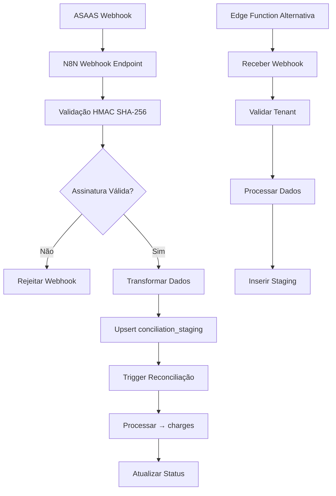
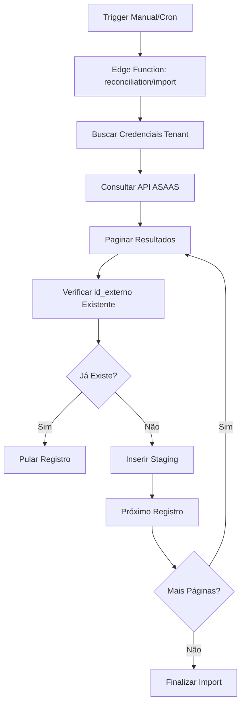
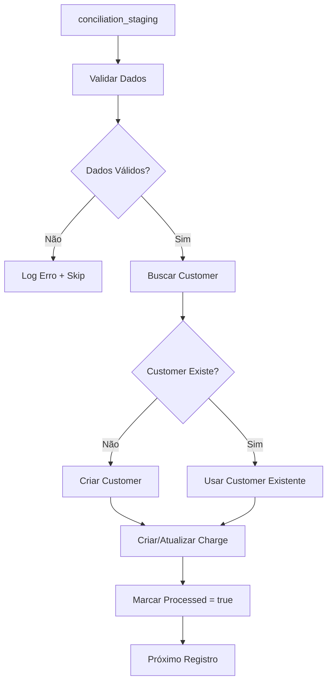

# 🏗️ ESTRUTURA DE COBRANÇA ASAAS - DOCUMENTAÇÃO TÉCNICA COMPLETA

**Versão:** 1.0  
**Data:** Janeiro 2025  
**Autor:** Barcelitos (AI Agent)  
**Projeto:** Revalya Oficial  
**Status:** 🔴 ÁREA CRÍTICA - DOCUMENTAÇÃO MASTER

---

## 🎯 **VISÃO GERAL DA ARQUITETURA DE COBRANÇA**

Esta documentação detalha **COMPLETAMENTE** a estrutura de cobrança ASAAS no sistema Revalya, incluindo:

- ✅ **Fluxo Push**: Webhooks ASAAS → Sistema Revalya
- ✅ **Fluxo Pull**: Sistema Revalya → API ASAAS  
- ✅ **Conciliação**: Staging → Reconciliação → Charges
- ✅ **Anti-Duplicação**: Estratégias e mecanismos
- ✅ **Edge Functions**: Supabase Functions para processamento
- ✅ **N8N Workflows**: Automação e transformação de dados

---

## 📊 **MAPEAMENTO COMPLETO DE TABELAS**

### **1. Tabela: `conciliation_staging`**
**Função:** Área de staging para dados brutos do ASAAS antes da reconciliação

```sql
-- AIDEV-NOTE: Estrutura atual da tabela de staging
CREATE TABLE conciliation_staging (
  id UUID PRIMARY KEY DEFAULT gen_random_uuid(),
  tenant_id UUID NOT NULL REFERENCES tenants(id),
  id_externo TEXT NOT NULL,           -- ID único do ASAAS
  valor DECIMAL(10,2) NOT NULL,       -- Valor da cobrança
  status TEXT NOT NULL,               -- Status ASAAS (PENDING, RECEIVED, etc.)
  data_vencimento DATE,               -- Data de vencimento
  data_pagamento TIMESTAMP,           -- Data do pagamento (se pago)
  customer_id TEXT,                   -- ID do cliente no ASAAS
  customer_name TEXT,                 -- Nome do cliente
  description TEXT,                   -- Descrição da cobrança
  payment_method TEXT,                -- Método de pagamento
  raw_data JSONB,                     -- Dados brutos completos do webhook
  processed BOOLEAN DEFAULT FALSE,    -- Flag de processamento
  created_at TIMESTAMP DEFAULT NOW(),
  updated_at TIMESTAMP DEFAULT NOW(),
  
  -- CONSTRAINTS DE SEGURANÇA MULTI-TENANT
  CONSTRAINT unique_external_id_per_tenant 
    UNIQUE (tenant_id, id_externo)
);

-- ÍNDICES PARA PERFORMANCE
CREATE INDEX idx_conciliation_staging_tenant_id ON conciliation_staging(tenant_id);
CREATE INDEX idx_conciliation_staging_id_externo ON conciliation_staging(id_externo);
CREATE INDEX idx_conciliation_staging_processed ON conciliation_staging(processed);
CREATE INDEX idx_conciliation_staging_created_at ON conciliation_staging(created_at);
```

### **2. Tabela: `charges`**
**Função:** Tabela principal de cobranças processadas e reconciliadas

```sql
-- AIDEV-NOTE: Estrutura da tabela principal de cobranças
CREATE TABLE charges (
  id UUID PRIMARY KEY DEFAULT gen_random_uuid(),
  tenant_id UUID NOT NULL REFERENCES tenants(id),
  asaas_id TEXT,                      -- ID no ASAAS (pode ser NULL para cobranças internas)
  customer_id UUID REFERENCES customers(id),
  amount DECIMAL(10,2) NOT NULL,
  status TEXT NOT NULL,               -- Status interno (pending, paid, overdue, cancelled)
  due_date DATE NOT NULL,
  paid_date TIMESTAMP,
  description TEXT,
  payment_method TEXT,
  gateway_data JSONB,                 -- Dados do gateway (ASAAS, etc.)
  created_at TIMESTAMP DEFAULT NOW(),
  updated_at TIMESTAMP DEFAULT NOW(),
  
  -- CONSTRAINTS DE SEGURANÇA
  CONSTRAINT unique_asaas_id_per_tenant 
    UNIQUE (tenant_id, asaas_id) WHERE asaas_id IS NOT NULL
);
```

### **3. Tabela: `customers`**
**Função:** Clientes sincronizados com ASAAS

```sql
-- AIDEV-NOTE: Estrutura de clientes com integração ASAAS
CREATE TABLE customers (
  id UUID PRIMARY KEY DEFAULT gen_random_uuid(),
  tenant_id UUID NOT NULL REFERENCES tenants(id),
  asaas_id TEXT,                      -- ID no ASAAS
  name TEXT NOT NULL,
  email TEXT,
  phone TEXT,
  document TEXT,                      -- CPF/CNPJ
  address JSONB,                      -- Endereço completo
  created_at TIMESTAMP DEFAULT NOW(),
  updated_at TIMESTAMP DEFAULT NOW(),
  
  -- CONSTRAINTS DE SEGURANÇA
  CONSTRAINT unique_asaas_id_per_tenant 
    UNIQUE (tenant_id, asaas_id) WHERE asaas_id IS NOT NULL
);
```

---

## 🔄 **FLUXO COMPLETO DE COBRANÇA - PUSH (WEBHOOKS)**

### **1. Arquitetura do Fluxo Push**



### **2. Implementação Atual - N8N Workflows**

#### **A. Workflow: `webhook/asaas/charges`**
**Localização:** `src/n8n/workflows/workflow-definitions.ts`

```typescript
// AIDEV-NOTE: Configuração do workflow de charges ASAAS
export const chargesWorkflow = {
  name: 'ASAAS Charges Webhook',
  nodes: [
    {
      name: 'Webhook Trigger',
      type: 'webhook',
      parameters: {
        path: 'webhook/asaas/charges',
        httpMethod: 'POST',
        responseMode: 'responseNode'
      }
    },
    {
      name: 'Transform Payment Data',
      type: 'function',
      parameters: {
        functionCode: `
          // Mapear status ASAAS para status interno
          const statusMapping = {
            'PENDING': 'pending',
            'RECEIVED': 'paid', 
            'OVERDUE': 'overdue',
            'CANCELLED': 'cancelled'
          };
          
          const payment = items[0].json;
          
          return [{
            json: {
              tenant_id: payment.tenant_id,
              id_externo: payment.id,
              valor: payment.value,
              status: statusMapping[payment.status] || 'pending',
              data_vencimento: payment.dueDate,
              data_pagamento: payment.paymentDate,
              customer_id: payment.customer,
              customer_name: payment.customerName,
              description: payment.description,
              payment_method: payment.billingType,
              raw_data: payment
            }
          }];
        `
      }
    },
    {
      name: 'Upsert Staging',
      type: 'supabase',
      parameters: {
        operation: 'upsert',
        table: 'conciliation_staging',
        conflictColumns: ['tenant_id', 'id_externo']
      }
    }
  ]
};
```

#### **B. Workflow: `webhook/asaas/customers`**
**Localização:** `src/n8n/workflows/webhook.ts`

```typescript
// AIDEV-NOTE: Workflow para sincronização de clientes
export const customerWebhookWorkflow = {
  name: 'ASAAS Customer Webhook',
  trigger: {
    type: 'webhook',
    path: 'webhook/asaas/customers'
  },
  transform: {
    // Transformar dados do cliente ASAAS
    customerData: {
      tenant_id: '{{ $json.tenant_id }}',
      asaas_id: '{{ $json.id }}',
      name: '{{ $json.name }}',
      email: '{{ $json.email }}',
      phone: '{{ $json.phone }}',
      document: '{{ $json.cpfCnpj }}'
    }
  },
  action: {
    type: 'supabase_upsert',
    table: 'customers',
    conflict: ['tenant_id', 'asaas_id']
  }
};
```

### **3. Implementação Proposta - Edge Function**

#### **A. Edge Function: `asaas-webhook-charges`**
**Localização Proposta:** `supabase/functions/asaas-webhook-charges/index.ts`

```typescript
// AIDEV-NOTE: Edge Function proposta para webhooks de cobrança
import { serve } from 'https://deno.land/std@0.168.0/http/server.ts';
import { createClient } from 'https://esm.sh/@supabase/supabase-js@2';
import { crypto } from 'https://deno.land/std@0.168.0/crypto/mod.ts';

interface AsaasWebhookPayload {
  event: string;
  payment: {
    id: string;
    value: number;
    status: string;
    dueDate: string;
    paymentDate?: string;
    customer: string;
    customerName: string;
    description: string;
    billingType: string;
  };
}

serve(async (req: Request) => {
  try {
    // 1. Validar método HTTP
    if (req.method !== 'POST') {
      return new Response('Method not allowed', { status: 405 });
    }

    // 2. Extrair headers e payload
    const signature = req.headers.get('asaas-signature');
    const tenantId = req.headers.get('x-tenant-id');
    const payload = await req.text();
    
    if (!signature || !tenantId) {
      return new Response('Missing required headers', { status: 400 });
    }

    // 3. Validar assinatura HMAC
    const webhookToken = Deno.env.get('ASAAS_WEBHOOK_TOKEN');
    const expectedSignature = await crypto.subtle.digest(
      'SHA-256',
      new TextEncoder().encode(webhookToken + payload)
    );
    
    if (signature !== Array.from(new Uint8Array(expectedSignature))
        .map(b => b.toString(16).padStart(2, '0')).join('')) {
      return new Response('Invalid signature', { status: 401 });
    }

    // 4. Processar dados
    const data: AsaasWebhookPayload = JSON.parse(payload);
    
    // 5. Mapear status
    const statusMapping: Record<string, string> = {
      'PENDING': 'pending',
      'RECEIVED': 'paid',
      'OVERDUE': 'overdue', 
      'CANCELLED': 'cancelled'
    };

    // 6. Preparar dados para staging
    const stagingData = {
      tenant_id: tenantId,
      id_externo: data.payment.id,
      valor: data.payment.value,
      status: statusMapping[data.payment.status] || 'pending',
      data_vencimento: data.payment.dueDate,
      data_pagamento: data.payment.paymentDate || null,
      customer_id: data.payment.customer,
      customer_name: data.payment.customerName,
      description: data.payment.description,
      payment_method: data.payment.billingType,
      raw_data: data.payment,
      processed: false
    };

    // 7. Inserir/Atualizar staging (UPSERT)
    const supabase = createClient(
      Deno.env.get('SUPABASE_URL')!,
      Deno.env.get('SUPABASE_SERVICE_ROLE_KEY')!
    );

    const { error } = await supabase
      .from('conciliation_staging')
      .upsert(stagingData, {
        onConflict: 'tenant_id,id_externo',
        ignoreDuplicates: false
      });

    if (error) {
      console.error('Erro ao inserir staging:', error);
      return new Response('Database error', { status: 500 });
    }

    // 8. Resposta de sucesso
    return new Response(JSON.stringify({ 
      success: true, 
      message: 'Webhook processado com sucesso',
      id_externo: data.payment.id
    }), {
      headers: { 'Content-Type': 'application/json' },
      status: 200
    });

  } catch (error) {
    console.error('Erro no webhook:', error);
    return new Response('Internal server error', { status: 500 });
  }
});
```

---

## 🔄 **FLUXO COMPLETO DE COBRANÇA - PULL (IMPORTAÇÃO)**

### **1. Arquitetura do Fluxo Pull**



### **2. Implementação Atual - Edge Function**

#### **A. Edge Function: `reconciliation/import`**
**Localização:** `supabase/functions/reconciliation/import.ts`

```typescript
// AIDEV-NOTE: Função de importação ASAAS existente
import { serve } from 'https://deno.land/std@0.168.0/http/server.ts';

serve(async (req: Request) => {
  try {
    const { tenant_id, start_date, end_date } = await req.json();
    
    // 1. Buscar credenciais do tenant
    const { data: integration } = await supabase
      .from('tenant_integrations')
      .select('api_key, api_url')
      .eq('tenant_id', tenant_id)
      .eq('integration_type', 'asaas')
      .eq('is_active', true)
      .single();

    if (!integration) {
      throw new Error('Integração ASAAS não configurada');
    }

    // 2. Consultar API ASAAS
    let offset = 0;
    const limit = 100;
    let hasMore = true;

    while (hasMore) {
      const response = await fetch(
        `${integration.api_url}/payments?offset=${offset}&limit=${limit}&dateCreated[ge]=${start_date}&dateCreated[le]=${end_date}`,
        {
          headers: {
            'access_token': integration.api_key,
            'Content-Type': 'application/json'
          }
        }
      );

      const data = await response.json();
      
      // 3. Processar cada pagamento
      for (const payment of data.data) {
        // Verificar se já existe
        const { data: existing } = await supabase
          .from('conciliation_staging')
          .select('id')
          .eq('tenant_id', tenant_id)
          .eq('id_externo', payment.id)
          .single();

        if (!existing) {
          // Inserir novo registro
          await supabase
            .from('conciliation_staging')
            .insert({
              tenant_id,
              id_externo: payment.id,
              valor: payment.value,
              status: payment.status.toLowerCase(),
              data_vencimento: payment.dueDate,
              data_pagamento: payment.paymentDate,
              customer_id: payment.customer,
              customer_name: payment.customerName,
              description: payment.description,
              payment_method: payment.billingType,
              raw_data: payment,
              processed: false
            });
        }
      }

      // 4. Verificar se há mais páginas
      hasMore = data.hasMore;
      offset += limit;
    }

    return new Response(JSON.stringify({ 
      success: true, 
      message: 'Importação concluída' 
    }));

  } catch (error) {
    return new Response(JSON.stringify({ 
      error: error.message 
    }), { status: 500 });
  }
});
```

---

## 🛡️ **ESTRATÉGIAS ANTI-DUPLICAÇÃO**

### **1. Nível de Banco de Dados**

#### **A. Constraints Únicas**
```sql
-- AIDEV-NOTE: Constraint principal para prevenir duplicação
ALTER TABLE conciliation_staging 
ADD CONSTRAINT unique_external_id_per_tenant 
UNIQUE (tenant_id, id_externo);

-- Constraint para tabela charges
ALTER TABLE charges 
ADD CONSTRAINT unique_asaas_id_per_tenant 
UNIQUE (tenant_id, asaas_id) WHERE asaas_id IS NOT NULL;
```

#### **B. Índices de Performance**
```sql
-- AIDEV-NOTE: Índices para otimizar consultas de duplicação
CREATE INDEX CONCURRENTLY idx_staging_tenant_external 
ON conciliation_staging(tenant_id, id_externo);

CREATE INDEX CONCURRENTLY idx_charges_tenant_asaas 
ON charges(tenant_id, asaas_id) WHERE asaas_id IS NOT NULL;
```

### **2. Nível de Aplicação**

#### **A. Padrão UPSERT**
```sql
-- AIDEV-NOTE: Padrão SQL para upsert seguro
INSERT INTO conciliation_staging (
  tenant_id, id_externo, valor, status, data_vencimento,
  customer_id, customer_name, description, payment_method, raw_data
) VALUES (
  $1, $2, $3, $4, $5, $6, $7, $8, $9, $10
) 
ON CONFLICT (tenant_id, id_externo) 
DO UPDATE SET
  valor = EXCLUDED.valor,
  status = EXCLUDED.status,
  data_pagamento = EXCLUDED.data_pagamento,
  raw_data = EXCLUDED.raw_data,
  updated_at = NOW()
WHERE conciliation_staging.updated_at < EXCLUDED.updated_at;
```

#### **B. Verificação Prévia (Edge Function)**
```typescript
// AIDEV-NOTE: Verificação antes de inserir
async function checkExistingRecord(tenantId: string, idExterno: string) {
  const { data } = await supabase
    .from('conciliation_staging')
    .select('id, updated_at')
    .eq('tenant_id', tenantId)
    .eq('id_externo', idExterno)
    .single();
    
  return data;
}
```

### **3. Nível de Webhook (Validação HMAC)**

#### **A. Validação de Assinatura**
```typescript
// AIDEV-NOTE: Validação HMAC SHA-256 para webhooks
async function validateWebhookSignature(
  payload: string, 
  signature: string, 
  secret: string
): Promise<boolean> {
  const encoder = new TextEncoder();
  const key = await crypto.subtle.importKey(
    'raw',
    encoder.encode(secret),
    { name: 'HMAC', hash: 'SHA-256' },
    false,
    ['sign']
  );
  
  const expectedSignature = await crypto.subtle.sign(
    'HMAC',
    key,
    encoder.encode(payload)
  );
  
  const expectedHex = Array.from(new Uint8Array(expectedSignature))
    .map(b => b.toString(16).padStart(2, '0'))
    .join('');
    
  return signature === expectedHex;
}
```

---

## 🔧 **EDGE FUNCTIONS EXISTENTES E PROPOSTAS**

### **1. Edge Functions Existentes**

#### **A. `asaas-proxy`**
**Localização:** `supabase/functions/asaas-proxy/index.ts`
**Função:** Proxy para API ASAAS com rate limiting e CORS

```typescript
// AIDEV-NOTE: Resumo da função proxy existente
- Rate limiting por tenant (100 req/min)
- Validação de credenciais por tenant
- Proxy transparente para API ASAAS
- Tratamento de CORS
- Logs de auditoria
```

#### **B. `bulk-insert-helper`**
**Localização:** `supabase/functions/bulk-insert-helper/index.ts`
**Função:** Helper para inserções em massa com upsert

```typescript
// AIDEV-NOTE: Capacidades do bulk insert helper
- Suporte a upsert com onConflict
- Processamento em lotes (batch)
- Validação de dados
- Otimização de performance
```

### **2. Edge Functions Propostas**

#### **A. `asaas-webhook-charges` (NOVA)**
**Função:** Processar webhooks de cobrança ASAAS
**Status:** 🟡 PROPOSTA - ALTA PRIORIDADE

```typescript
// AIDEV-NOTE: Especificação da nova Edge Function
Funcionalidades:
- Receber webhooks de cobrança ASAAS
- Validar assinatura HMAC SHA-256
- Transformar dados para formato interno
- Upsert em conciliation_staging
- Logs de auditoria e monitoramento
- Resposta padronizada para ASAAS
```

#### **B. `asaas-reconciliation-processor` (NOVA)**
**Função:** Processar registros de staging para charges
**Status:** 🟡 PROPOSTA - MÉDIA PRIORIDADE

```typescript
// AIDEV-NOTE: Especificação do processador de reconciliação
Funcionalidades:
- Ler registros não processados de staging
- Validar e transformar dados
- Inserir/atualizar tabela charges
- Marcar registros como processados
- Tratamento de erros e retry
- Relatórios de processamento
```

---

## 📋 **PROCESSO DE RECONCILIAÇÃO**

### **1. Fluxo de Reconciliação**



### **2. Implementação da Reconciliação**

#### **A. Função de Processamento**
```typescript
// AIDEV-NOTE: Lógica de reconciliação proposta
async function processReconciliation(tenantId: string) {
  // 1. Buscar registros não processados
  const { data: stagingRecords } = await supabase
    .from('conciliation_staging')
    .select('*')
    .eq('tenant_id', tenantId)
    .eq('processed', false)
    .order('created_at', { ascending: true });

  for (const record of stagingRecords) {
    try {
      // 2. Validar dados obrigatórios
      if (!record.id_externo || !record.valor) {
        await markAsError(record.id, 'Dados obrigatórios ausentes');
        continue;
      }

      // 3. Buscar/criar customer
      let customerId = await findOrCreateCustomer(
        tenantId, 
        record.customer_id, 
        record.customer_name
      );

      // 4. Criar/atualizar charge
      await upsertCharge({
        tenant_id: tenantId,
        asaas_id: record.id_externo,
        customer_id: customerId,
        amount: record.valor,
        status: record.status,
        due_date: record.data_vencimento,
        paid_date: record.data_pagamento,
        description: record.description,
        payment_method: record.payment_method,
        gateway_data: record.raw_data
      });

      // 5. Marcar como processado
      await supabase
        .from('conciliation_staging')
        .update({ processed: true, updated_at: new Date() })
        .eq('id', record.id);

    } catch (error) {
      await markAsError(record.id, error.message);
    }
  }
}
```

---

## 🚨 **MONITORAMENTO E LOGS**

### **1. Métricas Importantes**

#### **A. Webhooks**
- Taxa de sucesso de webhooks recebidos
- Tempo de processamento por webhook
- Erros de validação de assinatura
- Volume de webhooks por tenant

#### **B. Importação**
- Registros importados vs. duplicados
- Tempo de importação por lote
- Erros de API ASAAS
- Performance de consultas de duplicação

#### **C. Reconciliação**
- Registros processados vs. com erro
- Tempo médio de reconciliação
- Taxa de criação de novos customers
- Discrepâncias de dados

### **2. Implementação de Logs**

#### **A. Estrutura de Log**
```typescript
// AIDEV-NOTE: Estrutura padronizada de logs
interface LogEntry {
  timestamp: string;
  level: 'INFO' | 'WARN' | 'ERROR';
  component: 'webhook' | 'import' | 'reconciliation';
  tenant_id: string;
  operation: string;
  details: Record<string, any>;
  error?: string;
}
```

#### **B. Implementação**
```typescript
// AIDEV-NOTE: Função de log centralizada
function logOperation(entry: LogEntry) {
  console.log(JSON.stringify({
    ...entry,
    timestamp: new Date().toISOString()
  }));
  
  // Opcional: Enviar para sistema de monitoramento
  // await sendToMonitoring(entry);
}
```

---

## 🔄 **PLANO DE IMPLEMENTAÇÃO RECOMENDADO**

### **Fase 1: Fundação (ALTA PRIORIDADE)**
1. ✅ **Criar Edge Function `asaas-webhook-charges`**
2. ✅ **Implementar validação HMAC SHA-256**
3. ✅ **Configurar constraints de duplicação**
4. ✅ **Testes de webhook com dados reais**

### **Fase 2: Otimização (MÉDIA PRIORIDADE)**
1. 🟡 **Criar Edge Function `asaas-reconciliation-processor`**
2. 🟡 **Implementar monitoramento e alertas**
3. 🟡 **Otimizar consultas e índices**
4. 🟡 **Documentar APIs e contratos**

### **Fase 3: Evolução (BAIXA PRIORIDADE)**
1. 🔵 **Implementar retry automático**
2. 🔵 **Dashboard de monitoramento**
3. 🔵 **Alertas proativos**
4. 🔵 **Métricas avançadas**

---

## 📚 **REFERÊNCIAS E DEPENDÊNCIAS**

### **1. Arquivos Relacionados**
- `src/services/asaas.ts` - Serviço principal
- `src/services/gatewayService.ts` - Validação de gateway
- `supabase/functions/asaas-proxy/index.ts` - Proxy existente
- `src/n8n/workflows/` - Workflows N8N
- `src/types/asaas.ts` - Tipos TypeScript

### **2. Tabelas do Banco**
- `conciliation_staging` - Staging de dados
- `charges` - Cobranças processadas
- `customers` - Clientes sincronizados
- `tenant_integrations` - Credenciais por tenant

### **3. APIs Externas**
- ASAAS API v3 - `https://api.asaas.com/v3`
- ASAAS Sandbox - `https://sandbox.asaas.com/v3`

---

## ⚠️ **NOTAS CRÍTICAS DE MANUTENÇÃO**

### **🔴 NUNCA ALTERAR SEM VALIDAÇÃO:**
1. Constraints de `tenant_id` (segurança multi-tenant)
2. Validação de assinatura HMAC (segurança webhooks)
3. Estrutura de `id_externo` (prevenção duplicação)
4. Mapeamento de status ASAAS → interno

### **🟡 ALTERAR COM CUIDADO:**
1. Estrutura de tabelas (requer migração)
2. Formato de dados em `raw_data` (compatibilidade)
3. Timeouts de API (performance)
4. Configurações de rate limiting

### **🟢 SEGURO PARA ALTERAR:**
1. Logs e monitoramento
2. Mensagens de erro
3. Configurações de UI
4. Documentação

---

**📝 AIDEV-NOTE:** Esta documentação deve ser atualizada sempre que houver mudanças na arquitetura de cobrança ASAAS. Mantenha sempre sincronizada com o código real.

**🔄 Última Atualização:** Janeiro 2025  
**👤 Responsável:** Barcelitos (AI Agent)  
**📋 Status:** 🔴 DOCUMENTAÇÃO CRÍTICA - SEMPRE CONSULTAR ANTES DE ALTERAÇÕES