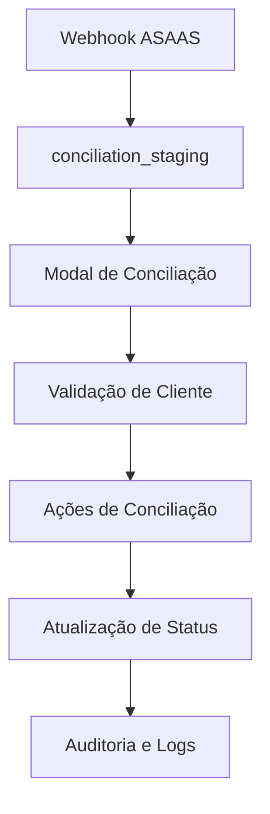
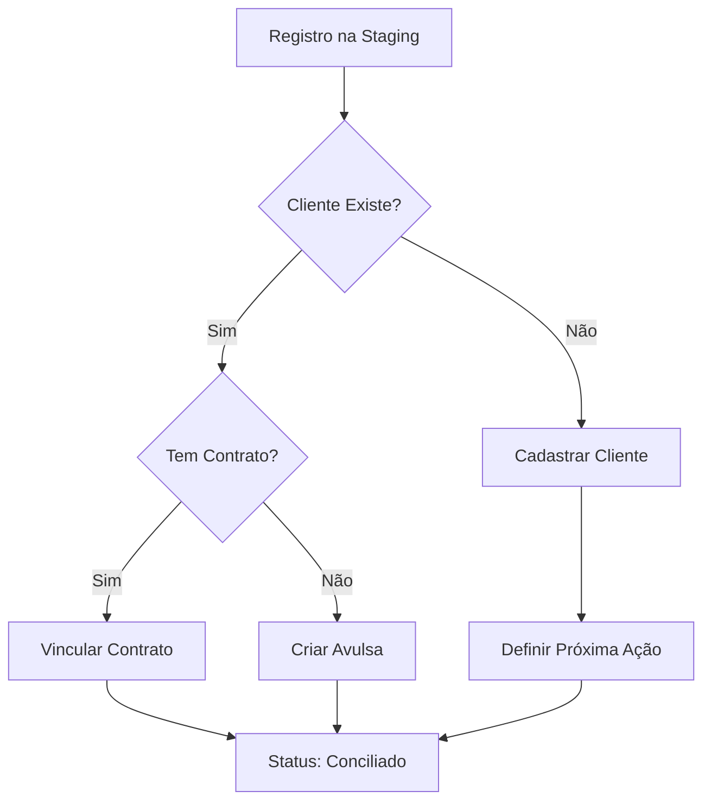

# 🔄 PASSOS PARA CONCILIAÇÃO - SISTEMA REVALYA

**Versão:** 1.0  
**Data:** Janeiro 2025  
**Autor:** Barcelitos (AI Agent)  
**Projeto:** Revalya Oficial  
**Status:** 🟡 DOCUMENTAÇÃO ATIVA - EM DESENVOLVIMENTO

---

## 🎯 **VISÃO GERAL DO PROCESSO DE CONCILIAÇÃO**

O sistema de conciliação do Revalya processa dados financeiros vindos do ASAAS através de um fluxo estruturado que garante integridade, segurança multi-tenant e rastreabilidade completa.

### **Fluxo Principal**


---

## 📊 **ESTRUTURA DE DADOS**

### **1. Tabela Principal: `conciliation_staging`**

#### **Campos Essenciais**
- `id` (UUID) - Identificador único
- `tenant_id` (UUID) - Isolamento multi-tenant
- `origem` (TEXT) - Fonte dos dados (ex: "ASAAS")
- `id_externo` (TEXT) - ID do sistema externo
- `asaas_customer_id` (TEXT) - ID do cliente no ASAAS

#### **Dados Financeiros**
- `valor_original` (NUMERIC) - Valor original da cobrança
- `valor_pago` (NUMERIC) - Valor efetivamente pago
- `valor_liquido` (NUMERIC) - Valor líquido após taxas
- `installment_number` (INTEGER) - Número da parcela

#### **Status e Controle**
- `status_conciliacao` (TEXT) - Status da conciliação
- `status_externo` (TEXT) - Status no sistema externo
- `processed` (BOOLEAN) - Se foi processado
- `reconciled` (BOOLEAN) - Se foi conciliado

#### **Dados do Cliente**
- `customer_name` (TEXT) - Nome do cliente
- `customer_document` (TEXT) - CPF/CNPJ do cliente
- `customer_email` (TEXT) - Email do cliente

### **2. Integração com `customers`**
- **Chave de Ligação:** `asaas_customer_id` ↔ `customer_asaas_id`
- **Validação:** Verificação de existência do cliente
- **Status:** Identificação de clientes não cadastrados

---

## 🔧 **COMPONENTES DO SISTEMA**

### **1. ReconciliationModal.tsx**
**Localização:** `src/components/reconciliation/ReconciliationModal.tsx`

#### **Responsabilidades**
- ✅ Carregamento de dados da `conciliation_staging`
- ✅ Aplicação de filtros avançados
- ✅ Cálculo de indicadores em tempo real
- ✅ Mapeamento de dados para interface
- ✅ Execução de ações de conciliação

#### **Filtros Disponíveis**
- **Status de Conciliação:** Pendente, Conciliado, Divergente
- **Origem:** ASAAS, outros sistemas
- **Período:** Data de pagamento, vencimento
- **Cliente:** Nome, documento, email
- **Valores:** Faixas de valor original/pago
- **Contratos:** Com/sem contrato vinculado

### **2. Sistema de Ações**
**Status Atual:** 🟡 PARCIALMENTE IMPLEMENTADO

#### **Ações Disponíveis**
1. **Vincular Contrato** (`vincular_contrato`)
2. **Criar Avulsa** (`criar_avulsa`)
3. **Marcar Divergente** (`marcar_divergente`)
4. **Aprovar** (`aprovar`)
5. **Rejeitar** (`rejeitar`)

#### **Ações Necessárias (Pendentes)**
- **Cadastrar Cliente** (`cadastrar_cliente`)
- **Complementar Existente** (`complementar_existente`)
- **Ignorar** (`ignorar`)

---

## 🚀 **PROCESSO DE CONCILIAÇÃO PASSO A PASSO**

### **FASE 1: PREPARAÇÃO DOS DADOS**

#### **1.1 Recebimento via Webhook**
```typescript
// Edge Function: asaas-webhook
// Localização: supabase/functions/asaas-webhook/index.ts

// AIDEV-NOTE: Dados chegam do ASAAS e são inseridos na staging
const insertResult = await supabase
  .from('conciliation_staging')
  .upsert({
    tenant_id: tenantId,
    origem: 'ASAAS',
    id_externo: payment.id,
    asaas_customer_id: payment.customer,
    // ... outros campos
  });
```

#### **1.2 Validação de Integridade**
- ✅ Verificação de `tenant_id`
- ✅ Validação de campos obrigatórios
- ✅ Prevenção de duplicatas
- ✅ Logs de auditoria

### **FASE 2: ANÁLISE E VALIDAÇÃO**

#### **2.1 Carregamento no Modal**
```typescript
// AIDEV-NOTE: Hook seguro para carregamento de dados
const loadReconciliationData = useCallback(async () => {
  // 1. Configurar contexto de tenant
  await supabase.rpc('set_tenant_context_simple', { 
    p_tenant_id: currentTenant.id 
  });
  
  // 2. Buscar dados com RLS automático
  const { data, error } = await supabase
    .from('conciliation_staging')
    .select('*')
    .order('created_at', { ascending: false });
}, [currentTenant.id]);
```

#### **2.2 Validação de Clientes**
```sql
-- Query para verificar clientes não cadastrados
SELECT 
  cs.*,
  c.id as customer_exists
FROM conciliation_staging cs
LEFT JOIN customers c ON c.customer_asaas_id = cs.asaas_customer_id
WHERE cs.tenant_id = $1
  AND cs.asaas_customer_id IS NOT NULL
  AND c.id IS NULL;
```

**Resultado Atual:** 10 registros com `asaas_customer_id` sem cliente correspondente

### **FASE 3: AÇÕES DE CONCILIAÇÃO**

#### **3.1 Fluxo de Decisão**


#### **3.2 Implementação das Ações**

##### **A. Vincular Contrato**
```typescript
case 'vincular_contrato':
  updateData = {
    status_conciliacao: 'CONCILIADO',
    contrato_id: actionData.contratoId,
    observacao: `Vinculado ao contrato ${actionData.contratoId}`,
    reconciled: true,
    processed: true
  };
```

##### **B. Criar Avulsa**
```typescript
case 'criar_avulsa':
  updateData = {
    status_conciliacao: 'CONCILIADO',
    observacao: 'Cobrança avulsa criada',
    reconciled: true,
    processed: true
  };
```

##### **C. Cadastrar Cliente (PENDENTE)**
```typescript
// AIDEV-NOTE: Ação ainda não implementada
case 'cadastrar_cliente':
  // 1. Criar cliente na tabela customers
  // 2. Vincular asaas_customer_id
  // 3. Definir próxima ação
```

### **FASE 4: VALIDAÇÃO E AUDITORIA**

#### **4.1 Verificações de Segurança**
- ✅ Validação de `tenant_id` em todas as operações
- ✅ Verificação de permissões de usuário
- ✅ Logs de auditoria obrigatórios
- ✅ Rollback em caso de erro

#### **4.2 Atualização de Status**
```typescript
// AIDEV-NOTE: Atualização segura com contexto de tenant
const { error } = await supabase
  .from('conciliation_staging')
  .update(updateData)
  .eq('id', recordId)
  .eq('tenant_id', currentTenant.id); // Segurança adicional
```

---

## 📈 **INDICADORES E MÉTRICAS**

### **Indicadores Calculados em Tempo Real**
- **Total de Registros:** Contagem geral
- **Pendentes:** Status = 'PENDENTE'
- **Conciliados:** Status = 'CONCILIADO'
- **Divergentes:** Status = 'DIVERGENTE'
- **Valor Total:** Soma dos valores pagos
- **Clientes Únicos:** Contagem de clientes distintos

### **Distribuição por Origem**
- **ASAAS:** Maioria dos registros
- **Outros:** Sistemas adicionais

### **Status de Processamento**
- **Processados:** `processed = true`
- **Não Processados:** `processed = false`
- **Conciliados:** `reconciled = true`

---

## 🔍 **FILTROS AVANÇADOS**

### **1. Filtros de Status**
```typescript
// Filtro por status de conciliação
if (filters.reconciliationStatus && filters.reconciliationStatus !== 'all') {
  filtered = filtered.filter(item => 
    item.reconciliationStatus === filters.reconciliationStatus
  );
}
```

### **2. Filtros de Cliente**
```typescript
// Busca por nome, documento ou email
if (filters.searchTerm) {
  const searchLower = filters.searchTerm.toLowerCase();
  filtered = filtered.filter(item =>
    item.customerName?.toLowerCase().includes(searchLower) ||
    item.customerDocument?.toLowerCase().includes(searchLower) ||
    item.customer_name?.toLowerCase().includes(searchLower) ||
    item.customer_document?.toLowerCase().includes(searchLower)
  );
}
```

### **3. Filtros Financeiros**
```typescript
// Filtros por valor original
if (filters.valorOriginalMin !== undefined) {
  filtered = filtered.filter(item => 
    (item.valor_original || 0) >= filters.valorOriginalMin!
  );
}
```

---

## 🚨 **PROBLEMAS IDENTIFICADOS E SOLUÇÕES**

### **1. Clientes Não Cadastrados**
**Problema:** 10 registros com `asaas_customer_id` sem cliente correspondente
**Solução:** Implementar ação "Cadastrar Cliente"

### **2. Sistema de Ações Incompleto**
**Problema:** Faltam ações específicas para casos complexos
**Solução:** Criar `ReconciliationActionModal` com formulários específicos

### **3. Validação de Dados**
**Problema:** Falta validação prévia antes das ações
**Solução:** Implementar `CustomerValidationGuard`

### **4. Status Management**
**Problema:** Status limitados para casos complexos
**Solução:** Adicionar status `REQUIRES_CUSTOMER`

---

## 🛠️ **PRÓXIMOS PASSOS DE IMPLEMENTAÇÃO**

### **PRIORIDADE ALTA**
1. **Criar ReconciliationActionModal.tsx**
   - Formulários específicos para cada ação
   - Validação de dados obrigatória
   - Interface intuitiva

2. **Implementar CustomerValidationGuard.tsx**
   - Verificação automática de clientes
   - Alertas para registros problemáticos
   - Sugestões de ação

3. **Adicionar Ação "Cadastrar Cliente"**
   - Formulário de cadastro integrado
   - Validação de CPF/CNPJ
   - Vinculação automática

### **PRIORIDADE MÉDIA**
1. **Refinar Status Management**
   - Novos status para casos específicos
   - Transições de status controladas
   - Histórico de mudanças

2. **Melhorar UX/UI**
   - Indicadores visuais mais claros
   - Ações em lote
   - Exportação de relatórios

### **PRIORIDADE BAIXA**
1. **Otimizações de Performance**
   - Paginação server-side
   - Cache inteligente
   - Lazy loading

2. **Auditoria Avançada**
   - Logs detalhados
   - Rastreamento de mudanças
   - Relatórios de auditoria

---

## 📚 **REFERÊNCIAS TÉCNICAS**

### **Arquivos Principais**
- `src/components/reconciliation/ReconciliationModal.tsx`
- `src/components/reconciliation/ReconciliationTable.tsx`
- `src/components/reconciliation/actions.ts`
- `supabase/functions/asaas-webhook/index.ts`

### **Tabelas do Banco**
- `conciliation_staging` - Dados de staging
- `customers` - Clientes cadastrados
- `contracts` - Contratos ativos
- `charges` - Cobranças do sistema

### **Hooks e Utilitários**
- `useTenantAccessGuard()` - Segurança multi-tenant
- `useSecureTenantQuery()` - Queries seguras
- `useReconciliation()` - Lógica de conciliação

---

## 🔐 **SEGURANÇA E COMPLIANCE**

### **Multi-Tenant Security**
- ✅ RLS (Row Level Security) ativo
- ✅ Validação de `tenant_id` obrigatória
- ✅ Contexto de tenant configurado
- ✅ Isolamento completo de dados

### **Auditoria**
- ✅ Logs de todas as ações
- ✅ Rastreamento de mudanças
- ✅ Identificação de usuário
- ✅ Timestamp de operações

### **Validação de Dados**
- ✅ Schemas TypeScript rigorosos
- ✅ Validação de entrada
- ✅ Sanitização de dados
- ✅ Prevenção de SQL Injection

---

**📝 NOTA:** Esta documentação será atualizada conforme o desenvolvimento progride. Sempre consulte a versão mais recente antes de implementar mudanças.

**🔄 ÚLTIMA ATUALIZAÇÃO:** Janeiro 2025 - Análise completa do sistema atual