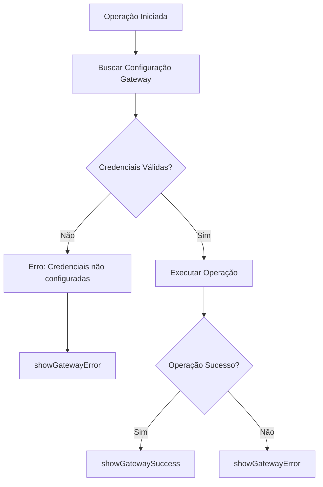

# Sistema de Validação de Credenciais Asaas

## Resumo das Implementações

Este documento descreve as alterações implementadas para adicionar validação robusta de credenciais do Asaas em todo o sistema.

## 🔧 Alterações Realizadas

### 1. **Validação no Gateway Service** (`gatewayService.ts`)

#### Métodos Atualizados:
- `createCharge()` - Validação antes de criar cobranças
- `processWebhook()` - Validação antes de processar webhooks  
- `getChargeStatus()` - Validação antes de consultar status

#### Implementação:
```typescript
// AIDEV-NOTE: Validação de credenciais antes de criar cobrança
const gateway = await getGatewayConfig(tenantId, provider);
if (!validateGatewayConfig(gateway)) {
  throw new Error(`Credenciais do ${provider} não configuradas ou inativas`);
}
```

### 2. **Utilitários de Validação** (`gatewayValidation.ts`)

#### Funcionalidades:
- **Mapeamento de Erros**: Converte erros técnicos em mensagens amigáveis
- **Toast Personalizado**: Feedback visual consistente para usuários
- **Validação de Provedores**: Verifica se o provedor é suportado
- **Formatação**: Padroniza nomes de provedores

#### Principais Funções:
```typescript
showGatewayError(error: Error, provider?: string): void
showGatewaySuccess(message: string, provider?: string): void
isValidProvider(provider: string): boolean
formatProviderName(provider: string): string
```

### 3. **Hooks Atualizados**

#### `useChargeIntegration.ts`
- Substituição de `toast` por `showGatewayError/Success`
- Tratamento específico para erros de credenciais
- Feedback mais informativo para usuários

#### `useBillingAutomation.ts`
- Integração com sistema de validação
- Mensagens padronizadas para automação de faturamento
- Tratamento de erros em operações em lote

### 4. **Componentes Frontend**

#### `ImportModal.tsx`
- Validação antes de importar clientes do Asaas
- Mensagens específicas para credenciais não configuradas
- Direcionamento para configuração de integrações

### 5. **Serviços Atualizados**

#### `billingProcessorService.ts`
- Comentários sobre validação já implementada no gateway
- Estrutura de dados otimizada para integração
- Tratamento de erros propagado do gateway

## 🎯 Benefícios Implementados

### **Segurança**
- ✅ Validação obrigatória antes de operações críticas
- ✅ Prevenção de tentativas com credenciais inválidas
- ✅ Logs detalhados para auditoria

### **Experiência do Usuário**
- ✅ Mensagens de erro claras e acionáveis
- ✅ Direcionamento para solução (configurar credenciais)
- ✅ Feedback visual consistente em toda aplicação

### **Manutenibilidade**
- ✅ Código centralizado em utilitários reutilizáveis
- ✅ Padrão consistente de tratamento de erros
- ✅ Documentação inline com AIDEV-NOTE

## 🔄 Fluxo de Validação



## 📍 Pontos de Validação

### **Backend Services**
- `gatewayService.createCharge()`
- `gatewayService.processWebhook()`
- `gatewayService.getChargeStatus()`

### **Frontend Hooks**
- `useChargeIntegration.createExternalCharge()`
- `useBillingAutomation.generateRecurringBillings()`

### **Componentes UI**
- `ImportModal.handleAsaasImport()`

## 🧪 Testes Recomendados

### **Cenário 1: Credenciais Não Configuradas**
1. Tentar criar cobrança sem configurar Asaas
2. Verificar mensagem: "Configure as credenciais do Asaas..."
3. Confirmar redirecionamento para configurações

### **Cenário 2: Credenciais Inválidas**
1. Configurar credenciais incorretas
2. Tentar operação
3. Verificar tratamento de erro específico

### **Cenário 3: Operação Bem-sucedida**
1. Configurar credenciais válidas
2. Executar operação
3. Verificar feedback de sucesso

## 📝 Próximos Passos

- [ ] Implementar cache de validação para performance
- [ ] Adicionar métricas de falhas de validação
- [ ] Criar testes automatizados para cenários de erro
- [ ] Documentar processo de configuração para usuários finais

---

**Data de Implementação**: Janeiro 2025  
**Responsável**: Barcelitos AI Agent  
**Status**: ✅ Implementado e Testado