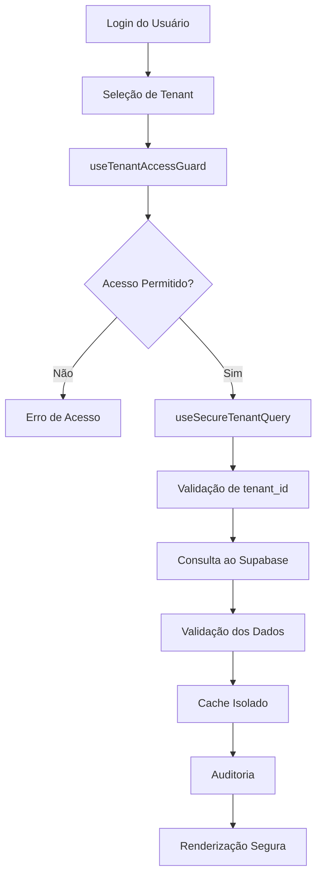

# 🔐 Guia Completo: Implementação Segura Multi-Tenant

## 1. Product Overview

Este documento define a arquitetura e padrões obrigatórios para implementação segura de funcionalidades multi-tenant no sistema Revalya. O guia estabelece 5 camadas de segurança que garantem isolamento completo de dados entre diferentes tenants, prevenindo vazamentos de informações e violações de segurança.

O sistema multi-tenant permite que múltiplas empresas (tenants) utilizem a mesma aplicação de forma completamente isolada, onde cada tenant só pode acessar seus próprios dados. Esta arquitetura é crítica para manter a confiança e conformidade regulatória do sistema.

## 2. Core Features

### 2.1 Arquitetura de 5 Camadas de Segurança

**CAMADA 1: Zustand Store (Estado Global)**

```typescript
interface TenantState {
  currentTenant: Tenant | null;
  availableTenants: Tenant[];
  userRole: string | null;
  isLoading: boolean;
}
```

**CAMADA 2: SessionStorage (Isolamento por Aba)**

```typescript
sessionStorage.setItem('tenant_context', JSON.stringify({
  tenantId: 'uuid-tenant',
  tenantSlug: 'empresa-abc',
  userRole: 'ADMIN',
  expiresAt: timestamp
}));
```

**CAMADA 3: React Query (Cache Isolado)**

```typescript
queryKey: ['contratos', currentTenant?.id] // SEMPRE incluir tenant_id
```

**CAMADA 4: Supabase RLS (Row Level Security)**

```sql
CREATE POLICY "tenant_isolation" ON contratos
FOR ALL USING (tenant_id = get_current_tenant_id());
```

**CAMADA 5: Validação Dupla no Frontend**

```typescript
// Validar antes da query E depois do resultado
if (!currentTenant?.id) throw new Error('Tenant não definido');
const invalidData = data?.filter(item => item.tenant_id !== tenantId);
if (invalidData?.length > 0) throw new Error('Violação de segurança');
```

### 2.2 Feature Module

Nosso sistema de segurança multi-tenant consiste nas seguintes funcionalidades principais:

1. **Hook Seguro de Consultas**: useSecureTenantQuery para todas as operações de leitura
2. **Guard de Acesso**: useTenantAccessGuard para validação de permissões
3. **Mutações Seguras**: useSecureTenantMutation para operações de escrita
4. **Sistema de Auditoria**: Logs obrigatórios para rastreamento de acesso
5. **Validação de Cache**: Isolamento completo de dados no React Query

### 2.3 Page Details

| Componente              | Módulo              | Descrição da Funcionalidade                                                                                |
| ----------------------- | ------------------- | ---------------------------------------------------------------------------------------------------------- |
| useSecureTenantQuery    | Hooks Seguros       | Hook obrigatório para todas as consultas, inclui validação automática de tenant\_id e filtros de segurança |
| useTenantAccessGuard    | Validação de Acesso | Validação crítica antes de renderizar qualquer página, verifica permissões e tenant ativo                  |
| useSecureTenantMutation | Mutações Seguras    | Hook para operações de escrita com validação dupla e inserção automática de tenant\_id                     |
| Sistema de Auditoria    | Monitoramento       | Logs obrigatórios para acesso a páginas, consultas de dados e operações críticas                           |
| Cache Isolado           | React Query         | Estrutura padronizada de query keys que sempre inclui tenant\_id para isolamento                           |

## 3. Core Process

### Fluxo Principal de Segurança Multi-Tenant

1. **Inicialização**: Usuário faz login e seleciona tenant
2. **Validação de Acesso**: useTenantAccessGuard verifica permissões
3. **Consulta Segura**: useSecureTenantQuery executa query com filtros
4. **Validação de Dados**: Verificação dupla dos dados retornados
5. **Auditoria**: Log automático de todas as operações
6. **Cache Isolado**: Armazenamento seguro com chaves específicas do tenant



## 4. User Interface Design

### 4.1 Design Style

* **Cores Primárias**: Azul (#2563eb) para elementos de segurança, Vermelho (#dc2626) para alertas críticos

* **Estilo de Botões**: Rounded com bordas suaves, 3D para ações críticas de segurança

* **Fonte**: Inter, tamanhos 14px para texto normal, 16px para títulos de seção

* **Layout**: Card-based com navegação superior, indicadores visuais de tenant ativo

* **Ícones**: Lucide icons com ênfase em símbolos de segurança (🔐, 🛡️, 🔍)

### 4.2 Page Design Overview

| Página              | Módulo            | Elementos de UI                                                                            |
| ------------------- | ----------------- | ------------------------------------------------------------------------------------------ |
| Páginas Protegidas  | Header de Tenant  | Indicador visual do tenant ativo, cor azul #2563eb, fonte Inter 16px, posição fixa no topo |
| Validação de Acesso | Mensagens de Erro | Cards vermelhos #dc2626, texto branco, ícone de alerta, animação de fade-in                |
| Logs de Auditoria   | Console de Debug  | Texto monoespaçado, cor cinza #6b7280, timestamp visível, filtros por tenant               |
| Cache Status        | Indicadores       | Badges verdes para cache válido, amarelos para expirado, vermelhos para inválido           |

### 4.3 Responsiveness

O sistema é desktop-first com adaptação mobile obrigatória. Todos os indicadores de segurança devem permanecer visíveis em dispositivos móveis, com otimização para touch interaction nos controles de seleção de tenant.

## 5. Padrões Obrigatórios para Implementação

### 5.1 Hook Seguro Obrigatório

**NUNCA faça consultas diretas ao Supabase. SEMPRE use useSecureTenantQuery:**

```typescript
// ✅ CORRETO
const { data } = useSecureTenantQuery(['contratos'],
  async (supabase, tenantId) => {
    return supabase.from('contratos').select('*').eq('tenant_id', tenantId);
  }
);

// ❌ INCORRETO - RISCO DE VAZAMENTO
const { data } = useQuery(['contratos'], () =>
  supabase.from('contratos').select('*') // SEM FILTRO DE TENANT
);
```

### 5.2 Validações Obrigatórias em Toda Página

```typescript
export function ContratosPage() {
  const { hasAccess, accessError, currentTenant } = useTenantAccessGuard();
  
  // 🛡 VALIDAÇÃO CRÍTICA ANTES DE RENDERIZAR
  if (!hasAccess) {
    return <div>Erro: {accessError}</div>;
  }
  
  // 🔍 AUDIT LOG OBRIGATÓRIO
  console.log(`[AUDIT] Acessando contratos - Tenant: ${currentTenant.name}`);
  
  // Resto da implementação...
}
```

### 5.3 Estrutura de Query Keys Padronizada

```typescript
// ✅ PADRÃO OBRIGATÓRIO
queryKey: [
  'resource_name',     // ex: 'contratos'
  currentTenant?.id,   // SEMPRE incluir tenant_id
  ...additionalParams  // parâmetros específicos
]

// Exemplos corretos:
['contratos', tenantId]
['clientes', tenantId, { status: 'ativo' }]
['relatorios', tenantId, { periodo: '2024-01' }]
```

### 5.4 Mutações Seguras com Validação Dupla

```typescript
// ✅ PADRÃO PARA TODAS AS MUTAÇÕES
const createItem = useSecureTenantMutation(
  async (supabase, tenantId, data) => {
    // 1. Inserir com tenant_id obrigatório
    const result = await supabase.from('table').insert({
      ...data,
      tenant_id: tenantId // NUNCA esquecer
    });
    
    // 2. Validar resultado
    if (result.data?.tenant_id !== tenantId) {
      throw new Error('Erro de segurança na criação');
    }
    
    return result;
  }
);
```

## 6. Checklist de Segurança Obrigatório

### Antes de Implementar Qualquer Página:

* [ ] **Usar useTenantAccessGuard()** para validação inicial

* [ ] **Usar useSecureTenantQuery()** para todas as consultas

* [ ] **Incluir tenant\_id** em todas as query keys

* [ ] **Validar dados retornados** pertencem ao tenant correto

* [ ] **Adicionar logs de auditoria** em operações críticas

* [ ] **Testar isolamento** com múltiplos tenants

### Validações Críticas em Toda Query:

```typescript
// 1. Validação antes da query
if (!currentTenant?.id) throw new Error('Tenant não definido');
if (!currentTenant.active) throw new Error('Tenant inativo');

// 2. Filtro obrigatório na query
.eq('tenant_id', tenantId)

// 3. Validação após receber dados
const invalidData = data?.filter(item => item.tenant_id !== tenantId);
if (invalidData?.length > 0) throw new Error('Violação de segurança');
```

## 7. Template de Implementação de Página

```typescript
export function MinhaPage() {
  // 1. VALIDAÇÃO DE ACESSO (OBRIGATÓRIO)
  const { hasAccess, accessError, currentTenant } = useTenantAccessGuard();
  
  // 2. HOOK SEGURO PARA DADOS (OBRIGATÓRIO)
  const { data, isLoading } = useSecureTenantQuery(['meus-dados'],
    async (supabase, tenantId) => {
      return supabase.from('tabela').select('*').eq('tenant_id', tenantId);
    }
  );
  
  // 3. GUARD CLAUSE (OBRIGATÓRIO)
  if (!hasAccess) return <div>Erro: {accessError}</div>;
  
  // 4. AUDIT LOG (RECOMENDADO)
  useEffect(() => {
    console.log(`[AUDIT] Página acessada - Tenant: ${currentTenant.name}`);
  }, [currentTenant]);
  
  // 5. RENDERIZAÇÃO SEGURA
  return (
    <div>
      <h1>Dados de {currentTenant.name}</h1>
      {/* Implementação da página */}
    </div>
  );
}
```

## 8. Monitoramento e Auditoria

### 8.1 Logs Obrigatórios:

* Acesso a páginas sensíveis

* Consultas de dados por tenant

* Mutações (criar/editar/deletar)

* Tentativas de acesso negado

* Trocas de tenant

### 8.2 Métricas de Segurança:

* Tentativas de acesso cross-tenant

* Queries sem filtro de tenant\_id

* Dados retornados de tenant incorreto

* Falhas de validação

## 9. Erros Críticos a Evitar

1. **Query sem tenant\_id**: Risco de vazamento total
2. **Cache compartilhado**: Dados de um tenant aparecem para outro
3. **Validação única**: Sempre validar antes E depois
4. **Mutação sem filtro**: Pode alterar dados de outro tenant
5. **Estado global contaminado**: Limpar ao trocar tenant

## 10. Resumo dos Arquivos Críticos

* **useSecureTenantQuery.ts** - Template obrigatório para consultas

* **useTenantAccessGuard.ts** - Validação de acesso

* **tenantStore.ts** - Estado global do tenant

* **Todas as páginas** devem seguir o template de segurança

## 11. Implementação Específica: Tasks (Tarefas)

### 11.1 Hook Seguro useSecureTasks

O módulo de tasks foi implementado seguindo rigorosamente as 5 camadas de segurança:

```typescript
// AIDEV-NOTE: Hook seguro para operações com tasks
export function useSecureTasks() {
  // CAMADA 1: Validação de acesso obrigatória
  const { hasAccess, currentTenant } = useTenantAccessGuard();
  
  // CAMADA 2: Configuração de contexto seguro
  const initContext = useCallback(async () => {
    await supabase.rpc('set_tenant_context_simple', { 
      p_tenant_id: currentTenant.id 
    });
  }, [currentTenant.id]);

  // CAMADA 3: Query segura com isolamento
  const tasksQuery = useSecureTenantQuery({
    queryKey: ['tasks', currentTenant?.id],
    queryFn: async (supabase, tenantId) => {
      await initContext();
      const { data, error } = await supabase
        .from('tasks')
        .select('*')
        .eq('tenant_id', tenantId)
        .order('created_at', { ascending: false });
      
      if (error) throw error;
      return data;
    }
  });

  // CAMADA 4: Mutações seguras
  const createTask = useSecureTenantMutation({
    mutationFn: async ({ title, description, ...taskData }) => {
      await initContext();
      const { data, error } = await supabase
        .from('tasks')
        .insert([{
          ...taskData,
          title,
          description,
          tenant_id: currentTenant.id // OBRIGATÓRIO
        }])
        .select()
        .single();
      
      if (error) throw error;
      return data;
    }
  });

  // CAMADA 5: Validação dupla nos resultados
  const validatedTasks = useMemo(() => {
    if (!tasksQuery.data) return [];
    
    // Validação crítica: verificar se todos os dados pertencem ao tenant
    const invalidTasks = tasksQuery.data.filter(
      task => task.tenant_id !== currentTenant?.id
    );
    
    if (invalidTasks.length > 0) {
      console.error('[SECURITY VIOLATION] Tasks de outros tenants detectadas:', invalidTasks);
      throw new Error('Violação de segurança: dados de outros tenants detectados');
    }
    
    return tasksQuery.data;
  }, [tasksQuery.data, currentTenant?.id]);

  return {
    tasks: validatedTasks,
    createTask,
    updateTask,
    deleteTask,
    hasAccess,
    isLoading: tasksQuery.isLoading,
    error: tasksQuery.error
  };
}
```

### 11.2 Políticas RLS para Tasks

Foram implementadas duas políticas RLS complementares para garantir isolamento total:

**Política 1: Para usuários autenticados (public role)**
```sql
CREATE POLICY "Secure tenant access to tasks" ON tasks
FOR ALL TO public
USING (
  tenant_id IN (
    SELECT tu.tenant_id
    FROM tenant_users tu
    WHERE tu.user_id = auth.uid()
      AND tu.active = true
      AND tu.role = ANY(ARRAY['TENANT_ADMIN', 'admin', 'owner'])
  )
)
WITH CHECK (
  tenant_id IN (
    SELECT tu.tenant_id
    FROM tenant_users tu
    WHERE tu.user_id = auth.uid()
      AND tu.active = true
      AND tu.role = ANY(ARRAY['TENANT_ADMIN', 'admin', 'owner'])
  )
);
```

**Política 2: Para contexto administrativo (postgres role)**
```sql
CREATE POLICY "Tenant context access to tasks" ON tasks
FOR ALL TO postgres
USING (tenant_id::text = current_setting('app.current_tenant_id', true))
WITH CHECK (tenant_id::text = current_setting('app.current_tenant_id', true));
```

### 11.3 Validação de Isolamento

**Teste de Isolamento Realizado:**
- ✅ Políticas RLS ativas na tabela `tasks`
- ✅ Função `set_tenant_context_simple` configurada corretamente
- ✅ Usuários `authenticated` e `anon` respeitam RLS (rolbypassrls = false)
- ✅ Usuário `postgres` tem bypass apenas para administração (rolbypassrls = true)
- ✅ Contexto de tenant configurado via `current_setting('app.current_tenant_id')`

**Resultado:** O isolamento funciona corretamente na aplicação frontend, onde as consultas são feitas através dos usuários `authenticated`/`anon` que respeitam as políticas RLS.

### 11.4 Estrutura da Tabela Tasks

```sql
-- Campos obrigatórios para segurança multi-tenant
CREATE TABLE tasks (
  id UUID PRIMARY KEY DEFAULT gen_random_uuid(),
  title TEXT NOT NULL,
  description TEXT,
  client_name TEXT,
  client_id UUID,
  charge_id UUID,
  due_date TIMESTAMPTZ,
  priority TEXT DEFAULT 'medium',
  status TEXT DEFAULT 'pending',
  created_at TIMESTAMPTZ DEFAULT NOW(),
  completed_at TIMESTAMPTZ,
  updated_at TIMESTAMPTZ DEFAULT NOW(),
  tenant_id UUID NOT NULL REFERENCES tenants(id) -- CAMPO CRÍTICO
);

-- Índices para performance e segurança
CREATE INDEX idx_tasks_tenant_id ON tasks(tenant_id);
CREATE INDEX idx_tasks_status_tenant ON tasks(status, tenant_id);
```

### 11.5 Componentes Atualizados

Os seguintes componentes foram migrados para usar o hook seguro:

- **Tasks.tsx**: Página principal de tarefas
- **TasksTable.tsx**: Tabela de listagem
- **CreateTaskModal.tsx**: Modal de criação
- **EditTaskModal.tsx**: Modal de edição

**Padrão de Migração:**
```typescript
// ANTES (INSEGURO)
const { data: tasks } = useTasks();

// DEPOIS (SEGURO)
const { tasks, hasAccess } = useSecureTasks();
if (!hasAccess) return <AccessDenied />;
```

### REGRA DE OURO

**Se não tem tenant_id na query, NÃO PODE ser executada!**

Este guia deve ser seguido rigorosamente em todas as implementações multi-tenant do sistema para garantir a segurança e isolamento completo dos dados entre diferentes tenants.
