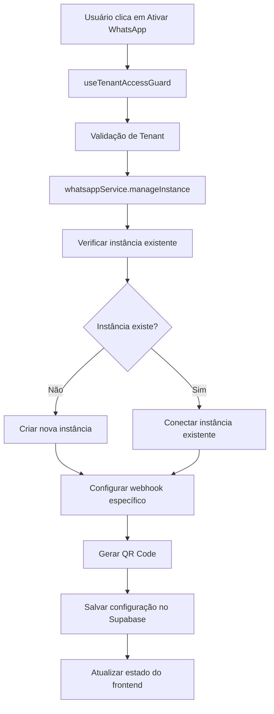

# 📱 Sistema de Canais/WhatsApp - Documentação Completa
## Arquitetura Multi-Tenant Segura com Isolamento Evolution

> **AIDEV-NOTE**: Documentação técnica completa baseada na auditoria de segurança realizada em Janeiro 2025.
> Este documento serve como referência para implementações futuras e manutenção do sistema.

---

## 🏗️ Visão Geral da Arquitetura

### Componentes Principais
```
┌─────────────────────────────────────────────────────────────┐
│                    FRONTEND (React/TypeScript)              │
├─────────────────────────────────────────────────────────────┤
│ CanalIntegration.tsx → useCanaisState.ts → useWhatsAppConnection.ts │
├─────────────────────────────────────────────────────────────┤
│                    BACKEND SERVICES                         │
├─────────────────────────────────────────────────────────────┤
│ WhatsAppService.ts → Evolution API → Supabase Database      │
├─────────────────────────────────────────────────────────────┤
│                    ISOLAMENTO POR TENANT                    │
├─────────────────────────────────────────────────────────────┤
│ Instância: revalya-{tenantSlug} → Webhook: /api/whatsapp/webhook/{tenantSlug} │
└─────────────────────────────────────────────────────────────┘
```

### Stack Tecnológica
- **Frontend**: React 18 + TypeScript + Shadcn/UI + Tailwind CSS
- **Estado**: Zustand + React Query + SessionStorage
- **Backend**: Supabase + PostgreSQL + RLS Policies
- **WhatsApp**: Evolution API + Baileys
- **Segurança**: 5 Camadas de Proteção Multi-Tenant

---

## 🔒 Arquitetura de Segurança Multi-Tenant

### Camada 1: Zustand Store
```typescript
// Localização: src/core/state/
interface TenantState {
  currentTenant: Tenant | null;
  tenantSlug: string;
  isAuthenticated: boolean;
}
```

**Responsabilidades:**
- Gerenciamento centralizado do estado do tenant
- Validação de autenticação em tempo real
- Sincronização entre componentes

### Camada 2: SessionStorage
```typescript
// Implementação em: src/core/security/
const TENANT_SESSION_KEY = 'revalya_tenant_session';
const SECURITY_TOKEN_KEY = 'revalya_security_token';
```

**Características:**
- Persistência segura de dados do tenant
- Limpeza automática em logout
- Validação de integridade dos dados

### Camada 3: React Query
```typescript
// Hook principal: useSecureTenantQuery
const { data: integrations } = useSecureTenantQuery({
  queryKey: ['tenant-integrations', tenantSlug],
  queryFn: () => supabase.rpc('get_tenant_integrations_by_tenant', {
    p_tenant_slug: tenantSlug
  })
});
```

**Funcionalidades:**
- Cache isolado por tenant
- Invalidação automática em mudança de contexto
- Retry policies específicas

### Camada 4: Supabase RLS (Row Level Security)
```sql
-- Política aplicada em tenant_integrations
CREATE POLICY "tenant_integrations_isolation" ON tenant_integrations
FOR ALL USING (tenant_id = auth.uid());
```

**Proteções:**
- Isolamento total de dados por tenant
- Validação no nível do banco de dados
- Prevenção de vazamento de dados

### Camada 5: Validação Dupla no Frontend
```typescript
// Implementação em: useTenantAccessGuard
const useTenantAccessGuard = () => {
  const { currentTenant, isAuthenticated } = useTenantStore();
  
  if (!isAuthenticated || !currentTenant) {
    throw new Error('Acesso negado: Tenant não autenticado');
  }
  
  return { tenantSlug: currentTenant.slug };
};
```

---

## 🔧 Sistema de Isolamento Evolution

### Nomenclatura Padronizada
```typescript
// Padrão de nomenclatura: revalya-{tenantSlug}
const instanceName = `revalya-${tenantSlug}`;

// Exemplos:
// Tenant "empresa-abc" → Instância "revalya-empresa-abc"
// Tenant "loja-xyz" → Instância "revalya-loja-xyz"
```

### Configuração de Instância
```typescript
interface EvolutionInstanceConfig {
  instanceName: string;           // revalya-{tenantSlug}
  integration: "WHATSAPP-BAILEYS"; // Tipo fixo
  webhook: string;                // /api/whatsapp/webhook/{tenantSlug}
  token: string;                  // Token único por instância
  qrcode: boolean;               // true para gerar QR Code
}
```

### Fluxo de Criação de Instância


### Webhook Isolado por Tenant
```typescript
// Estrutura do webhook
const webhookUrl = `${webhookBaseUrl}/api/whatsapp/webhook/${tenantSlug}`;

// Exemplo:
// https://app.revalya.com/api/whatsapp/webhook/empresa-abc
```

---

## 📁 Estrutura de Arquivos

### Frontend Components
```
src/components/canais/
├── CanalIntegration.tsx          # Componente principal
├── components/
│   ├── CanalCard.tsx            # Card individual de canal
│   ├── QRDialog.tsx             # Modal do QR Code
│   └── StatusIndicator.tsx      # Indicador de status
└── hooks/
    ├── useCanaisState.ts        # Estado dos canais
    ├── useWhatsAppConnection.ts # Conexão WhatsApp
    └── useStatusMonitoring.ts   # Monitoramento de status
```

### Backend Services
```
src/services/
└── whatsappService.ts           # Serviço principal Evolution
    ├── createInstance()         # Criação de instâncias
    ├── manageInstance()         # Gerenciamento completo
    ├── generateQRCode()         # Geração de QR Code
    └── saveInstanceConfig()     # Persistência no Supabase
```

### Core Security
```
src/core/
├── security/
│   ├── tenantGuard.ts          # Proteção de acesso
│   └── sessionManager.ts       # Gerenciamento de sessão
└── tenant/
    ├── tenantStore.ts          # Estado global do tenant
    └── tenantQueries.ts        # Queries específicas
```

---

## 🔄 Fluxos de API e Integrações

### 1. Fluxo de Ativação do WhatsApp
```typescript
// 1. Validação de acesso
const { tenantSlug } = useTenantAccessGuard();

// 2. Buscar configurações existentes
const existingConfig = await supabase.rpc('get_tenant_integrations_by_tenant', {
  p_tenant_slug: tenantSlug
});

// 3. Configurar credenciais Evolution
whatsappService.setCredentials(apiUrl, apiKey);

// 4. Gerenciar instância
const result = await whatsappService.manageInstance(tenantSlug, 'connect');

// 5. Salvar configuração
await whatsappService.saveInstanceConfig(tenantSlug, instanceConfig);
```

### 2. Fluxo de Monitoramento de Status
```typescript
// Polling automático a cada 5 segundos
useEffect(() => {
  const interval = setInterval(async () => {
    if (isConnecting) {
      const status = await whatsappService.getInstanceStatus(instanceName);
      if (status.instance.state === 'open') {
        setIsConnected(true);
        setIsConnecting(false);
      }
    }
  }, 5000);

  return () => clearInterval(interval);
}, [isConnecting, instanceName]);
```

### 3. Fluxo de Persistência Segura
```typescript
// Função RPC segura no Supabase
const saveInstanceConfig = async (tenantSlug: string, config: InstanceConfig) => {
  return await executeWithAuth(async (supabase) => {
    const { data: tenant } = await supabase
      .from('tenants')
      .select('id')
      .eq('slug', tenantSlug)
      .single();

    return await supabase
      .from('tenant_integrations')
      .update({
        config: config,
        is_active: true,
        updated_at: new Date().toISOString()
      })
      .eq('tenant_id', tenant.id)
      .eq('integration_type', 'whatsapp');
  });
};
```

---

## 🛠️ Guia de Manutenção e Troubleshooting

### Problemas Comuns e Soluções

#### 1. Instância não conecta
```bash
# Verificar status da instância
GET /instance/connectionState/{instanceName}

# Logs para debug
GET /instance/fetchInstances
```

**Soluções:**
- Verificar se a Evolution API está rodando
- Validar credenciais (api_url e api_key)
- Checar se o nome da instância está correto

#### 2. QR Code não aparece
```typescript
// Debug no frontend
console.log('QR Code data:', qrCodeData);
console.log('Instance name:', instanceName);
```

**Soluções:**
- Verificar se `qrcode: true` na configuração
- Validar resposta da API Evolution
- Checar se o componente QRDialog está renderizando

#### 3. Webhook não recebe mensagens
```typescript
// Verificar configuração do webhook
const webhookUrl = `${process.env.WEBHOOK_BASE_URL}/api/whatsapp/webhook/${tenantSlug}`;
```

**Soluções:**
- Validar URL do webhook
- Verificar se o endpoint está ativo
- Checar logs do servidor

### Comandos de Debug

#### Verificar instâncias ativas
```bash
curl -X GET "https://evolution-api.com/instance/fetchInstances" \
  -H "apikey: YOUR_API_KEY"
```

#### Resetar instância
```bash
curl -X DELETE "https://evolution-api.com/instance/logout/revalya-{tenantSlug}" \
  -H "apikey: YOUR_API_KEY"
```

#### Verificar configuração no banco
```sql
SELECT 
  t.slug as tenant_slug,
  ti.integration_type,
  ti.config,
  ti.is_active,
  ti.updated_at
FROM tenant_integrations ti
JOIN tenants t ON t.id = ti.tenant_id
WHERE ti.integration_type = 'whatsapp';
```

---

## 📊 Monitoramento e Métricas

### Indicadores de Saúde do Sistema
```typescript
interface SystemHealth {
  activeInstances: number;        // Instâncias ativas
  connectedTenants: number;      // Tenants conectados
  qrCodesPending: number;        // QR Codes pendentes
  webhookErrors: number;         // Erros de webhook
  lastHealthCheck: Date;         // Última verificação
}
```

### Logs Importantes
```typescript
// Logs de segurança
logger.info('Tenant access validated', { tenantSlug, userId });

// Logs de instância
logger.info('Instance created', { instanceName, tenantSlug });

// Logs de webhook
logger.info('Webhook received', { tenantSlug, messageType });
```

---

## 🔐 Checklist de Segurança

### ✅ Validações Implementadas
- [x] Isolamento completo por tenant
- [x] Validação de acesso em todas as camadas
- [x] RLS policies no banco de dados
- [x] Nomenclatura padronizada de instâncias
- [x] Webhooks isolados por tenant
- [x] Configurações seguras no Supabase
- [x] Limpeza de dados em logout
- [x] Validação dupla no frontend

### 🔍 Pontos de Atenção
- Monitorar logs de acesso regularmente
- Validar integridade dos webhooks
- Verificar performance das queries RLS
- Auditar configurações da Evolution API

---

## 📝 Notas de Implementação

### Padrões de Código
```typescript
// AIDEV-NOTE: Sempre usar useTenantAccessGuard antes de operações sensíveis
const { tenantSlug } = useTenantAccessGuard();

// AIDEV-NOTE: Nomenclatura padronizada para instâncias Evolution
const instanceName = `revalya-${tenantSlug}`;

// AIDEV-NOTE: Usar executeWithAuth para operações no Supabase
const result = await executeWithAuth(async (supabase) => {
  // Operação segura aqui
});
```

### Convenções de Nomenclatura
- **Instâncias Evolution**: `revalya-{tenantSlug}`
- **Webhooks**: `/api/whatsapp/webhook/{tenantSlug}`
- **Chaves de cache**: `tenant-{resource}-{tenantSlug}`
- **Logs**: `[{tenantSlug}] {action} - {details}`

---

## 🚀 Roadmap de Melhorias

### Curto Prazo
- [ ] Implementar retry automático para conexões falhadas
- [ ] Adicionar métricas de performance
- [ ] Melhorar feedback visual de status

### Médio Prazo
- [ ] Sistema de backup de configurações
- [ ] Dashboard de monitoramento em tempo real
- [ ] Alertas automáticos para falhas

### Longo Prazo
- [ ] Suporte a múltiplas APIs de WhatsApp
- [ ] Sistema de load balancing para instâncias
- [ ] Análise avançada de mensagens

---

## 📞 Contatos e Suporte

### Equipe Responsável
- **Arquitetura**: Barcelitos (AI Agent)
- **Segurança**: Multi-tenant Security Team
- **Infraestrutura**: Evolution API Team

### Documentos Relacionados
- <mcfile name="guia-implementacao-multi-tenant-seguro.md" path="f:\NEXFINAN\revalya-oficial\.trae\documents\guia-implementacao-multi-tenant-seguro.md"></mcfile>
- <mcfile name="CLAUDE.md" path="f:\NEXFINAN\revalya-oficial\CLAUDE.md"></mcfile>
- <mcfile name="README.md" path="f:\NEXFINAN\revalya-oficial\README.md"></mcfile>

---

**Última Atualização**: Janeiro 2025  
**Versão**: 1.0.0  
**Status**: ✅ Auditoria de Segurança Aprovada