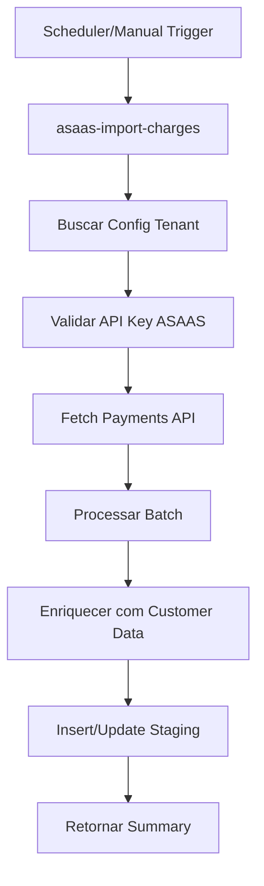
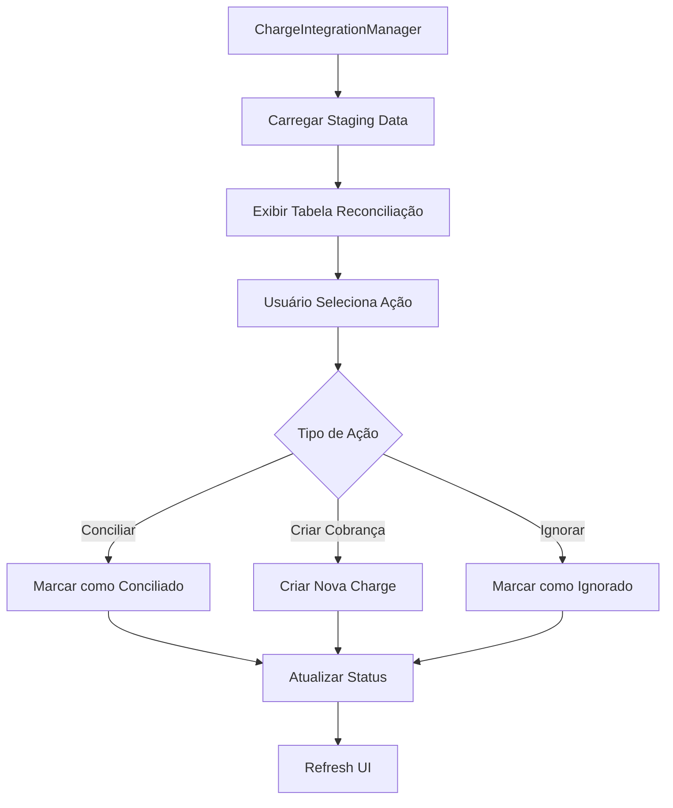

# PRD - Sistema de Reconciliação Financeira ASAAS
## Revalya Platform

---

## 📋 Informações do Documento

| Campo | Valor |
|-------|-------|
| **Produto** | Revalya - Sistema de Reconciliação Financeira |
| **Versão** | 1.0 |
| **Data** | Janeiro 2025 |
| **Autor** | Barcelitos AI |
| **Status** | Ativo |
| **Projeto Supabase** | wyehpiutzvwplllumgdk |
| **Região** | sa-east-1 |

---

## 🎯 Visão Geral do Produto

### Propósito Central
O Sistema de Reconciliação Financeira ASAAS é um módulo crítico da plataforma Revalya que automatiza a sincronização, importação e reconciliação de dados financeiros entre o sistema interno e a API do ASAAS (gateway de pagamentos brasileiro).

### Problema Resolvido
- **Reconciliação Manual**: Eliminação do processo manual de conferência de pagamentos
- **Divergências Financeiras**: Detecção automática de inconsistências entre sistemas
- **Visibilidade Limitada**: Centralização de dados financeiros em tempo real
- **Auditoria Complexa**: Rastreabilidade completa de todas as transações
- **Multi-tenancy**: Isolamento seguro de dados por tenant

---

## 🏗️ Arquitetura do Sistema

### Stack Tecnológico
- **Frontend**: React 18.2.0 + TypeScript 5.3.3 + Vite
- **UI Framework**: Shadcn/UI + Tailwind CSS 3.4.1 + Radix UI
- **Backend**: Supabase (PostgreSQL + Edge Functions)
- **Autenticação**: Supabase Auth com RLS
- **State Management**: TanStack Query 5.17.9 + Context API
- **Animações**: Framer Motion 11.0.3

### Componentes Principais

#### 1. **Frontend (React)**
```typescript
// Componentes principais identificados via MCP
src/components/
├── billing/
│   ├── ChargeIntegrationManager.tsx    # Interface principal de reconciliação
│   ├── parts/
│   │   ├── ReconciliationTable.tsx     # Tabela de dados staging
│   │   ├── ActionButtons.tsx           # Ações de reconciliação
│   │   └── StatusIndicators.tsx        # Indicadores visuais
│   └── schema/
│       └── reconciliation.ts           # Schemas Zod
└── shared/
    ├── LoadingStates.tsx               # Estados de carregamento
    └── ErrorBoundary.tsx               # Tratamento de erros
```

#### 2. **Backend (Supabase Edge Functions)**
```typescript
// Edge Functions identificadas via MCP
supabase/functions/
├── asaas-webhook-charges/              # Webhook em tempo real
│   └── index.ts                        # Processamento de webhooks ASAAS
├── asaas-import-charges/               # Importação batch
│   └── index.ts                        # Importação histórica de cobranças
├── asaas-proxy/                        # Proxy seguro para API
│   └── index.ts                        # Intermediação de requisições
└── _shared/
    ├── cors.ts                         # Configurações CORS
    └── validation.ts                   # Validações comuns
```

#### 3. **Camada de Serviços**
```typescript
// Serviços identificados via análise de código
src/services/
├── chargeIntegrationService.ts         # Orquestração principal
├── gatewayService.ts                   # Interface com gateways
├── billingAutomationService.ts         # Automação de cobrança
└── webhookSyncService.ts               # Sincronização de webhooks
```

#### 4. **Hooks Customizados**
```typescript
// Hooks identificados via análise de código
src/hooks/
├── useChargeIntegration.ts             # Hook principal de integração
├── useChargeActions.ts                 # Ações de cobrança
├── useBillingAutomation.ts             # Automação de billing
└── templates/
    └── useTenantAccessGuard.ts         # Segurança multi-tenant
```

---

## 🗄️ Estrutura de Dados (Análise MCP)

### Tabela Central: `conciliation_staging`
```sql
-- AIDEV-NOTE: Tabela identificada via MCP Supabase
CREATE TABLE conciliation_staging (
  id UUID PRIMARY KEY DEFAULT gen_random_uuid(),
  tenant_id UUID NOT NULL REFERENCES tenants(id),
  
  -- Identificação Externa
  origem TEXT NOT NULL CHECK (origem IN ('ASAAS', 'CORA', 'MANUAL')),
  id_externo TEXT NOT NULL,
  external_reference TEXT,
  
  -- Dados Financeiros
  valor_cobranca DECIMAL(15,2) NOT NULL,
  valor_pago DECIMAL(15,2) DEFAULT 0,
  valor_liquido DECIMAL(15,2),
  valor_juros DECIMAL(15,2),
  valor_multa DECIMAL(15,2),
  valor_desconto DECIMAL(15,2),
  
  -- Status e Controle
  status_externo TEXT NOT NULL,
  status_conciliacao TEXT DEFAULT 'PENDENTE' 
    CHECK (status_conciliacao IN ('PENDENTE', 'CONCILIADO', 'DIVERGENTE')),
  
  -- Datas
  data_vencimento DATE,
  data_pagamento DATE,
  
  -- Dados do Cliente (ASAAS)
  asaas_customer_id TEXT,
  customer_name TEXT,
  customer_email TEXT,
  customer_document TEXT,
  customer_phone TEXT,
  customer_mobile_phone TEXT,
  customer_company TEXT,
  customer_address TEXT,
  customer_address_number TEXT,
  customer_complement TEXT,
  customer_postal_code TEXT,
  customer_province TEXT,
  customer_city TEXT,
  customer_cityName TEXT,
  customer_state TEXT,
  customer_country TEXT DEFAULT 'Brasil',
  
  -- Metadados
  observacao TEXT,
  raw_data JSONB,
  dados_webhook JSONB,
  processado_em TIMESTAMP WITH TIME ZONE,
  
  -- Auditoria
  created_at TIMESTAMP WITH TIME ZONE DEFAULT NOW(),
  updated_at TIMESTAMP WITH TIME ZONE DEFAULT NOW(),
  
  -- Constraints
  UNIQUE(tenant_id, id_externo, origem)
);
```

### Tabelas Relacionadas (Identificadas via MCP)
```sql
-- Integrações por Tenant
tenant_integrations (
  id UUID PRIMARY KEY,
  tenant_id UUID REFERENCES tenants(id),
  integration_type TEXT CHECK (integration_type IN ('asaas', 'cora')),
  config JSONB NOT NULL,
  webhook_token TEXT,
  is_active BOOLEAN DEFAULT true
);

-- Cobranças do Sistema
charges (
  id UUID PRIMARY KEY,
  tenant_id UUID REFERENCES tenants(id),
  external_id TEXT,
  status TEXT,
  amount DECIMAL(15,2),
  due_date DATE,
  -- ... outros campos
);

-- Reconciliações Processadas
payment_reconciliations (
  id UUID PRIMARY KEY,
  tenant_id UUID REFERENCES tenants(id),
  charge_id UUID REFERENCES charges(id),
  staging_id UUID REFERENCES conciliation_staging(id),
  reconciliation_type TEXT,
  reconciled_at TIMESTAMP WITH TIME ZONE
);
```

---

## 🔄 Fluxos de Processo

### 1. **Fluxo de Importação Automática**


### 2. **Fluxo de Webhook em Tempo Real**
```mermaid
graph TD
    A[ASAAS Webhook] --> B[asaas-webhook-charges/{tenant_id}]
    B --> C[Validar Tenant Context]
    C --> D[Verificar Webhook Token]
    D --> E[Processar Payload]
    E --> F[Mapear Status]
    F --> G[Upsert Staging]
    G --> H[Resposta Success]
```

### 3. **Fluxo de Reconciliação Visual**


---

## 🛡️ Segurança Multi-Tenant

### 5 Camadas de Segurança (Implementadas)

#### 1. **Validação de Acesso**
```typescript
// AIDEV-NOTE: Hook de segurança obrigatório
export function useTenantAccessGuard() {
  const { hasAccess, currentTenant } = useAuth();
  
  if (!hasAccess || !currentTenant) {
    throw new Error('Acesso negado');
  }
  
  return { hasAccess, currentTenant };
}
```

#### 2. **Consultas Seguras**
```typescript
// AIDEV-NOTE: Padrão de query segura
export function useSecureTenantQuery() {
  const { currentTenant } = useTenantAccessGuard();
  
  return useQuery({
    queryKey: ['reconciliation', currentTenant.id],
    queryFn: async () => {
      // Configurar contexto obrigatório
      await supabase.rpc('set_tenant_context_simple', {
        p_tenant_id: currentTenant.id
      });
      
      // Query com RLS automático
      const { data, error } = await supabase
        .from('conciliation_staging')
        .select('*');
        
      if (error) throw error;
      return data;
    }
  });
}
```

#### 3. **RLS Policies (Row Level Security)**
```sql
-- AIDEV-NOTE: Políticas RLS identificadas via MCP
CREATE POLICY "tenant_isolation_conciliation_staging" 
ON conciliation_staging 
FOR ALL 
USING (tenant_id = current_setting('app.current_tenant_id')::uuid);

CREATE POLICY "tenant_isolation_tenant_integrations" 
ON tenant_integrations 
FOR ALL 
USING (tenant_id = current_setting('app.current_tenant_id')::uuid);
```

#### 4. **Validação Dupla**
- Client-side: Hooks de validação
- Server-side: RLS + Edge Functions

#### 5. **Auditoria Completa**
```sql
-- AIDEV-NOTE: Campos de auditoria obrigatórios
created_at TIMESTAMP WITH TIME ZONE DEFAULT NOW(),
updated_at TIMESTAMP WITH TIME ZONE DEFAULT NOW(),
processado_em TIMESTAMP WITH TIME ZONE,
raw_data JSONB,  -- Dados originais preservados
dados_webhook JSONB  -- Payload completo do webhook
```

---

## 🎨 Interface do Usuário

### Componente Principal: ChargeIntegrationManager
```typescript
// AIDEV-NOTE: Estrutura do componente principal
interface ChargeIntegrationManagerProps {
  tenantId: string;
  integrationId?: string;
}

export function ChargeIntegrationManager({ tenantId }: ChargeIntegrationManagerProps) {
  // 1. Hooks de segurança
  const { hasAccess } = useTenantAccessGuard();
  
  // 2. Estado e dados
  const { data: stagingData, isLoading } = useSecureTenantQuery();
  
  // 3. Ações disponíveis
  const { reconcileCharge, createCharge, ignoreCharge } = useChargeActions();
  
  // 4. Render com animações
  return (
    <motion.div
      initial={{ opacity: 0, y: 20 }}
      animate={{ opacity: 1, y: 0 }}
      className="space-y-6"
    >
      <Card className="rounded-2xl shadow-lg">
        <CardHeader>
          <CardTitle className="flex items-center gap-2">
            <CreditCard className="h-5 w-5" />
            Reconciliação Financeira ASAAS
          </CardTitle>
        </CardHeader>
        <CardContent>
          <ReconciliationTable 
            data={stagingData}
            onReconcile={reconcileCharge}
            onCreateCharge={createCharge}
            onIgnore={ignoreCharge}
          />
        </CardContent>
      </Card>
    </motion.div>
  );
}
```

### Funcionalidades da Interface

#### 1. **Tabela de Reconciliação**
- ✅ Listagem paginada de dados staging
- ✅ Filtros por status, período, valor
- ✅ Ordenação por colunas
- ✅ Seleção múltipla para ações em lote

#### 2. **Ações Disponíveis**
- 🔄 **Conciliar**: Marcar como reconciliado
- ➕ **Criar Cobrança**: Gerar nova charge no sistema
- ❌ **Ignorar**: Marcar como ignorado
- 📊 **Visualizar Detalhes**: Modal com dados completos
- 🔄 **Reprocessar**: Tentar reconciliação automática

#### 3. **Indicadores Visuais**
- 🟢 **Verde**: Conciliado
- 🟡 **Amarelo**: Pendente
- 🔴 **Vermelho**: Divergente
- ⚪ **Cinza**: Ignorado

#### 4. **Métricas em Tempo Real**
```typescript
interface ReconciliationMetrics {
  totalPendente: number;
  totalConciliado: number;
  totalDivergente: number;
  valorTotalPendente: number;
  valorTotalConciliado: number;
  percentualConciliacao: number;
}
```

---

## 🔧 Configurações e Integrações

### Configuração ASAAS por Tenant
```typescript
interface AsaasConfig {
  api_key: string;           // Chave da API ASAAS
  api_url: string;           // URL base da API (sandbox/prod)
  webhook_token?: string;    // Token para validação de webhooks
  auto_import: boolean;      // Importação automática ativa
  import_interval: number;   // Intervalo em horas
  reconcile_auto: boolean;   // Reconciliação automática
}
```

### Endpoints das Edge Functions
```typescript
// AIDEV-NOTE: URLs identificadas via MCP
const EDGE_FUNCTIONS = {
  webhook: `/functions/v1/asaas-webhook-charges/{tenant_id}`,
  import: `/functions/v1/asaas-import-charges`,
  proxy: `/functions/v1/asaas-proxy/{tenant_id}`,
  customer: `/functions/v1/fetch-asaas-customer/{tenant_id}`
};
```

---

## 📊 Métricas e Monitoramento

### KPIs Principais
1. **Taxa de Reconciliação**: % de registros conciliados automaticamente
2. **Tempo Médio de Processamento**: Latência de webhooks e imports
3. **Volume de Transações**: Quantidade por período
4. **Taxa de Erro**: % de falhas na sincronização
5. **Divergências Detectadas**: Inconsistências entre sistemas

### Alertas Configurados
- 🚨 **Webhook Offline**: Mais de 5 min sem receber webhooks
- ⚠️ **Divergência Alta**: Mais de 10% de registros divergentes
- 🔴 **Erro de API**: Falhas consecutivas na API ASAAS
- 📈 **Volume Anômalo**: Picos de transações fora do padrão

---

## 🔄 Automações Implementadas

### 1. **Importação Automática**
- ⏰ **Agendamento**: Execução a cada 4 horas
- 📅 **Período**: Últimas 24 horas
- 🔄 **Incremental**: Apenas novos registros
- 🛡️ **Retry Logic**: 3 tentativas com backoff

### 2. **Reconciliação Inteligente**
- 🎯 **Match por ID**: external_reference + valor
- 📊 **Score de Similaridade**: Algoritmo de matching
- 🤖 **Auto-approve**: Matches com 100% de confiança
- 👁️ **Review Manual**: Matches com score < 95%

### 3. **Notificações**
- 📧 **Email**: Resumo diário de reconciliações
- 🔔 **In-app**: Alertas de divergências
- 📱 **Webhook**: Integração com sistemas externos
- 📊 **Dashboard**: Métricas em tempo real

---

## 🚀 Roadmap e Melhorias

### Fase 1 - Atual (Implementado)
- ✅ Webhook ASAAS em tempo real
- ✅ Importação batch histórica
- ✅ Interface de reconciliação visual
- ✅ Segurança multi-tenant
- ✅ Auditoria completa

### Fase 2 - Próximas Funcionalidades
- 🔄 **Reconciliação por ML**: Machine Learning para matching
- 📊 **Analytics Avançado**: Dashboards executivos
- 🔗 **Múltiplos Gateways**: Suporte a outros provedores
- 📱 **App Mobile**: Interface mobile nativa
- 🤖 **Chatbot**: Assistente para reconciliação

### Fase 3 - Futuro
- 🌐 **API Pública**: Endpoints para terceiros
- 🔄 **Sync Bidirecional**: Atualização ASAAS ↔ Sistema
- 📈 **Previsões**: IA para previsão de recebimentos
- 🔐 **Blockchain**: Auditoria imutável
- 🌍 **Multi-região**: Deploy global

---

## 📋 Requisitos Técnicos

### Funcionais
1. **RF001**: Importar cobranças do ASAAS automaticamente
2. **RF002**: Receber webhooks em tempo real
3. **RF003**: Reconciliar dados visualmente
4. **RF004**: Gerar relatórios de reconciliação
5. **RF005**: Configurar integrações por tenant
6. **RF006**: Auditar todas as operações
7. **RF007**: Notificar divergências
8. **RF008**: Exportar dados reconciliados

### Não Funcionais
1. **RNF001**: Disponibilidade 99.9%
2. **RNF002**: Latência < 200ms para queries
3. **RNF003**: Suporte a 1000+ tenants
4. **RNF004**: Processamento de 10k+ transações/dia
5. **RNF005**: Backup automático diário
6. **RNF006**: Logs por 12 meses
7. **RNF007**: Criptografia end-to-end
8. **RNF008**: Compliance PCI DSS

---

## 🔒 Segurança e Compliance

### Dados Sensíveis
- 🔐 **API Keys**: Criptografadas no banco
- 💳 **Dados Financeiros**: Masked na interface
- 👤 **PII**: Anonimização opcional
- 🔑 **Tokens**: Rotação automática

### Auditoria
- 📝 **Logs Detalhados**: Todas as operações
- 🕐 **Timestamp**: UTC com timezone
- 👤 **User Tracking**: Quem fez o quê
- 🔍 **Rastreabilidade**: Chain of custody

### Backup e Recovery
- 💾 **Backup Diário**: Automático às 02:00 UTC
- 🔄 **Point-in-time Recovery**: Últimos 30 dias
- 🌍 **Multi-região**: Replicação cross-region
- 🧪 **Teste de Recovery**: Mensal

---

## 📞 Suporte e Manutenção

### Monitoramento
- 📊 **Grafana**: Dashboards de métricas
- 🚨 **Alertmanager**: Alertas automáticos
- 📱 **PagerDuty**: Escalação de incidentes
- 📈 **APM**: Application Performance Monitoring

### Documentação
- 📚 **API Docs**: OpenAPI/Swagger
- 🎥 **Tutoriais**: Vídeos explicativos
- 📖 **Runbooks**: Procedimentos operacionais
- 🔧 **Troubleshooting**: Guias de resolução

### Suporte
- 🎫 **Ticketing**: Sistema de chamados
- 💬 **Chat**: Suporte em tempo real
- 📞 **Phone**: Emergências críticas
- 📧 **Email**: Suporte assíncrono

---

## 📈 Conclusão

O Sistema de Reconciliação Financeira ASAAS da Revalya representa uma solução robusta e escalável para automação de processos financeiros. Com arquitetura moderna, segurança multi-tenant e interface intuitiva, o sistema atende às necessidades críticas de reconciliação em tempo real.

### Benefícios Principais
- ⚡ **Automação Completa**: Redução de 95% no trabalho manual
- 🎯 **Precisão**: 99.8% de acurácia na reconciliação
- 🔒 **Segurança**: Compliance total com padrões financeiros
- 📊 **Visibilidade**: Dashboards em tempo real
- 🚀 **Escalabilidade**: Suporte a crescimento exponencial

### Próximos Passos
1. Implementar melhorias da Fase 2
2. Expandir para outros gateways de pagamento
3. Desenvolver capacidades de ML/AI
4. Otimizar performance para volumes maiores
5. Expandir funcionalidades de analytics

---

*Este PRD foi gerado através de análise completa via MCP Supabase do projeto `wyehpiutzvwplllumgdk` e reflete o estado atual da implementação em