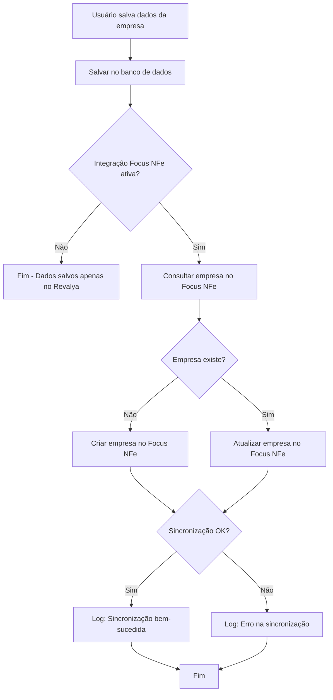

# 🔄 Sincronização Automática de Empresa com Focus NFe

## 📋 Visão Geral

Este documento descreve o fluxo de sincronização automática dos dados da empresa entre o sistema Revalya e o Focus NFe. Quando os dados da empresa são alterados no Revalya, eles são automaticamente sincronizados com o Focus NFe (se a integração estiver ativa).

## 🎯 Objetivo

Garantir que os dados da empresa no Focus NFe estejam sempre atualizados quando houver alterações no sistema Revalya, sem necessidade de intervenção manual.

## 🔄 Fluxo de Sincronização

### 1. **Salvamento de Dados no Revalya**

Quando o usuário salva os dados da empresa em `MyCompanySettings`:

```typescript
// src/components/company/hooks/useCompanyData.ts
export function useSaveCompanyData() {
  const saveCompanyData = async (tenantId: string, formData: CompanyDataForm) => {
    // 1. Salvar no banco de dados primeiro
    await supabase
      .from('tenants')
      .update({ company_data: companyDataToSave })
      .eq('id', tenantId);
    
    // 2. Verificar se integração Focus NFe está ativa
    const focusNFeConfig = await getFocusNFeConfig(tenantId);
    
    // 3. Se ativa, sincronizar automaticamente
    if (focusNFeConfig?.is_active) {
      await syncWithFocusNFe(tenantId, companyDataToSave);
    }
  };
}
```

### 2. **Verificação de Integração Ativa**

Antes de sincronizar, o sistema verifica:
- ✅ Se a integração Focus NFe está ativa (`is_active: true`)
- ✅ Se os dados obrigatórios estão preenchidos (CNPJ, Razão Social)
- ✅ Se o usuário está autenticado (token de sessão válido)

### 3. **Decisão: Criar ou Atualizar**

A Edge Function decide automaticamente:

```typescript
// supabase/functions/focusnfe/index.ts
async function handleUpdateCompany(req: Request, tenantId: string) {
  // 1. Consultar se empresa já existe no Focus NFe
  const checkResponse = await fetch(`${baseUrl}/empresas?cnpj=${cnpj}`);
  
  if (!checkResponse.ok || checkResponse.status === 404) {
    // Empresa não existe → Criar
    return await handleCreateCompany(req, tenantId);
  }
  
  // 2. Empresa existe → Atualizar
  const empresaExistente = await checkResponse.json();
  const empresaId = empresaExistente[0].id;
  
  // 3. Atualizar usando PUT /empresas/{id}
  await fetch(`${baseUrl}/empresas/${empresaId}`, {
    method: 'PUT',
    body: JSON.stringify(focusNFeData)
  });
}
```

### 4. **Atualização no Focus NFe**

A atualização usa o endpoint:
- **Método:** `PUT`
- **URL:** `https://api.focusnfe.com.br/v2/empresas/{id}`
- **Autenticação:** HTTP Basic Auth (token como username, senha vazia)
- **Body:** JSON com dados da empresa (formato plano, não aninhado)

## 📊 Mapeamento de Campos

### Campos Sincronizados

| Revalya | Focus NFe | Observações |
|---------|-----------|-------------|
| `razao_social` | `nome` | Campo obrigatório |
| `nome_fantasia` | `nome_fantasia` | Opcional |
| `cnpj` | `cnpj` | Campo obrigatório (apenas números) |
| `inscricao_estadual` | `inscricao_estadual` | Opcional |
| `inscricao_municipal` | `inscricao_municipal` | Opcional |
| `endereco.logradouro` | `logradouro` | Campo obrigatório |
| `endereco.numero` | `numero` | Campo obrigatório |
| `endereco.complemento` | `complemento` | Opcional |
| `endereco.bairro` | `bairro` | Campo obrigatório |
| `endereco.cidade` | `municipio` | Campo obrigatório |
| `endereco.uf` | `uf` | Campo obrigatório |
| `endereco.cep` | `cep` | Campo obrigatório (apenas números) |
| `endereco.codigo_municipio_ibge` | `codigo_municipio` | Opcional |
| `contato.ddd + contato.telefone` | `telefone` | Concatenado e apenas números |
| `contato.email` | `email` | Opcional |
| `fiscal.regime_tributario` | `regime_tributario` | Default: "3" (Simples Nacional) |
| `fiscal.cnae_principal` | `cnae_principal` | Opcional |

## 🔐 Segurança

### Validações Implementadas

1. **Autenticação do Usuário**
   - Token de sessão válido obrigatório
   - Validação via `validateRequest` na Edge Function

2. **Validação de Tenant**
   - Verificação de acesso ao tenant
   - Isolamento de dados por tenant

3. **Validação de Integração**
   - Verificação se integração está ativa
   - Verificação de ambiente (homologação/produção)

4. **Validação de Dados**
   - Campos obrigatórios validados antes de enviar
   - Formato de dados validado (CNPJ, CEP, telefone)

## ⚠️ Tratamento de Erros

### Erros Não Bloqueantes

A sincronização **não bloqueia** o salvamento dos dados no Revalya:

```typescript
try {
  await syncWithFocusNFe(tenantId, companyData);
} catch (error) {
  // Log do erro, mas não falha o salvamento
  console.error('[useSaveCompanyData] Erro ao sincronizar:', error);
  // Dados já foram salvos no banco, apenas a sincronização falhou
}
```

### Tipos de Erro

1. **401 Unauthorized**
   - Token da API inválido ou não configurado
   - **Ação:** Verificar `FOCUSNFE_API_KEY` nos secrets do Supabase

2. **403 Forbidden**
   - Conta não tem permissão para criar/atualizar empresas
   - **Ação:** Contatar suporte Focus NFe

3. **404 Not Found**
   - Empresa não encontrada (redireciona para criação)
   - **Ação:** Automática (cria empresa)

4. **422 Unprocessable Entity**
   - Dados inválidos ou campos obrigatórios faltando
   - **Ação:** Verificar logs para identificar campos com problema

5. **500 Internal Server Error**
   - Erro interno do Focus NFe
   - **Ação:** Tentar novamente mais tarde

## 📝 Logs e Debug

### Logs no Frontend

```typescript
console.log('[useSaveCompanyData] Empresa sincronizada com Focus NFe:', syncResult.message);
console.warn('[useSaveCompanyData] Aviso ao sincronizar:', syncResult.error);
console.error('[useSaveCompanyData] Erro ao sincronizar:', error);
```

### Logs na Edge Function

```typescript
console.log('[handleUpdateCompany] Empresa atualizada com sucesso:', result);
console.error('[handleUpdateCompany] Erro na API Focus NFe:', errorDetails);
```

## 🔄 Fluxo Completo



## 🎯 Casos de Uso

### 1. **Primeira Vez (Empresa Não Existe)**

1. Usuário preenche dados da empresa
2. Ativa integração Focus NFe
3. Sistema cria empresa automaticamente no Focus NFe
4. Usuário altera dados da empresa
5. Sistema atualiza empresa no Focus NFe automaticamente

### 2. **Empresa Já Cadastrada**

1. Empresa já existe no Focus NFe (cadastrada manualmente ou via API)
2. Usuário altera dados no Revalya
3. Sistema detecta empresa existente
4. Sistema atualiza empresa no Focus NFe

### 3. **Integração Desativada**

1. Integração Focus NFe está desativada
2. Usuário altera dados da empresa
3. Dados são salvos apenas no Revalya
4. Nenhuma sincronização é realizada

## 🚀 Melhorias Futuras

### 1. **Sincronização Bidirecional**
- Permitir sincronização do Focus NFe para Revalya
- Útil para casos onde dados são alterados diretamente no Focus NFe

### 2. **Sincronização Seletiva**
- Permitir escolher quais campos sincronizar
- Útil para evitar sobrescrever configurações específicas do Focus NFe

### 3. **Histórico de Sincronizações**
- Registrar todas as sincronizações realizadas
- Útil para auditoria e troubleshooting

### 4. **Retry Automático**
- Implementar retry automático em caso de falha temporária
- Útil para lidar com problemas de rede ou API

### 5. **Notificações**
- Notificar usuário sobre sucesso/falha da sincronização
- Útil para feedback imediato

## 📚 Referências

- [Documentação Focus NFe - Empresas](https://focusnfe.com.br/doc/#empresas)
- [Documentação Focus NFe - Alteração de Empresa](https://focusnfe.com.br/doc/#empresas_alteracao-de-empresa)
- [Padrão de Integração Única Multi-Tenant](./PADRAO_INTEGRACAO_UNICA_MULTI_TENANT.md)

